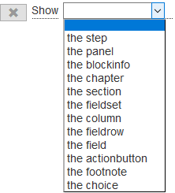

<!-- title: G6K: Administration guide  -->
<!-- subtitle: Composition of business rules -->

# Business rules

It is the « business rules » that determine the behavior of the simulator. They are triggered when the context changes.

A change of context always results in the acquisition or modification of data.

G6k inquiries about the context change by reverting the conditions associated with the rules when the value of a data changes.

Thus, when the user enters a value, g6K accesses a reference data or a value is calculated, the impacted rules are evaluated and the associated actions are executed if necessary.

The actions that can be carried out are:

* Show or hide part of the page (a field, a fields set, a panel, a button, ...)
* Display an error or warning message
* Perform a calculation and assign it to a data

A business rule has the following syntax:
<pre>
&lt;business rule&gt;: <span class="label label-default">When ...</span>&lt;condition&gt;[<span class="label label-default">then do ...</span>&lt;action&gt;...&lt;action&gt;][<span class="label label-default">else do ...</span>&lt;action&gt; ... &lt;action&gt;]
</pre>

**&lt;condition&gt;**

<pre>
&lt;condition&gt;: &lt;simple condition&gt; | &lt;composite condition&gt;

&lt;simple condition&gt;: &lt;operand&gt;&lt;operator&gt;[(&lt;value&gt; | &lt;expression&gt;)]

&lt;composite condition&gt;:
    &lt;connector&gt;
        &lt;condition&gt;
        ...
        &lt;condition&gt;
</pre>

**&lt;operator&gt;**

<pre>
&lt;operator&gt;:<span class="label label-default">contains</span> | <span class="label label-default">corresponds to</span> | <span class="label label-default">does not corresponds to</span> | <span class="label label-default">is after</span> | <span class="label label-default">is before</span> | <span class="label label-default">is equal to</span> | <span class="label label-default">is greater than</span> | <span class="label label-default">is greater than or equal to</span> | <span class="label label-default">is less than</span> | <span class="label label-default">is less than or equal to</span> | <span class="label label-default">is not after</span> | <span class="label label-default">is not before</span> | <span class="label label-default">is not equal to</span> | <span class="label label-default">is not present</span> | <span class="label label-default">is present</span> | <span class="label label-default">is true</span> | <span class="label label-default">matches</span> | <span class="label label-default">not contains</span>
</pre>

**&lt;connector&gt;**

<pre>
&lt;connector&gt;: <span class="label label-default">All</span> | <span class="label label-default">Any</span> | <span class="label label-default">None</span>
</pre>

**&lt;action&gt;**

<pre>
&lt;action&gt;: (<span class="label label-default">notify Error</span> | <span class="label label-default">notify Warning</span>)&lt;message&gt;<span class="label label-default">on</span><span class="label label-default">the data</span>&lt;data&gt;
ou
&lt;action&gt;: (<span class="label label-default">notify Error</span> | <span class="label label-default">notify Warning</span>)&lt;message&gt;<span class="label label-default">on</span><span class="label label-default">the dataset</span>
ou
&lt;action&gt;: (<span class="label label-default">notify Error</span> | <span class="label label-default">notify Warning</span>)&lt;message&gt;<span class="label label-default">on</span><span class="label label-default">the datagroup</span>&lt;datagroup&gt;
ou
&lt;action&gt;: (<span class="label label-default">Hide</span> | <span class="label label-default">Show</span>) <span class="label label-default">the step</span>&lt;step&gt;
ou
&lt;action&gt;: (<span class="label label-default">Hide</span> | <span class="label label-default">Show</span>) <span class="label label-default">the panel</span> <span class="label label-default">of step</span>&lt;step&gt;<span class="label label-default">whose label is</span>&lt;panel&gt;
ou
&lt;action&gt;: (<span class="label label-default">Hide</span> | <span class="label label-default">Show</span>) <span class="label label-default">the fieldset</span> <span class="label label-default">of step</span>&lt;step&gt;<span class="label label-default">of panel</span>&lt;panel&gt;<span class="label label-default">whose label is</span>&lt;fieldset&gt;
ou
&lt;action&gt;: (<span class="label label-default">Hide</span> | <span class="label label-default">Show</span>) <span class="label label-default">the field</span> <span class="label label-default">of step</span>&lt;step&gt;<span class="label label-default">of panel</span>&lt;panel&gt;<span class="label label-default">of fieldset</span>&lt;fieldset&gt;<span class="label label-default">whose label is</span>&lt;field&gt;
ou
&lt;action&gt;: (<span class="label label-default">Hide</span> | <span class="label label-default">Show</span>) <span class="label label-default">the column</span> <span class="label label-default">of step</span>&lt;step&gt;<span class="label label-default">of panel</span>&lt;panel&gt;<span class="label label-default">of fieldset</span>&lt;fieldset&gt;<span class="label label-default">whose label is</span>&lt;column&gt;
ou
&lt;action&gt;: (<span class="label label-default">Hide</span> | <span class="label label-default">Show</span>) <span class="label label-default">the fieldrow</span> <span class="label label-default">of step</span>&lt;step&gt;<span class="label label-default">of panel</span>&lt;panel&gt;<span class="label label-default">of fieldset</span>&lt;fieldset&gt;<span class="label label-default">whose label is</span>&lt;fieldrow&gt;
ou
&lt;action&gt;: (<span class="label label-default">Hide</span> | <span class="label label-default">Show</span>) <span class="label label-default">the blockinfo</span> <span class="label label-default">of step</span>&lt;step&gt;<span class="label label-default">of panel</span>&lt;panel&gt;<span class="label label-default">whose label is</span>&lt;blockinfo&gt;
ou
&lt;action&gt;: (<span class="label label-default">Hide</span> | <span class="label label-default">Show</span>) <span class="label label-default">the chapter</span> <span class="label label-default">of step</span>&lt;step&gt;<span class="label label-default">of panel</span>&lt;panel&gt;<span class="label label-default">of blockinfo</span>&lt;blockinfo&gt;<span class="label label-default">whose label is</span>&lt;chapter&gt;
ou
&lt;action&gt;: (<span class="label label-default">Hide</span> | <span class="label label-default">Show</span>) <span class="label label-default">the section</span> <span class="label label-default">of step</span>&lt;step&gt;<span class="label label-default">of panel</span>&lt;panel&gt;<span class="label label-default">of blockinfo</span>&lt;blockinfo&gt;<span class="label label-default">of chapter</span>&lt;chapter&gt;<span class="label label-default">whose label is</span>&lt;section&gt;
ou
&lt;action&gt;: (<span class="label label-default">Hide</span> | <span class="label label-default">Show</span>) <span class="label label-default">the actionbutton</span> <span class="label label-default">of step</span>&lt;step&gt;<span class="label label-default">whose label is</span>&lt;actionbutton&gt;
ou
&lt;action&gt;: (<span class="label label-default">Hide</span> | <span class="label label-default">Show</span>) <span class="label label-default">the footnote</span> <span class="label label-default">of step</span>&lt;step&gt;<span class="label label-default">whose label is</span>&lt;footnote&gt;
ou
&lt;action&gt;: (<span class="label label-default">Hide</span> | <span class="label label-default">Show</span>) <span class="label label-default">the choice</span> <span class="label label-default">of data</span>&lt;data&gt;<span class="label label-default">whose label is</span>&lt;choice&gt;
</pre>

Evaluating a rule consists to evaluate the condition of the rule. The result of the evaluation has three states: « true », « false » or « undefined ».

If the state is « true » then the <span class="label label-default">then do ...</span>  actions are executed.  
If the state is « false » then the <span class="label label-default">else do ... </span>  actions are executed.  
If the state is « undefined » then no action is executed.

The evaluation returns « undefined » if at least one of the operands contains no value.

# Rules composition interface

The G6K interface for entering or modifying a rule is as follows:


To access it, click on the « Simulators » button on the menu bar:


Then select the simulator from the left side menu.

To enter a new rule, click the « Add » button in the « Business rules » panel:


To edit a rule, unfold the « Business rules » panel and click the « Edit » button in the title bar of the rule you want to modify:


# Entering a rule

The form for entering a rule consists of 4 blocks:

1. the block for inputting the attributes of the rule.
2. the input block of the triggering condition of the actions of the rule.
3. the action input block when the condition is true.
4. the action input block when the condition is false.

**Attributes:**

1. « Name »: Name of the rule.
2. « Label »: Label of the rule.

The name and label appear in the title bar of the rule panel to allow you to locate it when the panel is folded. Give an explicit label to the rule.

## Entering a condition

In the condition entry block, there is the line:   
Click on the underlined word to select the connector: 

The connector allows you to enter a "compound condition" by combining the "simple conditions" that you enter directly below the connector.
The conditions are presented by levels. The connector introduces a level of conditions. One level is materialized by a shrinkage from the connector.

| Connector | Description |
|-----------|-------------|
| All       | All line conditions of the next lower level must be true (this is the equivalent of AND) |
| Any       | At least one of the conditions of the lines of the next lower level must be true (this is the equivalent of OR) |
| None      | None of the conditions of the lines of the next lower level must be true |

For example:
<pre>
<span class="label-default">All</span> the following conditions are met:
    <span class="label label-default">simple condition A </span>
    <span class="label label-default">Any</span> of the following conditions is satisfied:
        <span class="label label-default">simple condition B </span>
        <span class="label label-default">simple condition C </span>
</pre>
translates the boolean expression: ```simple condition A AND (simple condition B OR simple condition C)```

<pre>
<span class="label label-default">simple condition A</span> is level 1, <span class="label label-default">simple condition B</span> and <span class="label label-default">simple condition C</span> are level 2.
</pre>

Click  to add a compound condition by entering a subcondition level under that connector.  
The line below is displayed below the connector with an indent indicated by the arrow:


or  

Click  to the right of the connector to add a simple condition of that connector's level.  
The following line is displayed below the connector with an indent:


### Simple condition

As seen at the beginning of this document, a simple condition has the following syntax:
<pre>
&lt;simple condition&gt;: &lt;operand&gt;&lt;operator&gt;[(&lt;value&gt; | &lt;expression&gt;)]
</pre>

#### Selection of the operand

Click on the first underlined item in the condition, a drop-down list appears:


The items in this list are composed from the data you defined in the « Datas » panel.

#### Selecting the operator

Click on the second underlined item in the condition, a drop-down list appears:


The items of this list of operators depend on the data type of the operand. These operators are described below:

##### Operators

##### String Operators

| Operator         | Description |
|------------------|-------------|
| is present       | The evaluation returns "true" if the data associated with the operand contains a value, "false" otherwise. |
| is not present   | The evaluation returns "true" if the data associated with the operand contains no value, "false" otherwise. |
| is equal to      | The evaluation returns "true" if the value of the data associated with the operand is equal to the value of the result of the evaluation of the expression, "false" otherwise. |
| is not equal to  | The evaluation returns "true" if the value of the data associated with the operand is different from the value of the result of the evaluation of the expression, "false" otherwise. |
| contains         | Applies only to list operands: The evaluation returns "true" if the value of the 'list' type data associated with the operand contains the value of the result of the evaluation of the expression , "false" otherwise. |
| does not contain | Applies only to list operands: The evaluation returns "true" if the value of the list data associated with the operand does not contain the value of the result of the evaluation of the list expression, "false" otherwise. |

###### Numeric Operators

| Operator                    | Description |
|-----------------------------| ------------- |
| is present                  | The evaluation returns "true" if the data associated with the operand contains a value, "false" otherwise. |
| is not present              | The evaluation returns "true" if the data associated with the operand contains no value, "false" otherwise. |
| is equal to                 | The evaluation returns "true" if the value of the data associated with the operand is equal to the value of the result of the evaluation of the expression, "false" otherwise. |
| is not equal to             | The evaluation returns "true" if the value of the data associated with the operand is different from the value of the result of the evaluation of the expression, "false" otherwise. |
| is greater than             | The evaluation returns "true" if the value of the data associated with the operand is greater than the value of the result of the evaluation of the expression, "false" otherwise. ||
| is greater than or equal to | The evaluation returns "true" if the value of the data associated with the operand is greater than or equal to the value of the evaluation result of the expression, "false" otherwise. |
| is less than                | The evaluation returns "true" if the value of the data associated with the operand is less than the value of the result of the evaluation of the expression, "false" otherwise. |
| is less than or equal to    | The evaluation returns "true" if the value of the data associated with the operand is less than or equal to the value of the result of the evaluation of the expression, "false" otherwise. |
| contains                    | Applies only to list operands: The evaluation returns "true" if the value of the 'list' type data associated with the operand contains the value of the result of the evaluation of the expression , "False" otherwise. |
| does not contain            | Applies only to list operands: The evaluation returns "true" if the value of the list data associated with the operand does not contain the value of the result of the evaluation of the list expression, "false" otherwise. |

#### Date operators

| Operator                    | Description |
|-----------------------------|-------------|
| is present                  | The evaluation returns "true" if the data associated with the operand contains a value, "false" otherwise. |
| is not present              | The evaluation returns "true" if the data associated with the operand contains no value, "false" otherwise. |
| corresponds to              | The evaluation returns "true" if the value of the date associated with the operand is equal to the value of the evaluation result of the expression, "false" otherwise. |
| does not corresponds to     | The evaluation returns "true" if the value of the date associated with the operand is different from the value of the result of the evaluation of the expression, "false" otherwise. |
| is after                    | The evaluation returns "true" if the value of the date associated with the operand is later than the value of the result of the evaluation of the expression, "false" otherwise. |
| is not before               | The evaluation returns "true" if the value of the date associated with the operand is not prior to the value of the result of the evaluation of the expression, "false" otherwise. |
| is before                   | The evaluation returns "true" if the value of the date associated with the operand is prior to the value of the result of the evaluation of the expression, "false" otherwise. |
| is not after                | The evaluation returns "true" if the value of the date associated with the operand is not later than the value of the result of the evaluation of the expression, "false" otherwise. |

#### Choice operators

| Operator                    | Description |
|-----------------------------|-------------|
| is present                  | The evaluation returns "true" if the data associated with the operand contains a value, "false" otherwise. |
| is not present              | The evaluation returns "true" if the data associated with the operand contains no value, "false" otherwise. |
| is equal to                 | The evaluation returns "true" if the value of the data associated with the operand is equal to the value of the result of the evaluation of the expression, "false" otherwise. |
| is not equal to             | The evaluation returns "true" if the value of the data associated with the operand is different from the value of the result of the evaluation of the expression, "false" otherwise. |

#### Boolean operators

| Operator                    | Description |
|-----------------------------|-------------|
| is present                  | The evaluation returns "true" if the data associated with the operand contains a value, "false" otherwise. |
| is not present              | The evaluation returns "true" if the data associated with the operand contains no value, "false" otherwise. |
| is true                     | The evaluation returns "true" if the value of the data associated with the operand is equal to 'true', 'false' otherwise. |
| is false                    | The evaluation returns "true" if the value of the data associated with the operand is equal to 'false', 'false' otherwise. |

The operators « is present », « is not present », « is true » and « is false » are unary operators, that is, they operate only on the operand. There is no expression on their right.  
The other operators are binary operators.

#### Entering the value / expression

If the selected operator is a binary operator, a list box appears after the operator.  
If the operand is of the "choice" type, the list box displayed is a list of possible values of the operand.  
Otherwise the list box allows you to compose an expression:


See [Composition of expressions](expression-builder.html) for how to enter an expression.


### Deleting a condition

To remove a single or compound condition, click the  button to the right of the condition.

## Entering an action

You can enter an action either in the "then do ..." block if you want it to be executed when the result of the condition evaluation returns 'true' or in the 'else do ...' block in the case 'false'.

You can add more than one action in each block of the same rule.

Click on the button  of one of these two blocks, the following line is displayed:


Click on « Choose an action ... » to open the list of possible actions:


| Action         | Description |
|----------------|-------------|
| notify Error   | Allows you to define an error message associated with a data, a data group or all the data |
| notify Warning | Defines a warning message associated with a data item, data group, or all data. Unlike the error message, the warning message does not block the progress of the simulation |
| Hide           | Allows to hide an element of the simulation form |
| Show           | Allows you to show (display) an element of the simulation form |
| Set            | Allows to assign a value or the result of the evaluation of an expression to the content of a data item or to its default value, its minimum or maximum value, or to define the field of a data source feeding the data. |
| Unset          | Deletes the contents of a data item. The data becomes "not filled". |

These actions are detailed below:

### Display an error or a warning

Choose « notify Error » or « notify Warning » in the action list.  
The line completes to allow you to enter the message as well as its target:


Click "click to enter the message", the input field appears.


Enter the message and validate by clicking on « Ok ».

Click « click to select ... », to choose the target.


| Target        | Description |
|---------------|-------------|
| the data      | The message concerns a particular data, the message is displayed below the input field |
| the dataset   | The message concerns all the simulation form (eg inconsistency of entered data), the message appears below the form. |
| the datagroup | The message concerns a group of data, the message is displayed below the group. |

If the target is a data or a data group, the data (or group) must be selected from the list that appears:


Note: For data values resulting from user input, it is not necessary to define an error message in the following cases:

* The input field is not set while the data is required.
* The value entered does not correspond to the format expected given the type of the data.

These cases are processed automatically by G6K or the browser.


### Hide or show an element of the simulation form

These two actions are used to manage the display of the form elements of a simulation step.

Choose « Hide » or « Show » in the list of actions, the list of items is displayed:



Once the form element is selected, the row completes to select the 'container' elements of the item to be hidden or shown.  
For example, if you choose to hide a field, you must successively select the step, the panel, the group of fields that contains this field.

The table below shows the hierarchy of the containers according to the chosen element:

| Form element     | containers |
|------------------|-------------|
| the step         | none                                     |
| the panel        | step                                     |
| the blockinfo    | step / panel                             |
| the chapter      | step / panel / blockinfo                 |
| the section      | step / panel / blockinfo / chapter       |
| the fieldset     | step / panel                             |
| the column       | step / panel / fieldset                  |
| the fieldrow     | step / panel / fieldset                  |
| the field (1)    | step / panel / fieldset [ / fieldrow ]   |
| the actionbutton | step                                     |
| the footnote     | step                                     |
| the choice (2)   | list of choices of data of type 'choice' |

(1) the row is to be specified only if the field is contained in an array.  
(2) makes it possible to show/hide a list element when the data item is of the 'choice' type

**Examples of actions to show form elements**


### Assigning a value to a data attribute

Choose « Set » or « Unset » in the list of actions, the list of attributes is displayed:


| Attribute        | Description |
|------------------|-------------|
| the content      | Contains the value assigned to the data |
| the default      | Contains the value to be taken into account when the "value" attribute is not filled. |
| the minimum      | Contains the minimum value that can be assigned to the data. |
| the maximum      | Contains the maximum value that can be assigned to the data. |
| the result index | Contains the name of a data source query field when the data is powered by this source. |
| the explanation  | Contains an explanation of how the data is calculated |

The « Set » action can be used to assign a value to one of these attributes, the « Unset » action can be used to erase (clear) the contents.

Once the attribute is chosen, the line completes as follows:


Click "click to select ..." to display the list of data:


Choose the data for which you want to change the attribute value.

If the action is « Unset », the entry of the action is completed.  
If this is the « Set » action, you can now choose the value or compose the expression to assign to the attribute:


Refer to the [Composition of expressions](expression-builder.html) page for how to enter the expression.

**Example of action assigning the result of a calculation to a data**


## Deleting an action

To delete an action, click the  button to the left of the action.

# Editing a rule

To modify a rule, click on the « Edit » button of the title bar of the rule to be modified:


The editing form for a rule is the same as the rule entry form, so refer to [Entering a rule](#entering-a-rule) in this document.

# Deleting a rule

To delete a rule, expand the « Business rules » panel and click the « Delete » button on the title bar of the rule you want to delete:


Then confirm the deletion:


# Sorting rules

To reorder the rules, unfold the "Business Rules" panel, click the title bar of the rule you want to move and hold down the left mouse button (the cursor  appears), drag the rule to the desired location.


