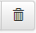

<!-- title: G6K: Administration Guide  -->
<!-- subtitle: Data sources management -->

# Data source

A data source allows a simulator to query the simulation field reference values ​​to perform the simulation.

The data source can be internal, i.e. the values ​​are stored in a database managed by G6K,  
or external, i.e. the values ​​are supplied either via queries on a remote database or via a web service (API).

In all cases, you must declare the source so that it can be used by the simulation engine.

If it is a database (internal or remote), you must also describe the tables and their columns so that the simulation engine can build the queries to find the desired values.

If it is a web service, you must specify the API url and the HTTP method to be implemented (GET or POST).  
The parameters of the API will be defined by the simulator which uses it at the time of creation of the latter.

# Internal data source.

## Creating the data source

Click on « Data sources » of the menu bar

then on  of the left side menu.

**Attributes:**

1. « Name »: Name of the data source without spaces or special or accented characters.
2. « Type »: Type of data source « Internal », « External database » or « External web service (API Rest) ». Choose « Internal ».
3. « Database » / « Type »: The type of database to be chosen according to the RDBMS at your disposal.
4. « Database Name »: Name of the database without spaces or special characters or accented characters.
5. « Database label »: At your convenience.

For databases such as MySQL or PostgreSQL, you must also provide:

* The « Database host »
* The « Database port»
* The « Database user »
* The « Database password ».

The login and password must be provided to you by your database administrator.  
The identifier must have the privilege of creating databases.

You can describe the data source in the « Description » space provided for this purpose.

Click « Save » to save the source.

NOTE: The form does not contain a « Cancel » button. If you want to leave your changes, just go to another page. If necessary, the browser will ask you to confirm the exit of the form page. This is the case for all the input forms presented in this document.

### Creating tables

After the data source is saved, the database is present but does not contain any table. To create one, click the  button in the left side menu.

**Attributes:** 

1. « Name »: Name of the table without spaces or special or accented characters.
2. « Label »:  Title of the table.

You can describe the table in the « Description » space provided for this purpose.

The « Add Field » button allows you to add fields (columns) to the database:

**Attributes:** 

1. « Field »: Name of the field without spaces or special characters or accented.
2. « Type »: Type of field.
3. « Not null »: If the data contained in this field is mandatory, select « Yes » otherwise select « No ».
4. « Label »: Label of the field.

Be sure to add all the required fields before saving.

If you add a field after saving, you will no longer be able to select « Yes » for the « Not Null » attribute. It is a constraint linked to the RDBMS.

The procedure is the same to create another table.

### Table feeding

To save data to the table, click the « Add Record » button.  
A blank line is displayed at the beginning of the table to allow you to enter the values of the record.

Once you have entered the values, click on the « Save » button to save them.  
If you want to change the values, click on the icon: , make the changes and click the « Save » button to save them.  
Finally, if you want to delete a record click on the icon: , 
a « Confirm » button will appear, click to delete the record permanently.

Once confirmed, the record will be deleted from the database, but the line will remain displayed with a « Restore » button if you have made a mistake or changed your mind.

If you click « Restore », the line will be re-registered in the database.

If you do not click « Restore », the next time the page is redisplayed, the record will no longer appear in the list.

### Importing data into tables

Another way to fill your table is to import data in .csv or .txt format from an Excel file.  
If you choose to import data, click the « Import Data » button in the title bar. 

The message « Are you sure you want to import data into the table 'Label of the selected table'? appears, press « OK » to confirm.  
The following screen appears:

In this form, once you have selected the « Text file » from the hard drive of your computer, the « Separator » and the « Delimiter » most appropriate to the format of the file (according to its extension: .csv or .txt) will be proposed to you.

If in your file you have a title line with the column names, make sure that you have named each column with the name of the corresponding field, not the label. You should also verify that the values assigned to the fields match their types (for example, the field « data_1 » contains a date value).

If you chose not to put a title line in your file, uncheck the box next to « Column names in first line? ». In this case, the columns must be presented in the order in which the fields in the table are declared.

Example .csv (DOS or semicolon when recording):

Example .txt (Text Tab separator when recording):

### Modify the structure of a table

The structure of the table (its name, its label, the characteristics of its fields) can be modified within the constraints imposed by the underlying RDBMS.
Fields can be added or deleted.

In the left sidebar, select the source to which the table belongs and click the table label in the top block.

The table information appears, click « Edit table structure » in the title bar:

Confirm the action to display the change form.

The pre-filled change form is the same as the one presented in the « Creating Tables » section at the beginning of this document.  
Refer to this section to follow the procedure.

### Delete a table

In the left sidebar, select the source to which the table belongs and click the table label in the top block.

The information in the table appears, click « Delete » in the title bar:

Confirm the action to permanently delete the table. This operation is irreversible.

## Export a data source

You can export a data source for archiving, broadcasting, or simply importing it into another instance of G6K (see above).

Click « Data sources » from the menu bar.

Then click the data source you want to export in the left sidebar.

Then click the « Export datasource » button in the title bar.

G6K generates two JSON files with the following characteristics:

The first file, whose name is formed with the name of the source followed by the .schema.json extension, describes data contained in the source.  
The description of the data is consistent with the [JSON schema](http://json-schema.org/) specification which is both a description standard and a JSON data validation standard.

The second file, whose name is formed with the name of the source followed by the .json extension, contains the data of the source.

These two files are compressed into a file that also has the name of the source with the .zip extension.  
It is available for download and archiving.

## Edit a data source

Click « Data sources » from the menu bar. 

Then click the data source you want to edit in the left sidebar.

Then click the « Edit datasource » button in the title bar.

Confirm the action to display the change form.

The pre-filled form is the same as the one presented in the « Creating the data Source » section at the beginning of this document.  
Refer to this section to follow the procedure.

## Delete a data source

Click « Data sources » from the menu bar. 

Then click the data source you want to delete in the left sidebar.

Then click the « Drop datasource » button on the title bar.

Confirm the action to permanently delete the source.

This operation is irreversible. If you have exported the data source (see « Export a data Source » earlier in this document), you can re-import the source by following the procedure below.

## Importing the data source

You can import a data source that would have been exported from another instance of G6K.

Extract the 2 files from the archive on your computer.

Click the « Import Datasource » button in the left sidebar.

**Attributes:**

1. « JSON Schema »: Click « Browse... » (or « Choose File ») and select the .schema.json file.
2. « JSON Data »: Click « Browse... » (or « Choose File ») and select the .json file.

# External data source.

## Remote database

### Declaration of the data source

Click « Data sources » from the menu bar. 

then on  from the left side menu.

**Attributes:**

1. « Name »: Name of the data source without spaces or special or accented characters.
2. « Type »: Type of data source « Internal », « External database » or « External web service (API Rest) ». Choose « External database ».
3. « Database » / « Type »: Type of the database (MySQL or PostgreSQL).
4. « Database name »: Name of the database without spaces or special characters or accented characters.
5. « Database label »: At your convenience.
6. « Database host »: The name of the server or its IP address.
7. « Database port »: port number, usually 4 digits.
8. « Database user »: The identifier of a user with the SELECT privilege.
9. « Database password »: The password associated with the identifier.

You can describe the data source in the « Description » space provided for this purpose.

#### Declaration of tables

The declaration of the tables is identical to the creation of the tables of an internal data source.

## Web service

### Declaration of the data source

Click on « Data sources » in the menu bar

then on  from the left side menu.

**Attributes:**

1. « Name »: Name of the data source without spaces or special or accented characters.
2. « Type »: Type of data source « Internal », « External database » or « External web service (API Rest) ». Choose « External web service (API Rest) ».
3. « URI »: URI of the webservice without parameters.
4. « Method »: GET (the parameters are added to the URI) or POST (the parameters are transmitted in the body of the HTTP message).

You can describe the data source in the « Description » space provided for this purpose.

The parameters transmitted to the API are defined by each of the simulators using the API.

If the URI of the webservice has a fixed path independent of the requests, make it appear in the URI.

If there is a variable path based on queries submitted to the web service, do not put it in the URI, it will be up to the simulator to complete the URI with the appropriate path.