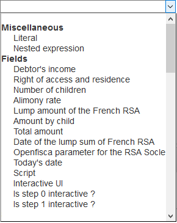
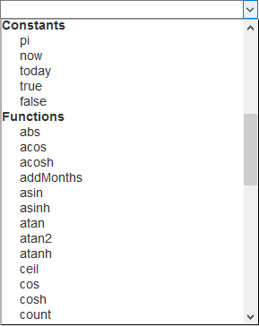
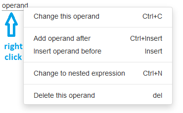
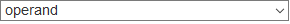
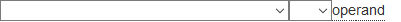

<!-- title: G6K: Administration guide  -->
<!-- subtitle: Composition of expressions -->

# Expressions

Expressions are mathematical formulas evaluated by G6K to perform a simulation.

An expression is a combination of operands and operators.
<pre>
&lt;expression&gt;: &lt;operand&gt;[&lt;operator&gt;&lt;operand&gt;]
&lt;operand&gt;: &lt;expression>|&lt;operand&gt;
</pre>

G6K has a component for entering expressions.

This component is used:

* for the constitution of the filters of the access requests to the reference data sources
* to calculate the default value, the minimum value, the maximum value or the content of a data
* for the constitution of the conditions of business rules

## Composition of an expression

To compose an expression, click on the list box 

So, you can select the elements that make up an operand:

* literal value
* constant
* data (field)
* function
* nested expression

 

These elements are described below:

### Operands

#### Miscellaneous

| Name              | Description |
| ----------------- | ------------- |
| Literal           | Lets you enters a literal value. After selecting this item, the input field appears: . Enter the value and press the "Enter" key. The word « Literal » is replaced by the value entered. |
| Nested expression | Lets you put part of the expression in brackets. After selecting this element, the list box is enclosed in parentheses:  |

#### Fields

The list of fields is made up of the labels of the data you have defined ("Datas" panel).

To insert a field into the expression, select it from the list.

#### Constants

| Name  | Description                     |
| ----- | ------------------------------- |
| pi    | 3,14159                         |
| now   | Date of simulation day          |
| today | Alias ​​from now                  |
| true  | Boolean 'true'                  |
| false | Boolean 'false'                 |

#### Functions

| Function        | Description   | Number of arguments | Type returned |
|-----------------|---------------|:-------------------:|---------------|
| abs             | returns the absolute value of the numeric argument | 1 | number |
| acos            | returns the arc cosine of the value passed in argument | 1 | number |
| acosh           | returns the hyperbolic cosine arc of the value passed in argument | 1 | number |
| addMonths       | adds the number of months in argument 1 to the date in argument 2 and returns the result date | 2 | date |
| asin            | returns the sine arc of the value passed in argument | 1 | number |
| asinh           | returns the hyperbolic sine arc of the value passed in argument | 1 | number |
| atan            | returns the arc tangent of the value passed in argument | 1 | number |
| atan2           | returns the arc tangent 2 of the value passed in argument | 1 | number |
| atanh           | returns the hyperbolic tangent arc of the value passed in argument | 1 | number |
| ceil            | returns the smallest integer value greater than or equal to the value passed in argument | 1 | number |
| cos             | returns the cosine of the value passed in argument | 1 | number |
| cos             | returns the cosine of the value passed in argument | 1 | number |
| count           | returns the number of non-zero arguments | unlimited | number |
| day             | returns the day (1 to 31) extracted from the date provided in argument | 1 | number |
| exp             | returns the exponential of the value passed in argument, ie the value of e scope to the power of the argument | 1 | number |
| firstDayOfMonth | returns the date corresponding to the first day of the month, calculated from the date given in argument | 1 | date |
| floor           | returns the largest integer value less than or equal to the value passed in argument | 1 | number |
| fullmonth       | returns the plaintext of the month extracted from the date given as argument | 1 | |
| get             | returns the element of the list in argument 1 in position given in argument 2 | 2 | text |
| lastday         | returns the last day of the month (1 to 31) calculated from the month (1 to 12) in argument 1 and the year in argument 2 | 2 | number |
| lastDayOfMonth  | returns the date corresponding to the last day of the month, calculated from the date provided in argument | 1 | date |
| length          | returns the length of the string passed as argument | 1 | integer |
| log             | returns the logarithm of the value passed in argument | 1 | number |
| log10           | returns the base 10 logarithm of the value passed in argument | 1 | number |
| lower           | converts the string to lowercase letters | 1 | text |
| match           | returns true if the text in argument 2 corresponds to the regular expression in argument 1, false otherwise | 2 | boolean |
| max             | returns the largest of the values ​​provided in arguments | unlimited | number |
| min             | returns the smallest of the values ​​provided in arguments | unlimited | number |
| money           | converts the amount provided in argument to a string | 1 | text |
| month           | returns the month (1 to 12) extracted from the given date in argument | 1 | number |
| nextWorkDay     | return on working day (taking account of bank holidays) according to the date provided in argument | 1 | date |
| pow             | returns the value of the argument 1 high to the power of the value of the argument 2 | 2 | number |
| rand            | returns a random value between 0 and 1 inclusive with the argument as the starting value | 1 | number |
| replace         | replaces all occurrences of argument 1 in argument 3 with the value of argument 2 | 3 | text |
| round           | rounding the value of argument 1 to the nearest value with the number of decimals passed in argument 2 | 2 | number |
| sin             | returns the sine of the value passed in argument | 1 | number |
| sinh            | returns the hyperbolic sine of the value passed in argument | 1 | number |
| size            | returns the number of elements in the supplied list e argument | 1 | number |
| split           | transforms the string provided in argument 2 into a list according to the regular expression in argument 1 | 2 | list |
| sqrt            | returns the square root of the value passed in argument | 1 | number |
| sum             | returns the sum of arguments | unlimited | number |
| tan             | returns the tangent of the value passed in argument | 1 | number |
| tanh            | returns the hyperbolic tangent of the value passed in argument | 1 | number |
| upper           | converts the string to uppercase | 1 | text |
| workdays        | returns the number of working days (taking into account the holidays) between the two dates provided in arguments. | 2 | number |
| workdaysofmonth | returns the number of working days (taking into account the holidays) of the month calculated from the month (1 to 12) in argument 2 and the year in argument 1 | 2 | number |
| year            | returns the extracted year |

After selection of the function, a list box by argument is displayed, allowing you to enter the arguments of the function. These arguments are also expressions.

When you have finished entering the operand, it is displayed underlined.
Thus, element names and opening parentheses are underlined.

This operand may be sufficient to constitute an expression, but you can combine it with other operands to compose a more "complex" expression.
To do this, right-click an underlined item and the following menu appears:



| Menu Item                   | Description             |
|-----------------------------|-------------------------|
| Change this operand         | Replaces the underlined element with a list box:  allowing you to replace the operand |
| Add operand after           | Adds a list box of operators  after the underlined element so you can select the operator that will combine the two operands. Once the operator is selected, a list box is displayed for the second operand.<br>Operators are defined in the following paragraph.
| Add operand before          | Adds a list box of operands for the second operand and a list box of operators to combine the two operands  before the underlined element.<br>Operators are defined in the following paragraph.
| Change to nested expression | Replaces the underlined element with a list box enclosed in parenthesis:  |
| Delete this operand         | Deletes the underlined operand. |

### Operators


| Symbol   | Description |
|:--------:|------------------------------|
|    +     | Addition                     |
|    -     | Subtraction                  |
|    *     | Multiplication               |
|    /     | Division                     |
|    %     | Rest of the entire division  |
|    &     | Bit-to-bit operator 'AND'    |
|    \|    | Bit-to-bit operator 'OR'     |

## Example of expression

In the demo simulator provided with G6K for the calculation of maintenance allowance, the "Amount per child" data is calculated with the following expression:

```max(0, round((Debtor's income - Lump amount of the French RSA) * Alimony rate / 100))```

In this expression « Debtor's income », « Lump amount of the French RSA » and « Alimony rate » are fields (data), « max » and « round » are functions, « 0 » and « 100 » are literal values, « - », « * » and « / »  are operators.
