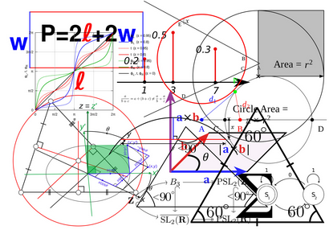

<!-- title: G6K: Administration guide  -->
<!-- subtitle: Tutorials -->

	

		

			
		

		

			<h1>Simulators</h1>
			A calculation simulator is an online service made available to a user to enable them to calculate the results (taxes, social benefits, etc.) corresponding to their particular situation. 
			 
			The results are calculated on the basis of data supplied by the user, reference data (e.g. amount of a tax) and business rules reflecting the current legislation in the field of simulation. 
			 
			<a href="simulators-management.html">
				View the documentation&nbsp;&nbsp;
			</a>
		

	

	

		

			<h1>Data sources</h1>
			A data source allows a simulator to query the simulation field reference values ​​to perform the simulation. 
			 
			The data source can be internal, i.e. the values ​​are stored in a database managed by G6K,  
			or external, i.e. the values ​​are supplied either via queries on a remote database or via a web service (API). 
			 
			<a href="datasources-management.html">
				View the documentation&nbsp;&nbsp;
			</a>
		

		

			
		

	

	

		

			
		

		

			<h1>Views</h1>
			Views are design elements of pages and styles in which the simulators are integrated. 
			They are composed of « Templates » and « Assets ». 
			 
			<a href="views-management.html">
				View the documentation&nbsp;&nbsp;
			</a>
		

	

	

		

			<h1>Users</h1>
			G6K has an interface allowing you to manage the user accounts that are authorized to access either the G6K administration module or the protected access simulators. 
			 
			<a href="users-management.html">
				View the documentation&nbsp;&nbsp;
			</a>
		

		

			
		

	

