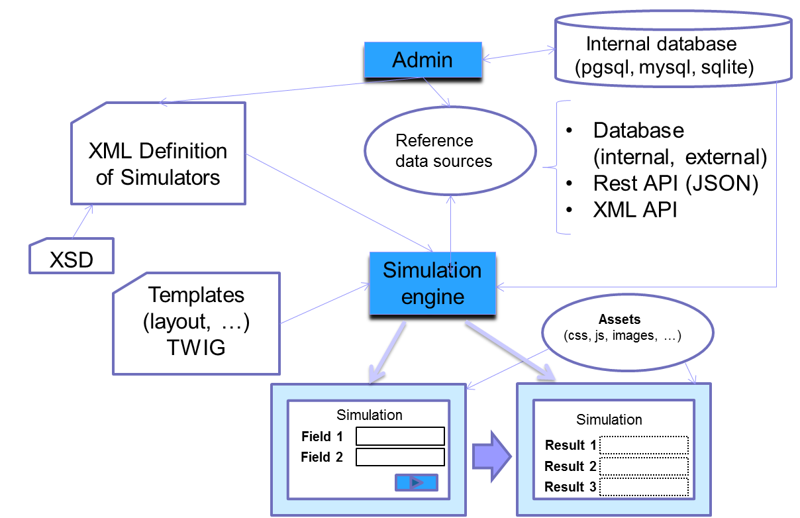

<!-- title: G6K: Calculation simulation engine  -->
<!-- subtitle: Learn more ... -->

# What is it ?

G6K is a tool that enables the creation and online publishing of calculation simulators without coding. It has a simulation engine and an administration module.

A calculation simulator is an online service made available to a user to enable them to calculate the results (taxes, social benefits, etc.) corresponding to their particular situation. The results are calculated on the basis of data supplied by the user, reference data (eg amount of a tax) and business rules reflecting the current legislation in the field of simulation.

# How does it work  ?

 

An administrator or a contributor defines the data to be requested to the user via forms and the results to be returned (possibly via intermediate calculation data).

The administrator stages the simulation by defining simulation steps. Each step consists of a form allowing the input or output of the previously defined data.

The administrator defines reference data sources that can be:

* external and accessible via web services or sql requests;
* or internal, stored in a G6K database.

The administrator or contributor defines rules (called "business rules in G6K) and calculations to be applied in the domain of simulation.

Data, data sources, steps, and business rules are saved in an XML file.

G6K has a simulation engine to "run" the simulation using the definitions contained in the XML file and data sources.

# Features of the simulation engine

- Analysis of the Definition XML file
- Loading and feeding templates
- Displaying Input Forms
- Control of data entered
- Access to baseline data
- Evaluation of calculation formulas
- Implementation of business rules
- Management of the simulation stages (information acquisition steps, the results restitution step)

# Main functions of the administration module

- Data definition:
    - entered by the user
    - intermediate
    - in data source
    - result
- Definition of calculations
- Definition of business rules
- Definition of texts (fields, help, notes ...)
- Definition of internal and external data sources
- Definition of simulation steps
- Update of internal "reference data"
