<!-- title: G6K: Administration guide  -->
<!-- subtitle: Simulators management -->

CAUTION: This document, which is under development, is very incomplete.

# Simulators

A calculation simulator is an online service made available to a user to enable them to calculate the results (taxes, social benefits, etc.) corresponding to their particular situation.

The results are calculated on the basis of data supplied by the user, reference data (e.g. amount of a tax) and business rules reflecting the current legislation in the field of simulation.

Creating simulators is reserved for users with the « Manager », « Administrator » or « Super Administrator » role.

# Before you begin

Before starting to enter the simulator, think carefully about the simulation scenario, that is, its step-by-step division and their sequence. A simulation step corresponds to a page and vice versa.

In each page, it is necessary to define the information that will be requested from the user (via a form) and those that are restituted to him. A page may also contain blocks of information.

The information returned is either reference data or data from the result of a calculation according to calculation rules (legislation).

It is therefore necessary to make an inventory of all these data:

* Data entered by the user
* Reference data (e.g. amount of SMIC, RSA, ceiling safety, various scales, ...)
* Data from a calculation
* Data resulting from an intermediate calculation.

For the reference data, the question of the data source must be asked. Is there an internal or external web service API or a database to retrieve these data?

If so, it will be possible to set this API or this database in G6K to be able to access it.

Otherwise, it will be necessary to create an internal data source (database) in G6K. Note that simple values ​​(such as the amount of the RSA) can be set constantly in the simulator, thus avoiding the creation of a data source. On the other hand, complex data structures (such as a scale) require the creation of an internal data source.

Then, it is advisable to identify all the elements of a page, name them, label them:

1. Give a name to the simulator, the one that will appear in the url
2. Give a title to the simulator. This title will appear on each page underneath the breadcrumb navigation.
3. Define a hat description that will appear on each page of the simulation below the title
4. For each step:
  * Give a short name to the step and a label (not too long). The short name will appear in the breadcrumb sequence.
  * Define the information (fields) that will be requested or restored to the user
  * For each field:
      - Give it a name and label (label)
      - Assign a type (date, integer, amount, percentage, choice list, ...)
      - Describe the field (this description can be used as a tooltip)
      - Describe the conditions ^1^ to display the field
      - Define its use (user input or restitution)
      - If this is an input field:
          * Define input controls and associated error messages.
          * Possibly define a statement that may appear above or below the input field.
      - If it is a field of restitution:
          * Define the rules for establishing the value of the field (calculation, data source, ...)
      - Possibly define footnotes and conditions ^1^ of their display.
      - Define navigation buttons between the steps (next step, previous, new simulation, jump to step N) and their display condition.

# Creating a data source

If you need a reference data source and it does not yet exist, you must create it before creating the simulator.

Refer to [« Data Sources management »](datasources-management.html) in the documentation.

# Creating a simulator

Click on « Simulators » from the menu bar:

then click the  button on the left side menu.

A form for entering the general parameters of the simulator is proposed to you:

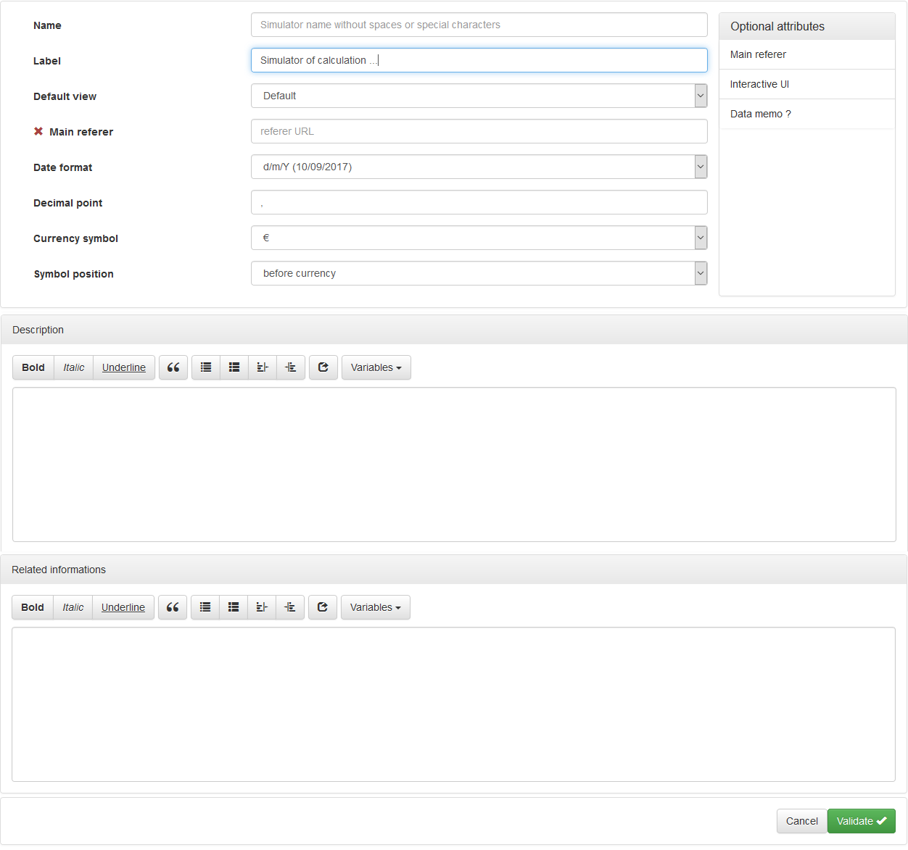

**Attributes:**
 
1. « Name »: This is the name that will be displayed in the URL (* .../calcul/simulator-name *) and the .XML file created when the simulator was registered.
The simulator will be saved as <simulator-name>.xml in the G6K simulator directory.
2. « Label »: Title that will be displayed on the page of your simulator.
3. « Default view »: View with which your simulator will be displayed.
The view is a set of templates and styles used to display the simulator.
For more information on views, see the [Views management](views-management.html) page of the documentation.
4. « Date format »: To be selected according to the format of display and the most commonly used dates in the country.
5. « Decimal point »: To be selected according to the display format of the numerical values ​​(amount, percentages, ...) desired.
6. « Currency symbol »: To be chosen according to the country.
7. « Symbol position »: To be chosen according to the country.

**Optional attributes:**

1. « Main Referer »: URL of the site page that calls the simulator.
G6K constructs a navigation line where the penultimate element is constructed with this URL and the label of the simulator.
2. « Interactive UI »: If this option is checked, the simulation engine will use Javascript to give interactivity to the simulation (recommended)
3. « Data Memo »: If this option is checked, the simulation engine will be allowed to save the value of certain fields in the browser cookies for later use. Useful for a value like date of birth.

Describe what your simulator does in the « Description » field.
This description will be displayed below the simulator label/title of all pages/simulation steps.

Optionally, you can enter additional information in the « Related Informations » field that the view template will display or not.

When you have finished entering the parameters and clicking on the button , the  button appears at the top right of the page.
This button allows you to send the entered or modified information to the server at any time, because the « Validate » button only keeps the information in the memory of your computer.

## Used data sources
 
In the « Used data sources » fold-out panel you will be able to define the specific requests for access to the datasources reference data.
Some of these queries may require parameters that must be defined in the « Data » panel beforehand.

In the title bar of the « Used data sources » panel, click the « Add » button to display the screen for selecting the source and defining a query:

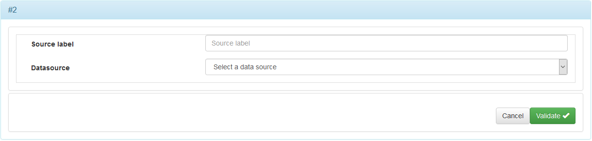

**Attributes:**

1. « Datasource »: Corresponds to the data source to which the request relates.

**Optional attribute:**

1. « Source label »: Title to be given to the source for this request.

Once the source is selected, the form completes the definition fields of the query.

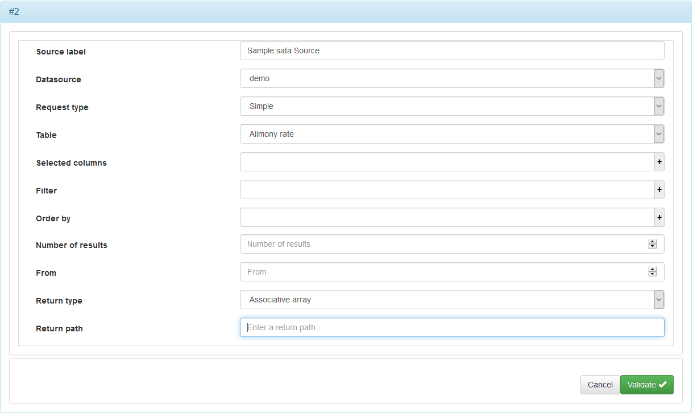

### Simple query

A query is simple if it relates to only one table and does not have a nested subquery.  
The form allows you to build simple queries without having to know the SQL language.

**Attributes:**

1. « Request type »: The queries are either « Simple », that is, you are guided by the menu, or of type « Complex » in this case you will be free to type your queries with the SQL language. If the query is for a single table and does not have a nested query, choose the « Simple » type, otherwise choose the « Complex » type.
2. « Table »: Name of the table to which the request relates.
3. « Selected Columns »: Fields/columns of the table that contain the data you want to retrieve.
To enter a column, click the '+' to the right of the field and select the column from the drop-down list.
You can also compose an expression in which case you will need to define an alias as the column name.
To delete a column, click the 'x' to the left of the column name.
4. « Filter »: Requirements for fields/columns to keep only the rows of the result of the query complying with these conditions.
5. « Order by »: Sort in ascending or descending order on the selected fields/columns.
To enter a column, do as in & nbsp; 3., And then select the sort order (ascending or descending).
6. « Number of Results »: Include the number of rows that should be retained among all « rows » of results returned by the query. Set 0 if all lines are to be retained.
7. « From »: From all « rows » of results returned by the query, indicate the number of the first line that must be taken into account for processing the query. The number of the first line is 0, 1 the second and so on.
8. « Return type »:
  * « JSON »: format for the exchange of data in readable text.
  * « XML »: format of description of the data.
  * « Single value »: N/A.
  * « Key / value pairs »: Table of key / value pairs.
  * « HTML »: data format designed to represent web pages.
  * « CSV »: open computer format representing data in comma-separated values.
9. « Return path »: The path depends on the format of the data being returned:
  * « JSON »: Path to [JsonPath](http://goessner.net/articles/JsonPath/) or [Xpath](http://xmlfr.org/w3c/TR/xpath/)
  * « XML »: Path in the format [Xpath](http://xmlfr.org/w3c/TR/xpath/)
  * « Single Value »: N/A
  * « Key/value pair (table) »: path in the form « Line number/column name » (example: 0/rate: rate column of line 1)

To construct the query, refer to the [Visual Component Manufacturing Simple Queries](source-query-builder.html) documentation

If the query contains a variable parameter, you must first declare a data (see « Data » section below) which will contain the value of the parameter.

Then, validate the entry without entering the filter at first. Click on the « Edit » button. The  button appears at the bottom right of the form to allow you to declare the parameter.  
After you declare the parameter, you can enter the filter and select the parameter of the expression.

**Parameter attributes:**

1. « Name »: Parameter name without spaces or special or accented characters.
2. « Provenance »: Origin of the parameter either « Data » or « Constant ».
3. « Data »: The name of the data you are going to work with.

**Optional attribute of parameters:**

1. « Optional »: Optional parameter or not. A parameter can only be optional if it is used by a request to a « Web service » data source

Figure 1: Data source with a simple query and parameter

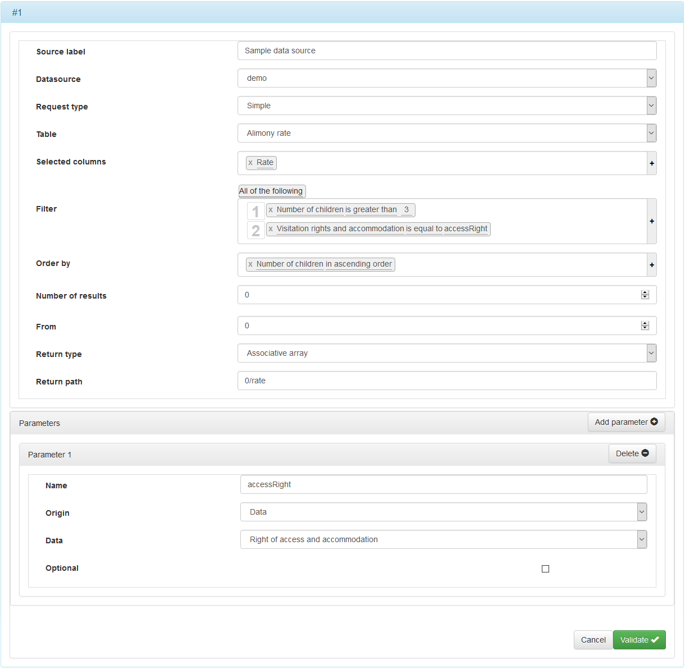

Once the input is validated, the following screen is displayed:

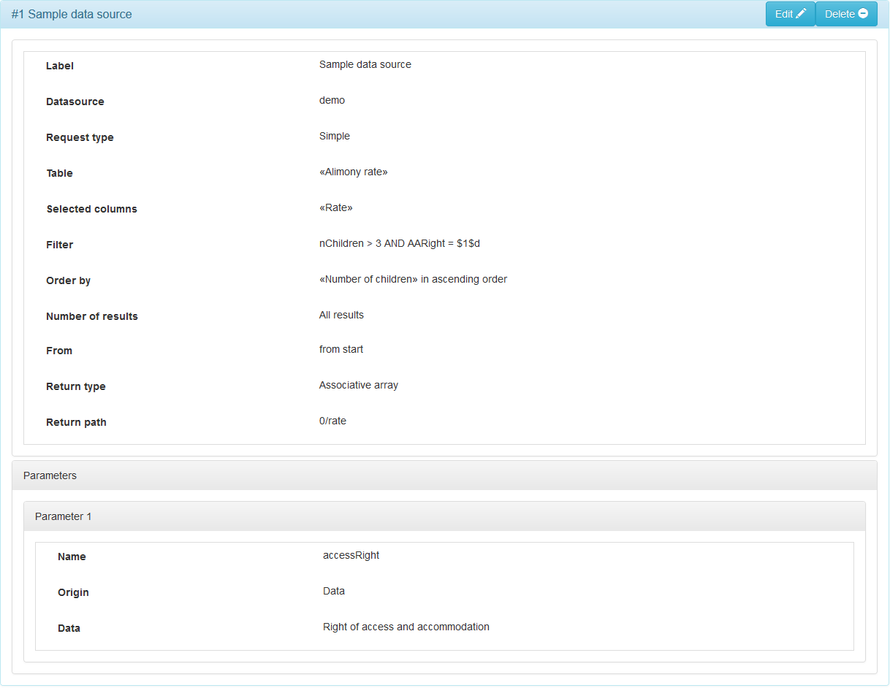

This query will return an array of « 'rate'/rate value » pairs. The specified return path (0/rate) will select the first row of the array and the value corresponding to 'rate'. We will see later how to declare a data to store the value of the rate.

### Complex query

In this case, the fields « Table », « Selected Columns », « Filter », « Order by », « Number of Results » and « From » are replaced by the « Request » field since those elements are contained in the request.

As with simple queries, parameters can be used.  
The forms $X$d where X is the number of the parameter, refer to integer values, $X$f to decimal values and $X$s to alphanumeric values.

**Attributes:**

1. « Request type »: Choose the « Complex » type.
2. « Request »: The SQL request.
3. « Return type »:
  * « JSON »: format for the exchange of data in readable text.
  * « XML »: format of description of the data.
  * « Single value »: N/A.
  * « Key / value pairs »: Table of key / value pairs.
  * « HTML »: data format designed to represent web pages.
  * « CSV »: open computer format representing data in comma-separated values.
4. « Return path »: The path depends on the format of the data being returned:
  * « JSON »: Path to [JsonPath](http://goessner.net/articles/JsonPath/) or [Xpath](http://xmlfr.org/w3c/TR/xpath/)
  * « XML »: Path in the format [Xpath](http://xmlfr.org/w3c/TR/xpath/)
  * « Single Value »: N/A
  * « Key/value pair (table) »: path in the form « Line number/column name » (example: 0/rate: rate column of line 1)

Figure 2: Data source with complex query

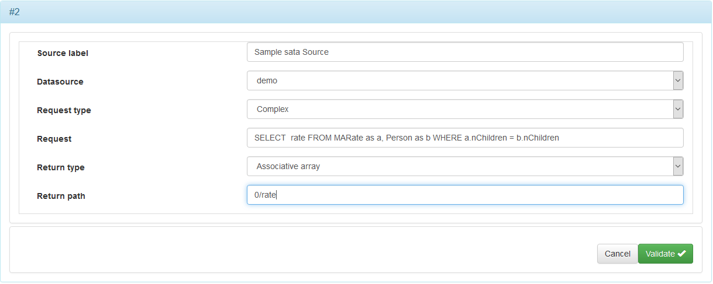

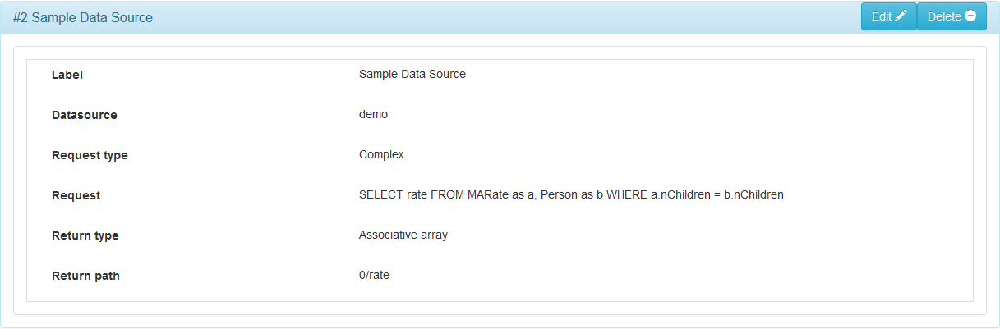

## Data

The data allow to store values whatever their origin (user input, data source, element or result of calculations).
They can be grouped into groups of data, allowing them to be arranged in the rows of a table (see « Grid layout » for a group of fields later in this document).

To add a data or  a data group, click « Add » in the title bar « Datas » and then click « Add data » or « Add datagroup » depending on the case.

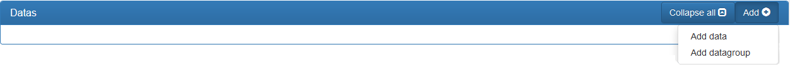

Figure 3 : Form for adding a data group

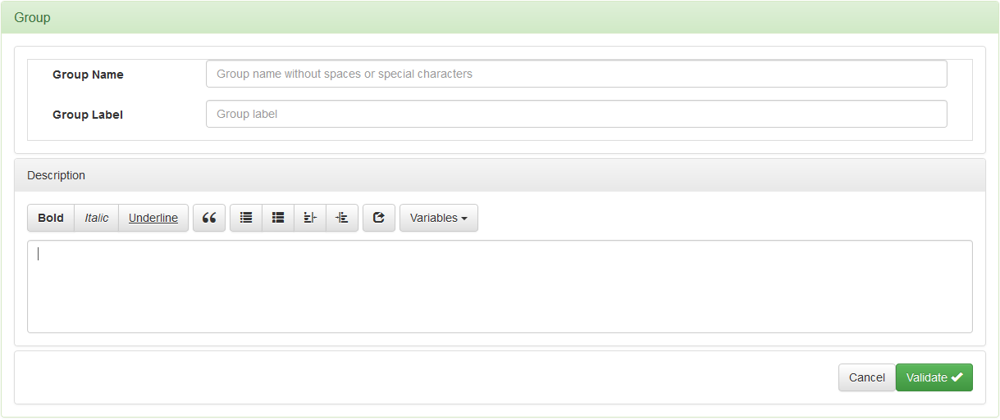

**Attributes:**

1. « Group Name »: Name of the data group without spaces or special or accented characters.
2. « Group Label »: Title of the data group that can be selected when defining fields groups of the step, business rules, or profiles.

Give a description of the data group in the "Description" field.

Figure 4 : Form for adding a data

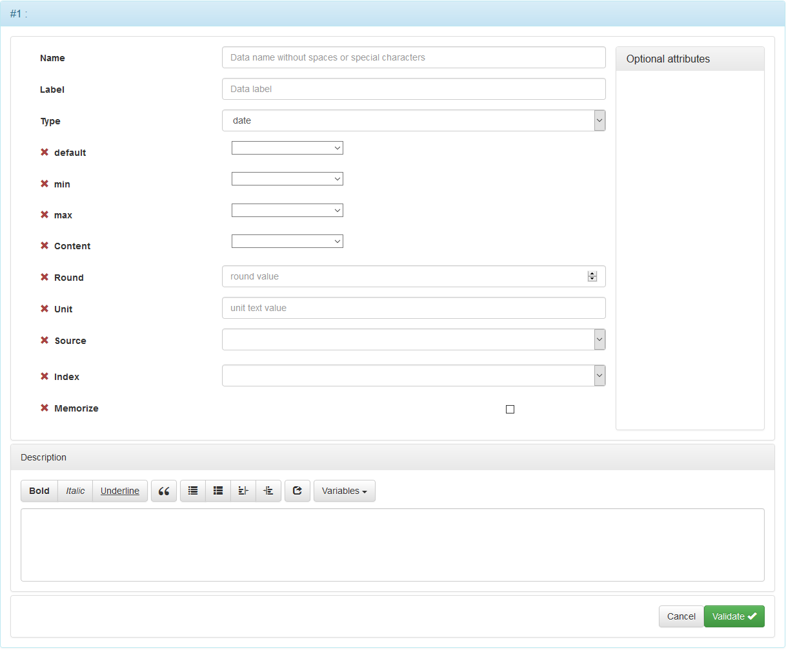

**Attributes:**

1. « Name »: Name of the data without spaces or special or accented characters.
2. « Label »: Label of the data that can be selected in the step fields, in the profiles.
3. « Type »: To be selected according to the desired data format.

**Data type**

| Type        | Description                             |
|-------------|-----------------------------------------|
| date        | Date in the format defined in the simulator options. See supra. If the data is associated with an input field, a date picker will be proposed to the user.|
| day         | Day number from 1 to 31.|
| month       | Number of months from 1 to 12.|
| year        | Year in 4 digits.|
| boolean     | Boolean value (0/1). If the data is associated with an input field, a check cache will be offered to the user.|
| integer     | Integer value.|
| number      | Decimal value with decimal point.|
| text        | Alphanumeric value.|
| textarea    | Alphanumeric value with enrichment (bold, italic, underline, ...).|
| money       | Monetary value to 2 decimals.|
| choice      | Value that can be selected from a drop-down list or with radio buttons.|
| multichoice | Values ​​selected using check boxes.|
| percent     | Percentage from 0 to 100, possibly with decimal values.​​|
| array       | List of values. Can not be used for input.|
| table       | Table of values. Can not be used for input.|
| department  | Department code. If the data is associated with an input field, the user chooses from a drop-down list.|
| region      | Region code. If the data is associated with an input field, the user chooses from a drop-down list.|
| country     | Country name.|

**Optional attributes:**

1. « Default »: Default value of the data.
2. « Min »: The minimum value of the data for numeric data.
3. « Max »: The maximum value of the data for numeric data.
4. « Content »: Unconditional expression to be assigned to the data. For the composition of the expression, refer to [Composition of expressions](expression-builder.html).
5. « Round »: Can be used with « Decimal Number » data. Allows you to set the decimal place after the decimal point. The last decimal place is rounded.
6. « Unit »: Characterizes a numerical value such as "miles", "liters", "ampere", etc. The unit is displayed after the field.
7. « Source »: If the data is to be supplied by a data source defined in the "Used datasources" panel.
8. « Index »: Corresponds to the field returned by the request to supply the data.
9. « Memorize »: Keep in memory (user's cookie) the value so that the user does not have to re-enter it (see attribute « Memo » of the simulator)

Give a description of the data in the "Description" field. This description can be displayed in a tooltip at the request of the user.

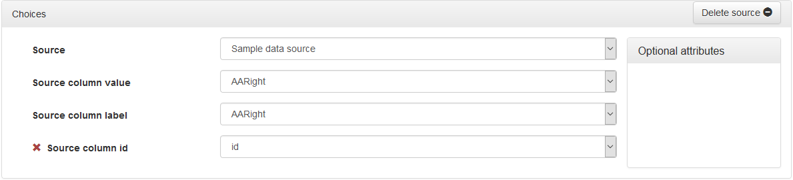

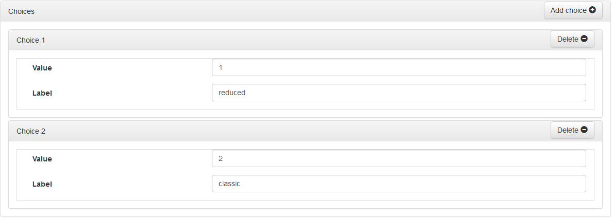

## Steps

Once you have defined your data sources and data you will be able to start setting up the step(s) of your simulator.

A step consists of one or more panels in which are arranged information blocks and groups of fields in the order in which they are declared.

The information blocks are composed of chapters themselves, which are composed of sections.

Field groups are composed of fields that can be arranged in three different ways:

* « Classic »: The fields and their labels are displayed in a classical way, that is to say one below the other.
* « Grid »: The fields are arranged in rows in the form of tables. The data associated with the fields in a row must be grouped into « data groups » (see below). Field labels are ignored.
* « Online »: The fields and their labels are arranged one after the other in order to form a sentence.

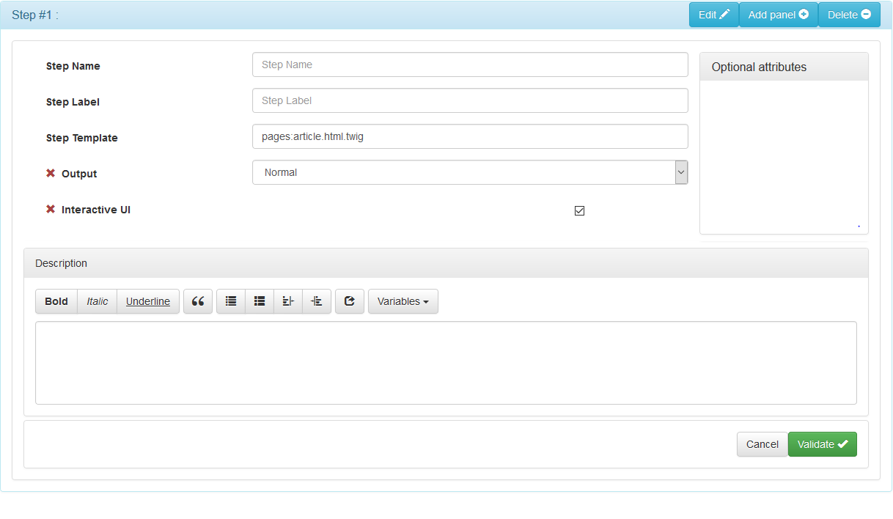

**Attributes:**

1. « Name »: Name of the step without spaces or special or accented characters.
2. « Step Label »: Title of the step to be displayed.
3. « Step display template »:

**Optional attributes:**

1. « Output »: 
2. « Interactive UI »:

### Panels

The panels compose the steps and are themselves made up of groups of fields.
If there are several panels, they will be presented in the form of tabs:

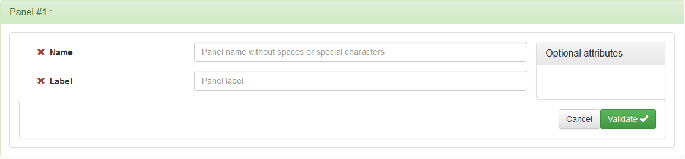

**Attributes:**

1. « Name »: Name of the panel without spaces or special or accented characters. 

***Optional attribute:***

1. « Label »: Panel label

#### Fields set

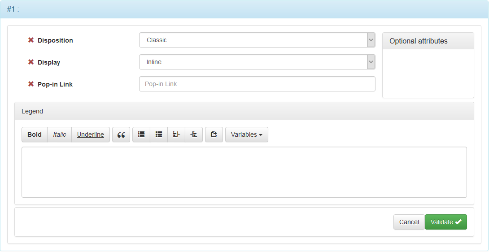

**Attributes:**

1. « Disposition »: Classic, grid or online.
2. « Display »: Online or pop-in.

**Optional attribute:**

1. « Pop-in activation link »:

##### Fields 

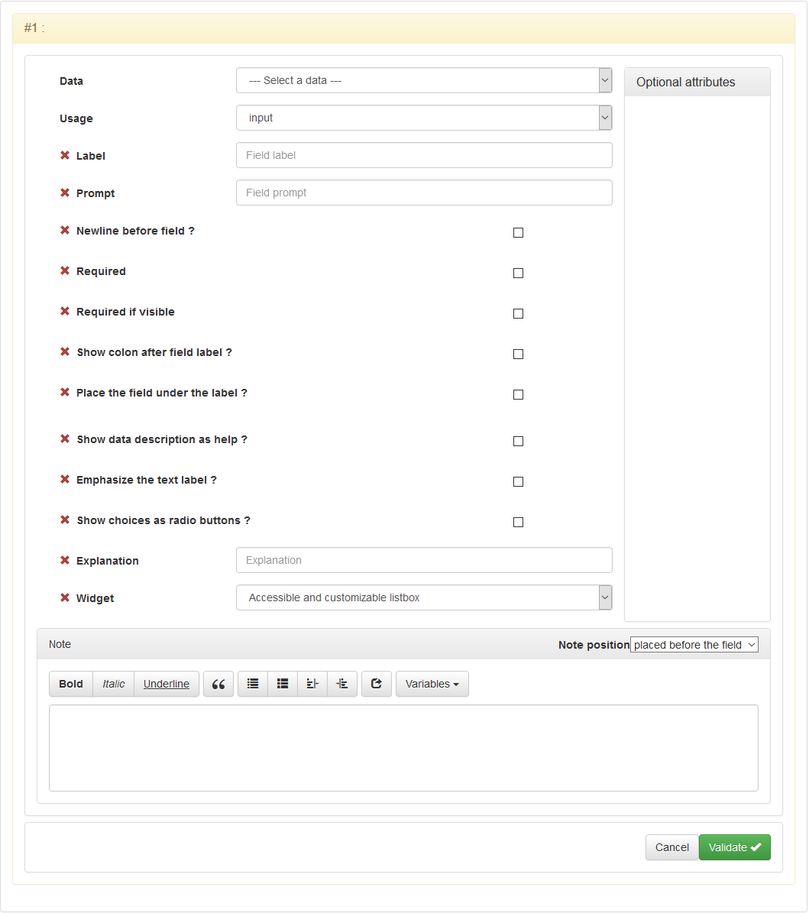

**Attributes:**

1. « Data »: Data associated with the field. If it is an input field, it is in this data that the value entered by the user will be stored. If it is a field of restitution, it is the content of this data that will be displayed in the field.
2. « Usage »: User input or restitution to the user.

**Optional attributes:**

1. « Label »: Label of the field.
2. « Required »: Required field (An error message will be displayed if the field is not filled in).
3. « Show after the field label?  »: To choose according to your needs.
4. « Use data description as help?  »: To choose according to your needs.
5. Prompt »:
6. « Line jump before field? »  »: To choose according to your needs.
7. « Required if visible »: When the field is visible it can be decided that it is required.
8. « Place the field under the field label?  »: To choose according to your needs.
9. « Highlight the field label?  »: To choose according to your needs.
10. « Show choices with radio buttons? » Do not use for long lists of choices.
11. « Explanation »: To be chosen according to your needs.
12. « Widget »: To be chosen according to your needs:
  * « List box conforming to RGAA »: List box according to the General Repository of Accessibility for the Administration.
  * « List box with auto-completion »: When entering the auto-completion is done automatically, this allows the user to find the item he is looking for.
  * « Postal code obtained by self-completion on the name of the municipality or its postal code »: Allows the user to take advantage of the self-completion concerning the name of the commune or its postal code.
  * « INSEE code obtained by self-completion on the name of the commune or its postal code »: Allows the user to benefit from the self-completion concerning the name of the commune or its postal code.
  * «Insee code derived from a card of France»: A map appears and leaves the choice to the user to geolocate or not.
  * « RGAA-compliant date selector »: Allows the user to select a date.
  * « Form Field Editor »:

#### Blocks of information

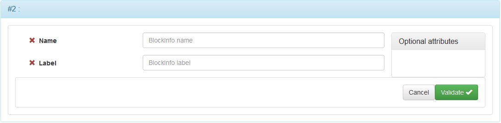

**Optional attributes:**

##### Chapter

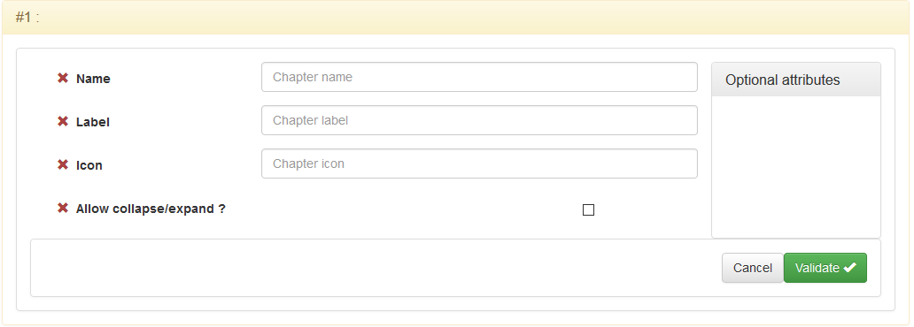

**Optional attributes:**

###### Section

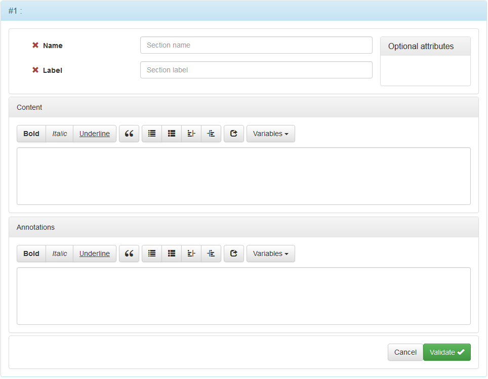

**Optional attributes:**

### Footnotes

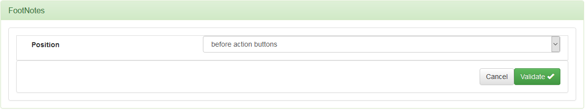

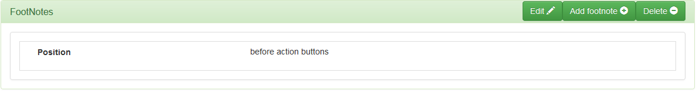

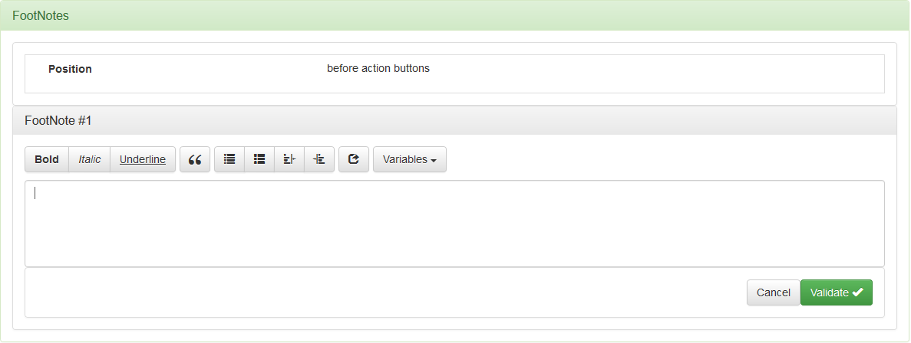
 
### Action Buttons
 
The action buttons allow you to go from one step to another or to reset a form.

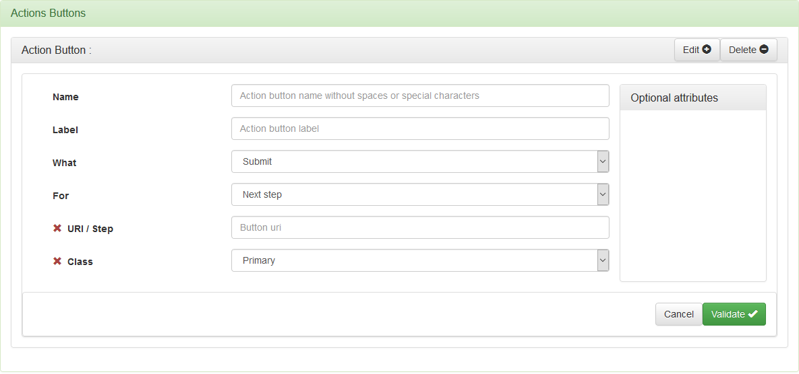

**Attributes:**

1. « Name »: The data that will be displayed to users.
2. « Label »: Entered by the user or returned to the user.
3. « What »: Submit the form and go to the step defined by the attribute « To » or reset.
4. « For »: To choose according to your needs.

**Optional attributes:**

1. « URI / Step »: Title of the field.
2. « Class »: Level of importance of the « Main » button the button will be put forward visually and « Secondary » the button will not be put forward visually.

## Business rules

Business rules are defined in the following way: « When ... » condition, « Then ... » actions and « Else ... » actions.

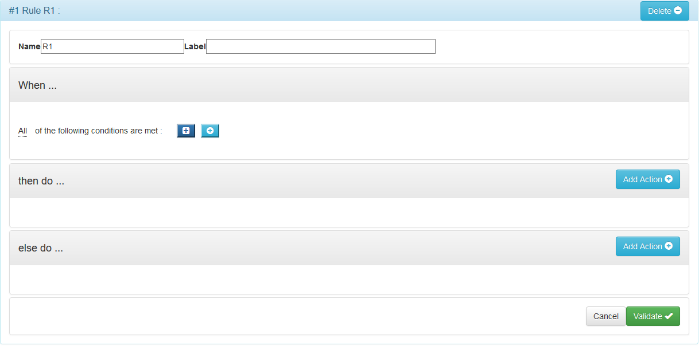

It is the « business rules » that determine the behavior of the simulator. They are triggered when the context changes.

A change of context always results in the acquisition or modification of data.

G6k inquiries about the context change by reverting the conditions associated with the rules when the value of a data changes.

Thus, when the user enters a value, g6K accesses a reference data or a value is calculated, the impacted rules are triggered and the associated actions are performed:

The actions that can be carried out are:

* Show or hide part of the page (a field, a fields set, a panel, a button, ...)
* Display an error or warning message
* Perform a calculation and assign it to a data

Refer to the [Business Rules Composition](business-rules.html) page for how to compose a rule.

## Profiles

When you define profiles, you will pre-define data related to the different profiles.

Profiles can correspond to types of people e.g. predefined data for a professional differ from pre-filled data of an individual.

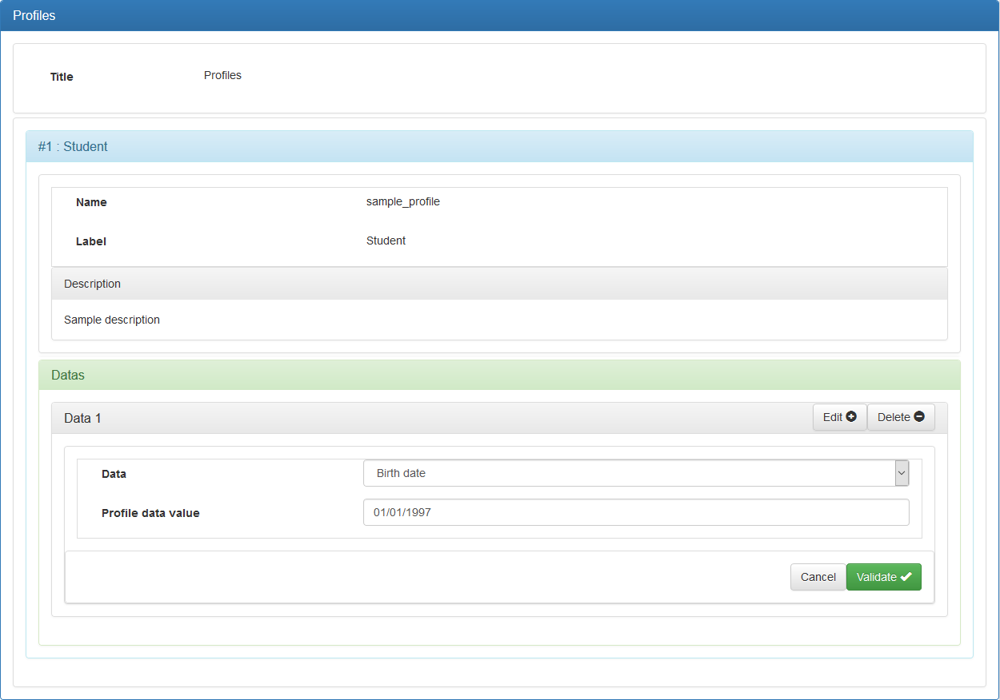

**Attributes:**

1. « Title »: Title of your profiles.
2. « Name »: Name of the profile.
3. « Label »: The label of the profile.
4. « Data »/« Add »: Add data to be filled in.
5. « Data »: Choice of the data to be filled.
6. « Value »: Pre-filled value.

## Simulator registration

At the end of your entry, click the  button at the top right of the page to save your work.

Note that G6K saves a version of « work » that it will be necessary to « Publish ».