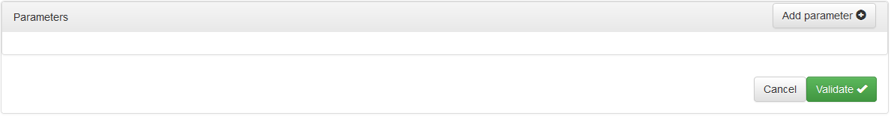

<!-- title: G6K: Administration guide  -->
<!-- subtitle: Visual component for making simple queries -->

# Overview

This UI component is a visual wizard for composing simple database access requests for reference data sources.

A simple query is a query that relates to only one table and does not contain nested queries.

The result of executing the query is a set of result lines that can be filtered in two ways:

* either by keeping only the lines that meet a certain condition
* either by keeping only p lines from line number q (the lines are numbered from 0 to n)

Conditions are expressions that are composed with the name of the columns

The result rows include only the columns that have been selected and can be sorted in a specific order.

# Usage

This component is used in the « Simulators » pane of the administration module. See the [Used datasources](simulators-management.html#used-data-sources) section of the Simulator Management Guide.

In the data source definition form you have opened, only the part concerning the following simple queries is covered in this document:

## Selection of the table

In the list box of the « Table » field, only tables of the data source chosen in the « Simulators » pane are available. Select the table to which the request is made.

## Selection of  columns

Columns are the values of the fields in the table that you want to retrieve after query execution.

G6K allows to define pseudo-columns using expressions.  
These expressions usually contain actual column names from the table, but they are not required.  
The pseudo-columns must have an alias name that allows them to be referenced as a result index in the simulator.

To define a column or a pseudo-column, click in the « Selected Columns » field or the « + » sign to the right of the field:

In front of the list box that was displayed, the « X » allows to delete the column.

Click on the list box:

then select the table field or refer to the [Composition of expressions](expression-builder.html) page to compose a pseudo-column.

The functions are specific to the database of the source, they are defined [hereafter](#functions).

If you have simply selected a field without composing an expression, the entry of the column is completed, otherwise you must enter an alias:

Click on « Click to enter the column alias », enter the alias (without spaces or special characters or accented characters) in the input box and press the « Enter » key.

To define a new column or a pseudo-column, click in the empty space of the field or on the « + » sign.

The number of columns is not limited.

## Composition of the filter

Without a filter, the query would return all rows in the table, which is not desirable unless you want to build a list of choices from the entire table.  
The filter allows to retain only the lines that meet a certain condition. This can be a simple condition or a combined condition.

A condition has the following syntax:
<pre class="prettyprint">
&lt;condition&gt; : &lt;simple condition&gt; | &lt;combined condition&gt;
&lt;simple condition&gt; : &lt;expression&gt;&lt;comparison operator&gt;&lt;expression&gt;
&lt;combined condition&gt; : &lt;conjunction&gt; | &lt;disjunction&gt;
&lt;conjunction&gt; : &lt;condition&gt; and &lt;condition&gt; | ( &lt;condition&gt; and &lt;condition&gt; )
&lt;disjunction&gt; : &lt;condition&gt; or &lt;condition&gt; | ( &lt;condition&gt; or &lt;condition&gt; )
&lt;expression&gt; : &lt;operand&gt;[&lt;arithmetic operator&gt;&lt;operand&gt;]
&lt;operand&gt; : &lt;expression&gt;|&lt;operand&gt;
</pre>

Refer to [here](business-rules.html#operators) for the list of comparison operators and [here](expression-builder.html#operators) for the list of numeric operators.

To compose the filter, click in the « Filter » field or on the « + » sign to the right of the field:

Click on the list box:

In this example, there are two parameters: « AARight » and « nChildren ». Parameters contain constants, values of user input, calculated data, or data from other sources.  
If you need parameters to constitute your query, validate the form without entering a filter then click on « Edit ».  
A « Parameters » panel is displayed below the form so you can define it. Refer to the [Setting Parameters](#setting-parameters) section of this page.

To compose an expression from this list, see the [Composition of expressions](expression-builder.html) page.

After entering the expression, « click to select the operator » is displayed:

Click to choose the comparison operator:

Once you have chosen the operator, you can compose the second expression:

You have finished entering a first condition, you can enter others by clicking in the empty space of the field or by the sign « + »

From the second condition, the conditions are numbered and a button is displayed above the field to allow you to combine the conditions:

Clicking on this button gives you 3 combinations:
 

| Combination | Description |
|----------------------------------|-------------|
| All of the following | Combines all conditions with connector 'and'                 |
| Any of the following | Combines all conditions with connector 'or'                  |
| Advanced             | Allows combining conditions with 'and', 'or' and parentheses |

The « Advanced » mode displays a bar below the conditions for combining the conditions by their numbers:

Click on a connector  change it to , click on a connector  change it to .

Click the  button to add an opening and closing parentheses pair.

The opening parenthesis is placed at the beginning of the condition, the closing one at the end of the condition.

You can remove a parenthesis pair by clicking the red cross above one of the two parentheses.

You can move each of the elements (number, connector, or parenthesis) of the condition by dragging them from one position to another.

## Sorting result rows

You can sort the result lines according to several criteria(sort keys), in ascending or descending order.

Criteria can be column names or expressions.

To add a criterion, click in the « Order by » field or on the « + » sign to the right of the field:

Click the list box to choose a field or compose an expression.

To change the sort order on this criterion, click on « in ascending order ».

You have entered a criterion, you can enter other criteria by clicking in the empty space of the field or on the sign « + »

To delete a criterion, click on the « X » to the left of the criterion.

## Limit the number of result rows

Another way to filter the query results is to limit unconditionally the number of returned rows.

The « Number of results » and « From » fields of the form allow you to define a "window" of rows on all the result rows.

* « Number of results »: Number of results rows you want to retrieve. « 0 » means: all rows.
* « From »: Number of the first rows you want to retrieve. Rows are numbered from 0 to n.

## Setting parameters

The parameters allow you to enter variable data into queries. These queries are called "parametrized".

The contents of the parameters are either constants or user-entered data, calculated data, or data from other sources

To access the source parameters panel, click the « Edit » button in the title bar of the source panel.

To add a parameter, click the « Add parameter » button:

The « Origin » field is set to « Data » by default and the « Data » field is displayed below to allow you to choose the data.

If you select « Constant » in the « Origin » field, the lower field is replaced by « Constant » with a text entry field:

**Attributes:**

* « Name »: Parameter name without space or special or accented characters
* « Origin »: Origin of the data: « Constant » or « Data »
* « Data »: Variable data feeding parameter
* « Constant »: Fixed value assigned to the parameter
* « Optional »: If this field is checked, the parameter will not be passed to the query if it does not contain any value.

# Functions

## SQLite

| Function   | Description                                                 | Number of arguments  | Type returned   |
|------------|-------------------------------------------------------------|:--------------------:|-----------------|
| abs        | returns the absolute value of the numeric argument | 1 | number |
| ifnull     | returns a copy of its first non-NULL argument, or NULL if both arguments are NULL | 2 | text |
| instr      | find the substring (argument 1) in the string (argument 2) and return an integer indicating the position of the first occurrence of the substring. | 2 | number |
| length     | returns the length of the string passed as argument | 1 | integer |
| like       | returns true if argument 2 matches the pattern provided in argument 1, false otherwise | 2 | boolean |
| lower      | converts the string to lowercase letters | 1 | text |
| ltrim      | returns a string whose white characters at the beginning of the supplied string are deleted | 1 | text |
| max        | returns the largest of the values ​​provided in arguments | -1 | number |
| min        | returns the smallest of the values ​​provided in arguments | -1 | number |
| nullif     | returns NULL if the first argument is equal to the second argument. | 2 | text |
| quote      | returns a string that is the value of its argument in a form suitable for inclusion in an SQL statement. The strings are surrounded by single quotation marks with escapes on inner quotation marks if necessary. | 1 | text |
| random     | returns a pseudo-random integer between -9223372036854775808 and 9223372036854775807 | 0 | number |
| replace    | returns a copy of the string in argument 1 with each instance of the substring in argument 2 replaced with the substring as argument 3 | 3 | text |
| round      | rounding a numeric value to the specified precision | 2 | number |
| rtrim      | returns a string whose white characters at the end of the supplied string are deleted | 1 | text |
| soundex    | returns a string that is the soundex encoding of the string passed in argument | 1 | text |
| trim       | returns a string whose white characters at the beginning and end of the supplied string are deleted | 1 | text |
| upper      | converts the string to uppercase | 1 | text |
| strftime   | format the date according to the specified format string | 2 | text |

## MySQL

| Function         | Description                                                 | Number of arguments  | Type returned   |
|------------ -- --|-------------------------------------------------------------|:--------------------:|-----------------|
| ascii            | returns the ASCII code of the first character of the argument | 1 | integer |
| char             | returns the character corresponding to the ascii code provided in argument 1 | 1 | text |
| char_length      | returns the length of the string passed as argument | 1 | integer |
| character_length | returns the length of the string passed as argument | 1 | integer |
| format           | format the argument 1 with the format #,###,###.## and round up with the number of decimal places specified in argument 2 | 2 | text |
| insert           | returns a string after replacing the string portion of argument 1, starting at the position specified by argument 2 and of length in characters specified by argument 3, argument 4 | 4 | text |
| instr            | returns the position of the first occurrence of the string of argument 2 in the string of argument 1 | 2 | integer |
| left             | returns the characters to the left of the string of argument 1, the length specified by argument 2 | 2 | text |
| length           | returns the length of the string passed as argument | 1 | integer |
| locate           | returns the position of the first occurrence of the string of argument 1 in the string of argument 2, starting from the position specified by argument 3 | 3 | integer |
| lower            | converts the string to lowercase letters | 1 | text |
| lpad             | complete the argument 1 to its left with the string in argument 3 repeated several times until the string reaches the length specified in argument 2 | 3 | text |
| ltrim            | returns a string whose white characters at the beginning of the supplied string are deleted | 1 | text |
| mid              | returns the substring extracted from the string passed in argument 1 from the position in argument 2, of a length specified by argument 3 | 3 | text |
| position         | returns the position of the first occurrence of the string of argument 1 in the character string of argument 2, starting from the position specified by argument 3 | 3 | number |
| quote            | returns a string that is the value of its argument in a form suitable for inclusion in an SQL statement. The strings are surrounded by single quotation marks with escapes on inner quotation marks if necessary. | 1 | text|
| repeat           | returns a string consisting of repeating the string of argument 1, a number of times specified by argument 2. If number of times <= 0, returns an empty string. Returns NULL on one of the two arguments is NULL | 2 | text |
| replace          | returns a copy of the string in argument 1 with each instance of the substring in argument 2 replaced with the substring as argument 3 | 3 | text |
| reverse          | returns a string whose order of characters is the inverse of the string provided in argument | 1 | text |
| right            | returns the characters to the right of the string of argument 1, the length specified by argument 2 | 2 | text |
| rpad             | complete the argument 1 to its right with the string in argument 3 repeated several times until the string reaches the length specified in argument 2 | 3 | text |
| rtrim            | returns a string whose white characters at the end of the supplied string are deleted | 1 | text |
| soundex          | returns a string that is the soundex encoding of the string passed in argument | 1 | text |
| space            | returns a string consisting of the number of spaces provided as argument | 1 | text |
| substring        | returns the substring extracted from the string passed in argument 1 from the position in argument 2, of a length specified by argument 3 | 3 | text |
| substring_index  | returns a portion of the string of argument 1 before the number of occurrences specified by argument 3 of the delimiter specified by argument 2. If argument 3 is positive, all which precedes the delimiter will be returned. If argument 3 is negative, everything after the delimiter will be returned | 3 | text |
| trim             | returns a string whose white characters at the beginning and end of the supplied string are deleted | 1 | text |
| upper            | converts the string to uppercase | 1 | text |
| abs              | returns the absolute value of the numeric argument | 1 | number |
| acos             | returns the arc cosine of the value passed in argument | 1 | number |
| asin             | returns the sine arc of the value passed in argument | 1 | number |
| atan             | returns the arc tangent of the value passed in argument | 1 | number |
| atan2            | returns the tangent arc 2 of the value passed in argument | 1 | number |
| ceil             | returns the smallest integer value greater than or equal to the value passed in argument | 1 | number |
| ceiling          | returns the smallest integer value greater than or equal to the value passed as an argument. Alias ​​of the function ceil | 1 | integer |
| cos              | returns the cosine of the value passed in argument | 1 | number |
| cot              | returns the cotangent of the value passed in argument | 1 | number |
| degrees          | converts the value in radians passed in argument | 1 | number |
| exp              | returns exponent |

**MySQL date format specifiers**

| Specifier | Description   |
|-----------|---------------|
| %a        | Short name of the day of the week (Mon ... Sun) |
| %b        | Short Name of the Month (Jan ... Dec) |
| %c        | Monthly, digital (0 ... 12) |
| %D        | Day of the month with English suffix (0th, 1st, 2nd, 3rd, ...) |
| %d        | Day of the month, numeric (00 ... 31) |
| %e        | Day of the month, digital (0 ... 31) |
| %f        | Microseconds (000000 ... 999999) |
| %H        | Time (00 ... 23) |
| %h        | Time (01 ... 12) |
| %I        | Time (01 ... 12) |
| %i        | Minutes, numeric (00 ... 59) |
| %j        | Day of the year (001 ... 366) |
| %k        | Time (0 ... 23) |
| %l        | Hour (1 ... 12) |
| %M        | Name of the month (January ... December) |
| %m        | Month, numeric (00 ... 12) |
| %p        | AM or PM |
| %r        | Time, 12 hours (hh: mm: ss followed by AM or PM) |
| %S        | Seconds (00 ... 59) |
| %s        | Seconds (00 ... 59) |
| %T        | Time, 24 hours (hh: mm: ss) |
| %U        | Week (00 ... 53), where Sunday is the first day of the week; WEEK () Mode 0 |
| %u        | Week (00 ... 53), where Monday is the first day of the week; WEEK () Mode 1 |
| %V        | Week (01 ... 53), where Sunday is the first day of the week; WEEK () Mode 2; used with% X |
| %v        | Week (01 ... 53), where Monday is the first day of the week; WEEK () Mode 3; used with% x |
| %W        | Name of the day of the week (Monday ... Sunday) |
| %w        | Day of the week (0 = Sunday .. 6 = Saturday) |
| %X        | Year of the week where Sunday is the first day of the week, numeric, four digits; used with% V |
| %x        | Year of the week, where Monday is the first day of the week, numeric, four digits; used with% v |
| %Y        | Year, numeric, four digits |
| %y        | Year, numeric (two digits) |
| %%        | One % literal |
| %x        | x, For any "x" not mentioned above |

## PostgreSQL

| Function         | Description                                                 | Number of arguments  | Type returned   |
|------------------|-------------------------------------------------------------|:--------------------:|-----------------|
| ascii            | returns the ASCII code of the first character of the argument | 1 | integer |
| char             | returns the character corresponding to the ascii code provided in argument 1 | 1 | text |
| char_length      | returns the length of the string passed as argument | 1 | integer |
| character_length | returns the length of the string passed as argument | 1 | integer |
| initcap          | converts the first letter of each word in the string to uppercase and all other letters are converted to lowercase | 1 | text |
| length           | returns the length of the string passed as argument | 1 | integer |
| lower            | converts the string to lowercase letters | 1 | text |
| lpad             | complete the argument 1 to its left with the string in argument 3 repeated several times until the string reaches the length specified in argument 2 | 3 | text |
| ltrim            | delete all specified characters (argument 2) on the left side of the string passed as argument 1 | 2 | text |
| repeat           | repeats the string in argument 1, the number of times specified in argument 2 | 2 | text |
| replace          | returns a copy of the string in argument 1 with each instance of the substring in argument 2 replaced with the substring as argument 3 | 3 | text |
| rpad             | complete the argument 1 to its right with the string in argument 3 repeated several times until the string reaches the length specified in argument 2 | 3 | text |
| rtrim            | deletes all the specified characters (argument 2) on the right side of the string passed as argument 1 | 2 | text |
| split_part       | splits the string passed in argument 1 with the delimiter passed in argument2 and returns the part whose position is specified in argument 3 | 3 | text |
| strpos           | returns the position of the substring as argument 2 in the argument string 1 | 2 | integer |
| substr           | returns the substring extracted from the string passed in argument 1 from the position in argument 2, of a length specified by argument 3 | 3 | text |
| translate        | replaces in the string in argument 1, each of the characters of the sequence in argument 2 by the character of the same position of the sequence in argument 3 | 3 | text |
| upper            | converts the string to uppercase | 1 | text |
| abs              | returns the absolute value of the numeric argument | 1 | number |
| acos             | returns the arc cosine of the value passed in argument | 1 | number |
| asin             | returns the sine arc of the value passed in argument | 1 | number |
| atan             | returns the arc tangent of the value passed in argument | 1 | number |
| atan2            | returns the tangent arc 2 of the value passed in argument | 1 | number |
| cbrt             | returns the cubic root of the value passed in argument | 1 | number |
| ceil             | returns the smallest integer value greater than or equal to the value passed in argument | 1 | integer |
| ceiling          | returns the smallest integer value greater than or equal to the value passed as an argument. Alias ​​of the function ceil | 1 | integer |
| cos              | returns the cosine of the value passed in argument | 1 | number |
| cot              | returns the cotangent of the value passed in argument | 1 | number |
| degrees          | converts the value in radians passed in argument | 1 | number |
| exp              | returns the exponential of the value passed in argument, ie the value of e scope to the power of the argument | 1 | number |
| floor            | returns the largest integer value less than or equal to the value passed in argument | 1 | number |
| ln               | returns the natural (natural) logarithm of the value passed in argument | 1 | number |
| log              | returns the logarithm of the value passed in argument | 1 | number |
| mod              | returns the remainder of the division of argument 1 by argument 2 | 2 | integer |
| power            | returns the value of argument 1 high to the power of the value of argument 2 | 2 | number |
| radians          | converts the past value in degrees to argument | 1 | number |
| random           | returns a random value between 0 and 1 inclusive | 0 | number |
| round            | round up the value of argument 1 to the nearest value with the number of decimals passed in argument 2 | 2 | number |
| sin              | returns the sine of the value passed in argument | 1 | number |
| sqrt             | returns the square root of the value passed in argument | 1 | number |
| tan              | returns the tangent of the value passed in argument | 1 | number |
| trunc            | truncates the value of argument 1 to the number of decimal places specified by argument 2 | 2 | number |
| date_part        | retrieves part of the date passed in argument 2 according to the keyword passed in argument 1. ex: date_part ('day', '207-08-25') returns 25. The key words are: microseconds, milliseconds, second, minute, hour, day, week, month, quarter, year, decade, century, millennium  | 2 | date |
| date_trunc       | truncates the date to argument 2 from its part specified by the keyword in argument 1: The keywords are: microseconds, milliseconds, second, minute, hour, day, week, month, quarter, year , decade, century, millennium  | 0 | date |
| now              | returns the current date | 0 | date |

