<!-- title: G6K: Administration Guide -->
<!-- subtitle: Users management -->

# User accounts

This interface allows you to manage the user accounts that are authorized to access either the G6K administration module or the protected access simulators.

**Note that the administration module does not allow to protect access to a simulator, it is necessary to ask the system administrator who will modify the configuration of G6K accordingly.**

Not all user accounts have access to the same administrative functions.

Access to the functions is done according to « roles » which respect the following hierarchy:

* « User » : access to protected simulators requiring authentication.
* « Contributor » : function of the role « user » + access to tutorials, update of data and therefore access to the menu « Data Sources".
* « Manager » : role functions « contributor » + management (creation / modification) of the simulators.
* « Admin » : functions of the role « manager » + management of views and cache.
* « Super admin » : functions of the role « admin » + management of the users.

So every manager is a contributor, every admin is manager and so on ...

# User management interface

If you have access to this interface, then you are one of the « Super admins"

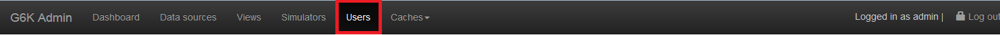

Click « Users » from the menu bar to access it.

The list of user accounts is displayed as a table:  

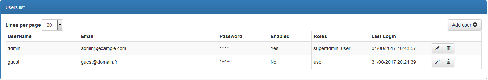

Several attributes concern users, they are defined below:

**Attributes :**

* « UserName : user identifier. *Specification :* **Minimum 3 characters**
* « Email » : user's email. *Specification:* **Different from other emails already registered**
* « Password » : password of the user who will be encrypted. *Specification:* **Minimum 6 characters**
* « Enabled » : determines whether the account is enabled or not.
* « Roles » : User, Contributor, Manager, Admin and Super admin.
* « Last Login » : The date the user last logged in.

You can adjust the size of the list with 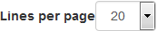, sort the list by clicking on the column name you want to make it easier to read and search the long list.  
So if you click on "UserName", the list will be sorted by usernames in ascending order. If you click a second time, it will be sorted in decreasing order. The same is true for the other columns of the table.

However above all, you can add, edit or delete a user account.

## Adding a user

To create a user account, click the 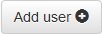 button at the top right of the list.

A blank line will appear at the top of the list, so you can enter the account attributes according to their specifications.

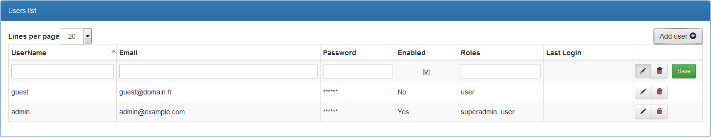

To save the account, click the  button, it will be immediately recorded in the database.

*If the user enters a bad username when logged in, the following message will be displayed: ‘’Invalid credentials.’’*

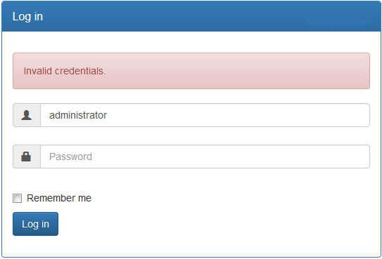

When an account is disabled, it can no longer log in to access its role functions.

For example, if the account of "Guest" is disabled, he will be notified by the message ‘’Account is disabled.’’. when he tries to connect*

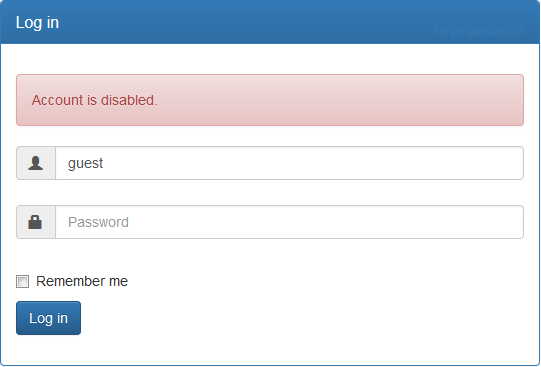

## Editing a user

To change a user account, click the button: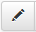  
The account line becomes editable, so you can make your changes:

* Enable/disable account;
* Change the username, email, password;
* Add or remove roles.

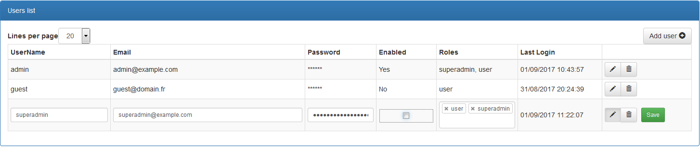

To remove a role, click the cross to the left of the role name.

When you click in the "Roles" field, a drop-down list opens to select a role.

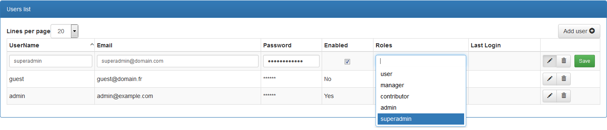

To save your changes, click the  button.

## Deleting a user

To delete a user click the button : 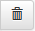

A confirmation button will appear, click on it ( 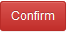 ) to delete the account.

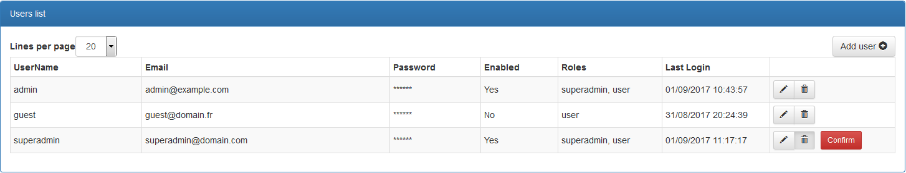

Once confirmed, the user's account will be deleted from the user database, but the account line will still be displayed with a "Restore" button if you have made a mistake or changed your mind.  
Note that if you restore the account, the user will not be able to log in with his old password. Indeed, for security reasons, the old password could not be registered because it was coded according to the day of its creation.  
You must enter a new password and communicate it to the user.

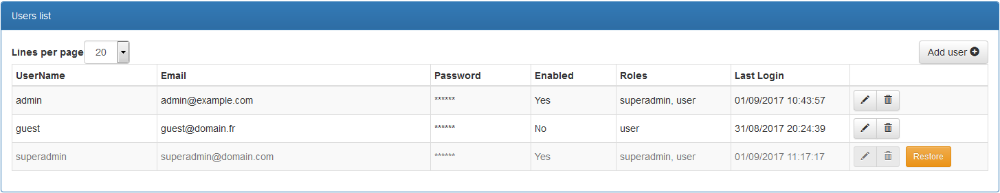

At the next re-display of the page, the account will no longer appear in the list.

