<!-- title: G6K: Administration Guide -->
<!-- subtitle: Views management -->

# What is a view?

Views are design elements of pages and styles in which the simulators are integrated. They are composed of « Templates » and « Assets ».  
« Templates » are (.twig) files that structure the page that is displayed.  
« Assets » contain all the style elements (CSS files, JavaScript, images, fonts ...).

Managing (creating, modifying, deleting) views is only allowed for users with the « Manager », « Administrator » or « Super Administrator » role.

# Creating a View

Click on the « Views » button on the menu bar

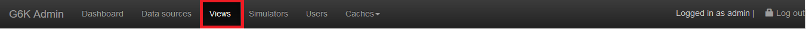

then on the « Create view » button in the left side menu

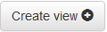

A form will then be displayed. It will be required to name the view (without space, special or accented characters) with the possibility to import two .zip files corresponding to the « Templates » and « Assets ».
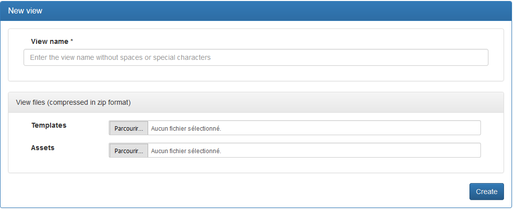

If you do not have a « Templates » file and a « Assets » file, the view that’s is created will inherit the elements of the default view provided with G6K.

Click « Create » to save the view. The .zip files, if provided, will be unzipped and then the view will be displayed in the form of directories, with two tabs:

* « Templates » where the .twig files that structure the page are stored
* and « Assets » where the style files and images are located.

<p class="figure-legend">Figure 1 - Displaying the « Templates » of the « Demo » view</p>

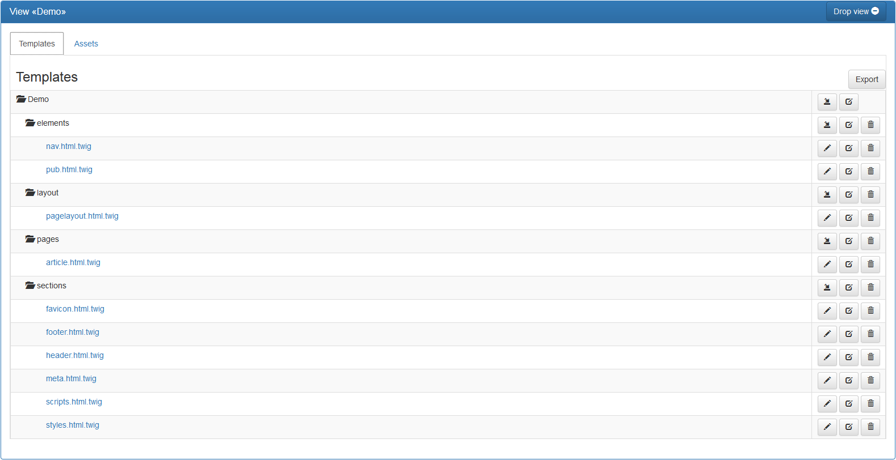


<p class="figure-legend">Displaying the « Assets » of the « Demo » view</p>

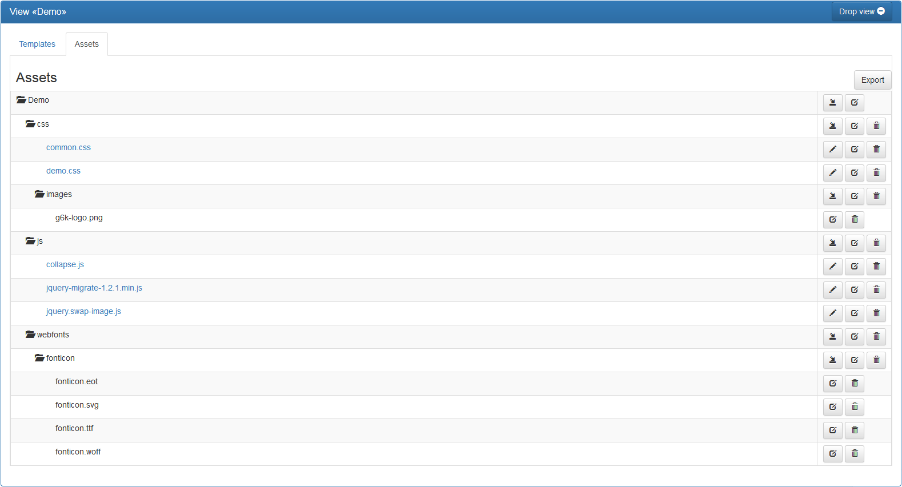

# Export a view

If you want to export the « Templates » or the « Assets », select the corresponding tab and click on the button 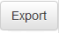.  
G6K then generates a zipped file that you can download.

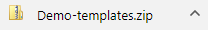 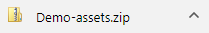

Export (recommended) allows you to archive your views and re-import them into a new system if you change it.

# Managing a view

There are several buttons that allow you to manage the « Templates » and « Assets ». Their functions are defined below.

## Adding a subfolder or a file to an existing folder

If you want to add a subfolder or a file to a folder, click the « Add subfolder or file to ‘Name of folder’ » button:  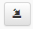  
A form will then be displayed to choose between:

* Add a « subfolder » : it will be required to name the subfolder (without spaces, special or accented characters),
* Add a « file » : it will be required to name it and import it from your computer.

In the « Templates » tab, only files with the .twig extension can be added, otherwise an error will be displayed.  
For « Assets » there is no special extension or type.

Then press the « Submit » button.

<p class="figure-legend">Figure 3 – Form for adding a subfolder and displaying of the added subfolder</p>

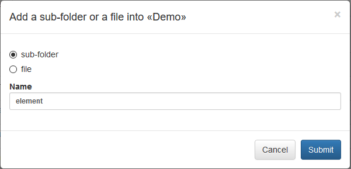

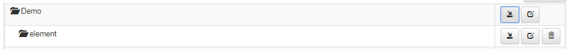


<p class="figure-legend">Figure 4 - Form for adding a file and displaying of the added file</p>

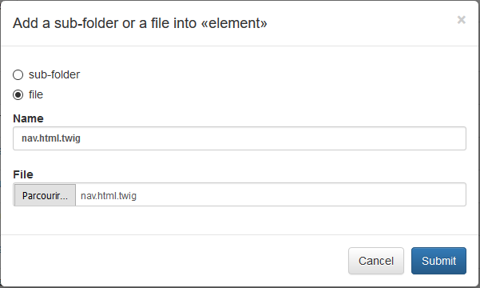

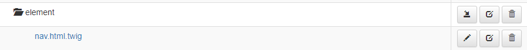

## Rename an element

To rename an element, simply press the « Rename ‘element’ » button : 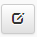  
A form will prompt you to indicate the new name of the element. You will need to press the « Submit » button to apply the renaming.

<p class="figure-legend">Figure 5 - Form to rename the element and displaying of the renamed element</p>

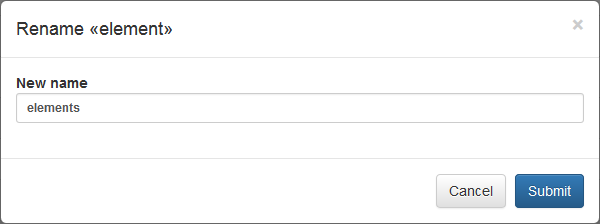

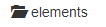

<div class="alert alert-warning" role="alert">
CAUTION: Some templates are mentioned in the definition of steps (see attribute « Step display template ») in the [Create a simulator](simulators-management.html) documentation, if you rename them, please update the step of the simulator involved.
</div>

## Update a file

To update a file, click the « Update this file » button : 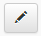

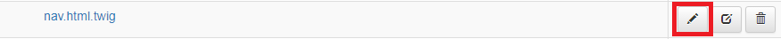

An edit box will appear where you can edit the file.  

<p class="figure-legend">Figure 6 - Editing interface (white background)</p>

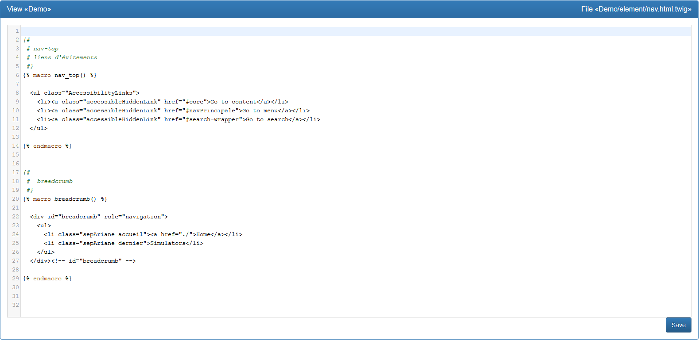

Once you have made your changes, click the « Save » button to save the file.  
Once the filed saved, the « Save » button will change to the « Edit » button and you will not be able to edit the file until you press the « Edit » button.

<p class="figure-legend">Figure 7 - Uneditable interface, saved changes (greyish background)</p>

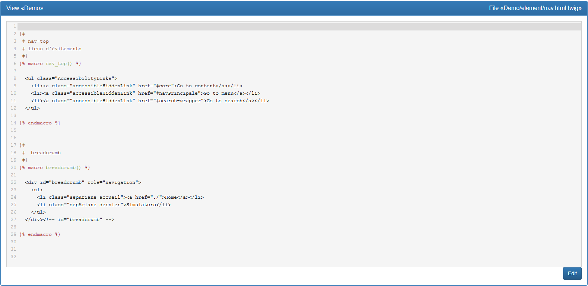

## Remove an element

To remove a folder, a subfolder or a file, click the « Remove this element » button : 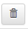  
A confirmation message will appear. If you are sure to delete this element, press « OK ».

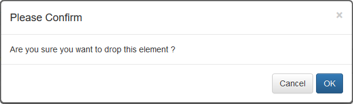

The page will then be reloaded and the item you have deleted will no longer be displayed.  
If you delete a folder that contains other elements, all its contents will be deleted.

<div class="alert alert-warning" role="alert">
CAUTION: Some templates are mentioned in the definition of steps (see attribute « Step display template ») in the [Create a simulator](simulators-management.html) documentation, if you remove them, please update the step of the simulator involved.
</div>


## Remove a view

If you want to delete a view, click the « Drop view » button.  
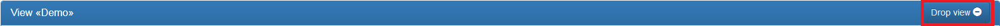

A confirmation message will appear. If you are sure you want to delete the view, click « OK ».  
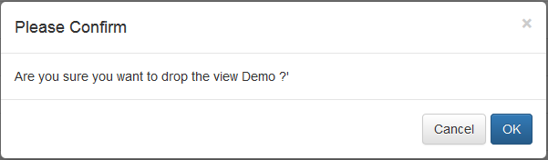

The view will be deleted and will no longer be displayed in the « Views Management » menu:  
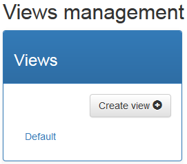

<div class="alert alert-warning" role="alert">
CAUTION: All simulators that use this view as « Default view » should be updated.
</div>

# Composition of templates

This section describes how you must compose the templates of a view and the rules and constraints they must follow.

All templates you compose must inherit the base layout « EUREKAG6KBundle:base/layout:pagelayout.html.twig » supplied with G6K.  
You must place the following line at the top of the template:

```  

```

The base layout performs the following functions:

* Calls of the scripts and styles necessary to the operation of the simulation engine;
* Define the blocks you can fill in or complete in your templates.

These blocks are:

* « doctype »: Document type of the page: contains &lt;!DOCTYPE html&gt; for HTML5
* « title »: Title of the web page: empty
* « metas »: Metadata of the web page
* « styles »: CSS style sheet links
* « hscripts »: Script calls in the &lt;head&gt; section of the web page.
* « body »: Body of the HTML page
* « bodyclass »: Allows you to add CSS classes to the &lt;body&gt; : empty
* « bodyattr »: Allows you to add attributes to the &lt;body&gt; : empty
* « content »: Visible content of the web page. Included in the body block: empty;
* « scripts »: Scripts and script calls at the end of the page. Included in body block.
* « jquery »: Call the correct version of jquery according to the browser.

<div class = "alert alert-warning" role = "alert">
CAUTION: If you add content to these blocks, put {{ parent() }} at the beginning of the block to avoid overwriting the content set by the basic layout. This is not useful for the « title », « bodyclass », « bodyattr » and « content » blocks that are empty.
</div>

Note that the base layout does not add any visible content to the web page. It's in the « content » block that you have to put your elements such as page header, footer, menus, sidebar(s) and other contents.
You must also add the simulation form, which you will do using a macro twig and variables provided by G6K.

Like the "Demo" view, it is advisable to define a layout specific to your view that will be responsible for displaying the different elements of the page except the simulation form and the elements specific to a simulator.  
You will then define a template that will inherit the layout specific to the view and which will contain the simulation form and the elements specific to a simulator.  
It's this last template that should be referenced in the definition of the simulation steps in the simulators. See [Creating a simulator](simulators-management.html)

Concretely, suppose your page has the following structure:

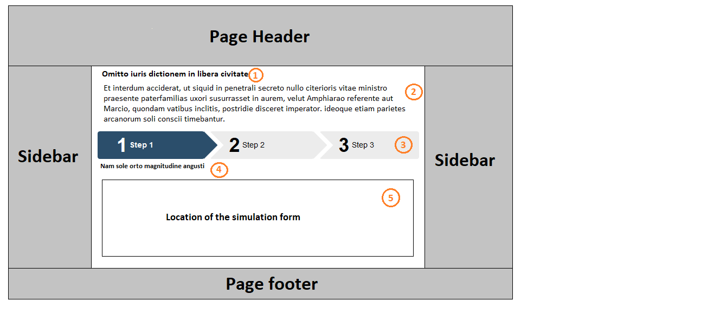

It's the layout that displays the part with gray background and positions the « content » block (part with white background) on the page.

It's the child template that feeds the « content » block where:

 Label/Title of the simulator  
 Description of the simulator  
 Breadcrumb trail  
 Description of the current step  
 Location of the simulation form in the current step  
 

Variables and macros that feed these elements are:

 ``{{ step.simulator.label }}``  
 ``{{ form.paragraphs(step.simulator.description|jscode) }}``  
 ``{{ form.breadcrumb(_context) }}``  
 ``{{ step.description }}``  
 ``{{ form.draw(_context, 'form-horizontal', 'form-group', 'control-label', 'input-group', 'form-control', 'panel panel-default', 'panel-heading', 'panel-body') }}``
 
To use these macros, they must be imported into the template:  
```  

```


The available and useful macros are:

* « form.breadcrumb »: Draws the breadcrumb thread of the steps.  
  Parameter: _context
* « form.draw »: Displays the simulation form for the current step.  
  Parameters :
  1. _context
  2. CSS class of the field group container
  3. CSS class of field container
  4. CSS class of field labels
  5. CSS class of the container that includes a field and its unit or the currency symbol
  6. field CSS class
  7. CSS Class of the Chapter Container
  8. CSS class of the chapter header
  9. CSS Class of Section Container
* « form.heading »: Displays text with a heading level (tags h1, h2, ...) after removing line breaks.  
  Parameters :
  1. text to display 
  2. heading level (1 to 6)
  3. CSS class of generated tag
* « form.paragraphs »: Displays text with line breaks by including each line of text in HTML paragraphs (&lt;p&gt;).  
  Parameter: the text to display
* « form.profiles »: Displays the profiles.  
  Parameter: _context

 
Available and useful variables are:

* « step.simulator.name »: Name of the simulator
* « step.simulator.label »: Label/Title of the simulator
* « step.simulator.description »: Description of the simulator
* « step.simulator.referer »: URL of the page of the site where the simulator is referenced
* « step.simulator.memo: True if the simulator allows the use of a memo (record of values ​​of fields in cookies), false if not
* « step.name »: Name of the current step
* « step.label »: Label/Title of the current step
* « step.description »: Description of the current step
* « step.dynamic »: True if Javascript is used to « animate » the simulation, false otherwise
* « Script »: True if Javascript is enabled in the browser, false otherwise

<p class="figure-legend">Figure 8 - « Demo » template illustrating the use of macros and variables</p>

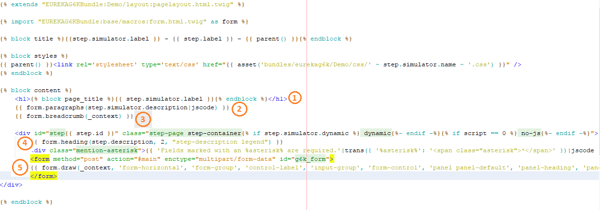
