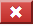
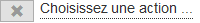
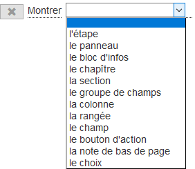

<!-- title: G6K: Guide d'administration  -->
<!-- subtitle: Composition des règles métier -->

# Règles métier

Ce sont les règles « métier » qui déterminent le comportement du simulateur. Elles se déclenchent lorsque le contexte change. 

Un changement de contexte se traduit toujours par l'acquisition ou la modification d'une donnée.

G6k s'informe du changement de contexte en revérifiant les conditions associées aux règles lorsque la valeur d'une donnée change.

Ainsi lorsque l'utilisateur saisit une valeur, que g6K accède à une donnée de référence ou qu'une valeur est calculée, les règles impactées sont évaluées et les actions associées sont exécutées le cas échéant.

Les actions qui peuvent être réalisées sont :

* Montrer ou cacher une partie de la page (un champ, un groupe de champs, un panneau, un bouton, ...)
* Afficher un message d'erreur ou d'avertissement
* Effectuer un calcul et l'affecter à une donnée

Une règle métier a la syntaxe suivante :
<pre>
&lt;règle métier&gt; : <span class="label label-default">Lorsque ...</span>&lt;condition&gt;[<span class="label label-default">alors ...</span>&lt;action&gt;...&lt;action&gt;][<span class="label label-default">sinon ...</span>&lt;action&gt; ... &lt;action&gt;]
</pre>

**&lt;condition&gt;**

<pre>
&lt;condition&gt; : &lt;condition simple&gt; | &lt;condition composée&gt;

&lt;condition simple&gt; : &lt;opérande&gt;&lt;opérateur&gt;[(&lt;valeur&gt; | &lt;expression&gt;)]

&lt;condition composée&gt; : 
    &lt;connecteur&gt;
        &lt;condition&gt;
        ...
        &lt;condition&gt;
</pre>

**&lt;opérateur&gt;**

<pre>
&lt;opérateur&gt; : <span class="label label-default">contient</span> | <span class="label label-default">correspond à</span> | <span class="label label-default">est antérieure à</span> | <span class="label label-default">est égal à</span> | <span class="label label-default">est faux</span> | <span class="label label-default">est inférieur à</span> | <span class="label label-default">est inférieur ou égal à</span> | <span class="label label-default">est postérieure à</span> | <span class="label label-default">est renseigné</span> | <span class="label label-default">est supérieur à</span> | <span class="label label-default">est supérieur ou égal à</span> | <span class="label label-default">est vrai</span> | <span class="label label-default">ne contient pas</span> | <span class="label label-default">ne correspond pas à</span> | <span class="label label-default">n'est pas antérieure à</span> | <span class="label label-default">n'est pas égal à</span> | <span class="label label-default">n'est pas postérieure à</span> | <span class="label label-default">n'est pas renseigné</span>
</pre>

**&lt;connecteur&gt;**

<pre>
&lt;connecteur&gt; : <span class="label label-default">toutes</span> | <span class="label label-default">au moins une</span> | <span class="label label-default">aucune</span>
</pre>

**&lt;action&gt;**

<pre>
&lt;action&gt; : (<span class="label label-default">afficher l'erreur</span> | <span class="label label-default">afficher l'avertissement</span>)&lt;message&gt;<span class="label label-default">portant sur</span><span class="label label-default">la donnée</span>&lt;donnée&gt;
ou
&lt;action&gt; : (<span class="label label-default">afficher l'erreur</span> | <span class="label label-default">afficher l'avertissement</span>)&lt;message&gt;<span class="label label-default">portant sur</span><span class="label label-default">l'ensemble des données</span>
ou
&lt;action&gt; : (<span class="label label-default">afficher l'erreur</span> | <span class="label label-default">afficher l'avertissement</span>)&lt;message&gt;<span class="label label-default">portant sur</span><span class="label label-default">le groupe de données</span>&lt;groupe de données&gt;
ou
&lt;action&gt; : (<span class="label label-default">Cacher</span> | <span class="label label-default">Montrer</span>) <span class="label label-default">l'étape</span>&lt;étape&gt;
ou
&lt;action&gt; : (<span class="label label-default">Cacher</span> | <span class="label label-default">Montrer</span>) <span class="label label-default">le panneau</span> <span class="label label-default">de l'étape</span>&lt;étape&gt;<span class="label label-default">dont le libellé est</span>&lt;panneau&gt;
ou
&lt;action&gt; : (<span class="label label-default">Cacher</span> | <span class="label label-default">Montrer</span>) <span class="label label-default">le groupe de champs</span> <span class="label label-default">de l'étape</span>&lt;étape&gt;<span class="label label-default">du panneau</span>&lt;panneau&gt;<span class="label label-default">dont le libellé est</span>&lt;groupe de champs&gt;
ou
&lt;action&gt; : (<span class="label label-default">Cacher</span> | <span class="label label-default">Montrer</span>) <span class="label label-default">le champ</span> <span class="label label-default">de l'étape</span>&lt;étape&gt;<span class="label label-default">du panneau</span>&lt;panneau&gt;<span class="label label-default">du groupe de champs</span>&lt;groupe de champs&gt;<span class="label label-default">dont le libellé est</span>&lt;champ&gt;
ou
&lt;action&gt; : (<span class="label label-default">Cacher</span> | <span class="label label-default">Montrer</span>) <span class="label label-default">la colonne</span> <span class="label label-default">de l'étape</span>&lt;étape&gt;<span class="label label-default">du panneau</span>&lt;panneau&gt;<span class="label label-default">du groupe de champs</span>&lt;groupe de champs&gt;<span class="label label-default">dont le libellé est</span>&lt;colonne&gt;
ou
&lt;action&gt; : (<span class="label label-default">Cacher</span> | <span class="label label-default">Montrer</span>) <span class="label label-default">la rangée</span> <span class="label label-default">de l'étape</span>&lt;étape&gt;<span class="label label-default">du panneau</span>&lt;panneau&gt;<span class="label label-default">du groupe de champs</span>&lt;groupe de champs&gt;<span class="label label-default">dont le libellé est</span>&lt;rangée&gt;
ou
&lt;action&gt; : (<span class="label label-default">Cacher</span> | <span class="label label-default">Montrer</span>) <span class="label label-default">le bloc d'infos</span> <span class="label label-default">de l'étape</span>&lt;étape&gt;<span class="label label-default">du panneau</span>&lt;panneau&gt;<span class="label label-default">dont le libellé est</span>&lt;bloc d'infos&gt;
ou
&lt;action&gt; : (<span class="label label-default">Cacher</span> | <span class="label label-default">Montrer</span>) <span class="label label-default">le chapitre</span> <span class="label label-default">de l'étape</span>&lt;étape&gt;<span class="label label-default">du panneau</span>&lt;panneau&gt;<span class="label label-default">du bloc d'infos</span>&lt;bloc d'infos&gt;<span class="label label-default">dont le libellé est</span>&lt;chapitre&gt;
ou
&lt;action&gt; : (<span class="label label-default">Cacher</span> | <span class="label label-default">Montrer</span>) <span class="label label-default">la section</span> <span class="label label-default">de l'étape</span>&lt;étape&gt;<span class="label label-default">du panneau</span>&lt;panneau&gt;<span class="label label-default">du bloc d'infos</span>&lt;bloc d'infos&gt;<span class="label label-default">du chapitre</span>&lt;chapitre&gt;<span class="label label-default">dont le libellé est</span>&lt;section&gt;
ou
&lt;action&gt; : (<span class="label label-default">Cacher</span> | <span class="label label-default">Montrer</span>) <span class="label label-default">le bouton d'action</span> <span class="label label-default">de l'étape</span>&lt;étape&gt;<span class="label label-default">dont le libellé est</span>&lt;bouton d'action&gt;
ou
&lt;action&gt; : (<span class="label label-default">Cacher</span> | <span class="label label-default">Montrer</span>) <span class="label label-default">la note de bas de page</span> <span class="label label-default">de l'étape</span>&lt;étape&gt;<span class="label label-default">dont le libellé est</span>&lt;note de bas de page&gt;
ou
&lt;action&gt; : (<span class="label label-default">Cacher</span> | <span class="label label-default">Montrer</span>) <span class="label label-default">le choix</span> <span class="label label-default">de la donnée</span>&lt;donnée&gt;<span class="label label-default">dont le libellé est</span>&lt;choix&gt;
</pre>

Evaluer une règle consiste à évaluer la condition qui la compose. Le résultat de l'évaluation a trois états : « vrai », « faux » ou « indéterminé ».

Si l'état est « vrai » alors les actions <span class="label label-default">alors ...</span> sont exécutées.  
Si l'état est « faux » alors les actions <span class="label label-default">sinon ...</span> sont exécutées.  
Si l'état est « indéterminé » alors aucune action n'est exécutée.  

L'évaluation renvoie « indéterminé », si au moins une des opérandes ne contient aucune valeur.

# Interface de composition des règles

L'interface de G6K permettant de saisir ou modifier une règle est la suivante :


Pour y accéder, cliquez sur le bouton « Simulateurs » de la barre de menu :


Puis sélectionnez le simulateur dans le menu latéral gauche.

Pour saisir une nouvelle règle, cliquez sur le bouton « Ajouter » du panneau « Règles métier » :


Pour modifier une règle, dépliez le panneau « Règles métier » puis cliquez sur le bouton « Modifier » de la barre de titre de la règle que vous souhaitez modifier :


# Saisie d'une règle

Le formulaire de saisie d'une règle comporte 4 blocs :

1. le bloc de saisie des attributs de la règle.
2. le bloc de saisie de la condition de déclenchement des actions de la règle.
3. le bloc de saisie des actions à exécuter lorsque la condition est vraie. 
4. le bloc de saisie des actions à exécuter lorsque la condition est fausse. 

**Attributs :**

1. « Nom » : Nom de la règle. 
2. « Libellé » : Libellé de la règle. 

Le nom et le libellé apparaissent dans la barre de titre du panneau de la règle pour vous permettre de la repérer lorsque le panneau est replié. Donnez donc un libellé explicite à la règle.

## Saisie d'une condition

Dans le bloc de saisie de la condition figure la ligne :   
Cliquez sur le mot souligné pour sélectionner le connecteur : 

Le connecteur permet de saisir une « condition composée » en combinant les « conditions simples » que vous saisirez directement sous le connecteur.  
Les conditions sont présentées par niveaux. Le connecteur introduit un niveau de conditions. Un niveau est matérialisé par un retrait par rapport au connecteur. 

| Connecteur   | Description |
|--------------|-------------|
| toutes       | Toutes les conditions des lignes du niveau immédiatement inférieur doivent être vraies (c'est l'équivalent du ET) |
| au moins une | Au moins une des conditions des lignes du niveau immédiatement inférieur doit être vraie (c'est l'équivalent du OU) |
| aucune       | Aucune des conditions des lignes du niveau immédiatement inférieur ne doit être vraie |

Par exemple :
<pre>
<span class="label label-default">toutes</span> les conditions suivantes sont satisfaites :
    <span class="label label-default">condition simple A</span>
    <span class="label label-default">au moins une</span> des conditions suivantes est satisfaite :
        <span class="label label-default">condition simple B</span>
        <span class="label label-default">condition simple C</span>
</pre>
traduit l'expression booléenne : ```condition simple A ET (condition simple B OU condition simple C)```

<pre>
<span class="label label-default">condition simple A</span> est de niveau 1, <span class="label label-default">condition simple B</span> et <span class="label label-default">condition simple C</span> sont de niveau 2.
</pre>

Cliquez sur  pour ajouter une condition composée en introduisant un niveau de sous-conditions sous ce connecteur.  
La ligne ci-dessous s'affiche sous le connecteur avec un retrait matérialisé par la flèche :


ou  

Cliquez sur  à droite du connecteur pour ajouter une condition simple du niveau de ce connecteur.  
La ligne ci-dessous s'affiche sous le connecteur avec un retrait :


### Condition simple

Comme vu en début de ce document, une condition simple à pour syntaxe :
<pre>
&lt;condition simple&gt; : &lt;opérande&gt;&lt;opérateur&gt;[(&lt;valeur&gt; | &lt;expression&gt;)]
</pre>

#### Sélection de l'opérande

Cliquez sur le premier élément souligné de la condition, une liste déroulante s'affiche :


Les éléments de cette liste sont composés à partir des données que vous avez définies dans le panneau « Données ».

#### Sélection de l'opérateur

Cliquez sur le deuxième élément souligné de la condition, une liste déroulante s'affiche :


La composition de cette liste d'opérateurs dépend du type de donnée de l'opérande. Ces opérateurs sont décrits ci-après :

##### Opérateurs

###### Opérateurs de chaînes

| Opérateur               | Description |
|-------------------------|-------------|
| est renseigné           | L'évaluation retourne « vrai » si la donnée associée à l'opérande contient une valeur, « faux » sinon. |
| n'est pas renseigné     | L'évaluation retourne « vrai » si la donnée associée à l'opérande ne contient aucune valeur, « faux » sinon. |
| est égal à              | L'évaluation retourne « vrai » si la valeur de la donnée associée à l'opérande est égale à la valeur du résultat de l'évaluation de l'expression, « faux » sinon. |
| n'est pas égal à        | L'évaluation retourne « vrai » si la valeur de la donnée associée à l'opérande est différente de la valeur du résultat de l'évaluation de l'expression, « faux » sinon. |
| contient                | Ne s'applique qu'aux opérandes de type 'liste' : L'évaluation retourne « vrai » si la valeur de la donnée de type 'liste' associée à l'opérande contient la valeur du résultat de l'évaluation de l'expression, « faux » sinon. |
| ne contient pas         | Ne s'applique qu'aux opérandes de type 'liste' : L'évaluation retourne « vrai » si la valeur de la donnée de type 'liste' associée à l'opérande ne contient pas la valeur du résultat de l'évaluation de l'expression, « faux » sinon. |

###### Opérateurs numériques

| Opérateur               | Description |
|-------------------------|-------------|
| est renseigné           | L'évaluation retourne « vrai » si la donnée associée à l'opérande contient une valeur, « faux » sinon. |
| n'est pas renseigné     | L'évaluation retourne « vrai » si la donnée associée à l'opérande ne contient aucune valeur, « faux » sinon. |
| est égal à              | L'évaluation retourne « vrai » si la valeur de la donnée associée à l'opérande est égale à la valeur du résultat de l'évaluation de l'expression, « faux » sinon. |
| n'est pas égal à        | L'évaluation retourne « vrai » si la valeur de la donnée associée à l'opérande est différente de la valeur du résultat de l'évaluation de l'expression, « faux » sinon. |
| est supérieur à         | L'évaluation retourne « vrai » si la valeur de la donnée associée à l'opérande est supérieure à la valeur du résultat de l'évaluation de l'expression, « faux » sinon. ||
| est supérieur ou égal à | L'évaluation retourne « vrai » si la valeur de la donnée associée à l'opérande est supérieure ou égale à la valeur du résultat de l'évaluation de l'expression, « faux » sinon. |
| est inférieur à         | L'évaluation retourne « vrai » si la valeur de la donnée associée à l'opérande est inférieure à la valeur du résultat de l'évaluation de l'expression, « faux » sinon. |
| est inférieur ou égal à | L'évaluation retourne « vrai » si la valeur de la donnée associée à l'opérande est inférieure ou égale à la valeur du résultat de l'évaluation de l'expression, « faux » sinon. |
| contient                | Ne s'applique qu'aux opérandes de type 'liste' : L'évaluation retourne « vrai » si la valeur de la donnée de type 'liste' associée à l'opérande contient la valeur du résultat de l'évaluation de l'expression, « faux » sinon. |
| ne contient pas         | Ne s'applique qu'aux opérandes de type 'liste' : L'évaluation retourne « vrai » si la valeur de la donnée de type 'liste' associée à l'opérande ne contient pas la valeur du résultat de l'évaluation de l'expression, « faux » sinon. |

###### Opérateurs de date

| Opérateur               | Description |
|-------------------------|-------------|
| est renseigné           | L'évaluation retourne « vrai » si la donnée associée à l'opérande contient une valeur, « faux » sinon. |
| n'est pas renseigné     | L'évaluation retourne « vrai » si la donnée associée à l'opérande ne contient aucune valeur, « faux » sinon. |
| correspond à            | L'évaluation retourne « vrai » si la valeur de la donnée de type date associée à l'opérande est égale à la valeur du résultat de l'évaluation de l'expression, « faux » sinon. |
| ne correspond pas à     | L'évaluation retourne « vrai » si la valeur de la donnée de type date associée à l'opérande est différente de la valeur du résultat de l'évaluation de l'expression, « faux » sinon. |
| est postérieure à       | L'évaluation retourne « vrai » si la valeur de la donnée de type date associée à l'opérande est postérieure à la valeur du résultat de l'évaluation de l'expression, « faux » sinon. |
| n'est pas antérieure à  | L'évaluation retourne « vrai » si la valeur de la donnée de type date associée à l'opérande n'est pas antérieure à la valeur du résultat de l'évaluation de l'expression, « faux » sinon. |
| est antérieure à        | L'évaluation retourne « vrai » si la valeur de la donnée de type date associée à l'opérande est antérieure à la valeur du résultat de l'évaluation de l'expression, « faux » sinon. |
| n'est pas postérieure à | L'évaluation retourne « vrai » si la valeur de la donnée de type date associée à l'opérande n'est pas postérieure à la valeur du résultat de l'évaluation de l'expression, « faux » sinon. |

###### Opérateurs de choix

| Opérateur               | Description |
|-------------------------|-------------|
| est renseigné           | L'évaluation retourne « vrai » si la donnée associée à l'opérande contient une valeur, « faux » sinon. |
| n'est pas renseigné     | L'évaluation retourne « vrai » si la donnée associée à l'opérande ne contient aucune valeur, « faux » sinon. |
| est égal à              | L'évaluation retourne « vrai » si la valeur de la donnée associée à l'opérande est égale à la valeur du résultat de l'évaluation de l'expression, « faux » sinon. |
| n'est pas égal à        | L'évaluation retourne « vrai » si la valeur de la donnée associée à l'opérande est différente de la valeur du résultat de l'évaluation de l'expression, « faux » sinon. |

###### Opérateurs booléens

| Opérateur               | Description |
|-------------------------|-------------|
| est renseigné           | L'évaluation retourne « vrai » si la donnée associée à l'opérande contient une valeur, « faux » sinon. |
| n'est pas renseigné     | L'évaluation retourne « vrai » si la donnée associée à l'opérande ne contient aucune valeur, « faux » sinon. |
| est vrai                | L'évaluation retourne « vrai » si la valeur de la donnée associée à l'opérande est égale à 'true', « faux » sinon. |
| est faux                | L'évaluation retourne « vrai » si la valeur de la donnée associée à l'opérande est égale à 'false', « faux » sinon. |

Les opérateurs « est renseigné », « n'est pas renseigné », « est vrai » et « est faux » sont des opérateurs unaires c'est-à-dire qu'ils n'opèrent que sur l'opérande. Il n'y pas d'expression à leur droite.  
Les autres opérateurs sont des opérateurs binaires.

#### Saisie de la valeur / de l'expression

Si l'opérateur sélectionné est un opérateur binaire, une boite à liste s'affiche après l'opérateur.  
Si l'opérande est de type « choix », la boite à liste affichée est la liste des valeurs possibles de l'opérande.  
Sinon la boite à liste vous permet de composer une expression :


Se reporter à la page [Composition des expressions](expression-builder.html) pour savoir comment saisir une expression.


### Suppression d'une condition

Pour supprimer une condition simple ou composée, cliquez sur le bouton  à droite de la condition.

## Saisie d'une action

Vous pouvez saisir une action soit dans le bloc « alors ... » si vous souhaitez qu'elle soit exécutée lorsque le résultat de l'évaluation de la condition retourne 'vrai', soit dans le bloc « sinon ... » dans le cas 'faux'.

Vous pouvez ajouter plusieurs actions dans chacun des blocs d'une même règle.

Cliquez sur le bouton  de l'un de ces deux blocs, la ligne suivante s'affiche :



Cliquez sur « Choisissez une action ... » pour ouvrir la liste des actions possibles :


| Action                   | Description |
|--------------------------|-------------|
| afficher l'erreur        | Permet de définir un message d'erreur associé à une donnée, un groupe de données ou toutes les données |
| afficher l'avertissement | Permet de définir un message d'avertissement associé à une donnée, un groupe de données ou toutes les données. A l'inverse du message d'erreur, le message d'avertissement ne bloque pas le déroulement de la simulation |
| Cacher                   | Permet de cacher un élément du formulaire de simulation  |
| Montrer                  | Permet de montrer (afficher) un élément du formulaire de simulation |
| Mettre                   | Permet d'affecter une valeur ou le résultat de l'évaluation d'une expression au contenu d'une donnée ou encore à sa valeur par défaut, sa valeur minimale ou maximale ou de définir le champ d'une source de données permettant d'alimenter la donnée. |
| Effacer                  | Permet d'effacer (mettre à blanc) le contenu d'une donnée. La donnée devient « non renseignée ». |

Ces actions sont détaillées ci-après :

### Afficher une erreur ou un avertissement

Choisissez « afficher l'erreur » ou « afficher l'avertissement » dans la liste des actions.  
La ligne se complète pour vous permettre de saisir le message ainsi que sa cible :


Cliquez sur « cliquez pour saisir le message », le champ de saisie apparait.


Saisissez le message puis valider en cliquant sur « Ok ».

Cliquez sur « cliquez pour sélectionner ... », pour choisir la cible.


| Cible                  | Description |
|------------------------|-------------|
| la donnée              | Le message concerne une donnée particulière, le message s'affiche en dessous du champ de saisie |
| l'ensemble des données | Le message concerne tout le formulaire de simulation (ex : incohérence de données saisies), le message s'affiche en dessous du formulaire. |
| le groupe de données   | Le message concerne un groupe de données, le message s'affiche en dessous du groupe. |

Si la cible est une donnée ou un groupe de données, il faut sélectionner la donnée (ou le groupe) dans la liste qui s'affiche:


A noter : Pour les valeurs de données résultant d'une saisie utilisateur, il n'est pas nécessaire de définir un message d'erreur dans les cas suivants :

* Le champ de saisie n'est pas renseigné alors que la donnée est requise.
* La valeur saisie ne correspond pas au format attendu compte tenu du type de la donnée.

Ces cas sont traités automatiquement par G6K ou le navigateur.


### Cacher ou montrer un élément du formulaire de simulation

Ces deux actions permettent de gérer l'affichage des éléments du formulaire d'une étape de simulation.

Choisissez « Cacher » ou « Montrer » dans la liste des actions, la liste des éléments s'affiche :



Une fois choisi l'élément du formulaire, la ligne se complète pour sélectionner les éléments 'conteneurs' de l'élément à cacher ou montrer.  
Par exemple, si on choisit de cacher un champ, il faut sélectionner successivement l'étape, le panneau, le groupe de champs qui contient ce champ.

Le tableau ci-dessous montre la hiérarchie des conteneurs en fonction de l'élément choisi :

| Elément formulaire     | Conteneurs                                      |
|------------------------|-------------------------------------------------|
| l'étape                | aucun                                           |
| le panneau             | étape                                           |
| le bloc d'infos        | étape / panneau                                 |
| le chapitre            | étape / panneau / bloc d'infos                  |
| la section             | étape / panneau / bloc d'infos / chapitre       |
| le groupe de champs    | étape / panneau                                 |
| la colonne             | étape / panneau / groupe de champs              |
| la rangée              | étape / panneau / groupe de champs              |
| le champ (1)           | étape / panneau / groupe de champs [ / rangée ] |
| le bouton d'action     | étape                                           |
| la note de bas de page | étape                                           |
| le choix (2)           | liste de choix d'une donnée de type 'choix'     |

(1) la rangée n'est à préciser que si le champ est contenu dans un tableau.  
(2) permet de montrer/cacher un élément de liste lorsque la donnée est de type 'choix'
 
**Exemples d'actions permettant de montrer des éléments de formulaire**


### Affecter une valeur à un attribut d'une donnée

Choisissez « Mettre » ou « Effacer » dans la liste des actions, la liste des attributs s'affiche :


| Attribut             | Description                                                                                                 |
|----------------------|-------------------------------------------------------------------------------------------------------------|
| la valeur            | Contient la valeur attribuée à la donnée                                                                    |
| la valeur par défaut | Contient la valeur à prendre en compte lorsque l'attribut « la valeur » n'est pas renseignée.               |
| la valeur minimale   | Contient la valeur minimale pouvant être attribuée à la donnée.                                             |
| la valeur maximale   | Contient la valeur maximale pouvant être attribuée à la donnée.                                             |
| l'index de résultat  | Contient le nom d'un champ de requête de source de données lorsque la donnée est alimentée par cette source. |
| l'explication        | Contient une explication du mode de calcul de la donnée                                                     |

L'action « Mettre » permet d'affecter une valeur à l'un de ces attributs, l'action « Effacer » permet d'en effacer (mettre à blanc) le contenu.

Une fois l'attribut choisi, la ligne se complète ainsi :


Cliquez sur « cliquez pour sélectionner ... » pour afficher la liste des données :


Choisissez la donnée pour laquelle vous souhaitez modifier la valeur d'attribut.

S'il s'agit de l'action « Effacer », la saisie de l'action est terminée.  
S'il s'agit de l'action « Mettre », vous pouvez maintenant choisir la valeur ou composer l'expression à affecter à l'attribut :


Se reporter à la page [Composition des expressions](expression-builder.html) pour savoir comment saisir l'expression.

**Exemple d'action permettant d'affecter le résultat d'un calcul à une donnée**


## Suppression d'une action

Pour supprimer une action, cliquez sur le bouton  à gauche de l'action.

# Modification d'une règle

Pour modifier une règle, cliquez sur le bouton « Modifier » de la barre de titre de la règle à modifier :


Le formulaire d'édition d'une règle est le même que celui de saisie d'une règle, reportez-vous donc à la section [Saisie d'une règle](#saisie-d-une-regle) du présent document.

# Suppression d'une règle

Pour supprimer une règle, dépliez le panneau « Règles métier » puis cliquez sur le bouton « Supprimer » de la barre de titre de la règle que vous souhaitez supprimer :


Puis confirmez la suppression :


# Tri des règles

Pour réordonner les règles, déplier le panneau « Règles métier », cliquez la barre de titre de la règle que vous souhaitez déplacer et tout en maintenant le bouton gauche de la souris enfoncée (le curseur  apparait), glissez la règle jusqu'à l'emplacement désiré. 


