<!-- title: G6K: Guide d'administration  -->
<!-- subtitle: Gestion des sources de données de référence -->

# Source de données

Une source de données permet à un simulateur d'interroger les valeurs de référence du domaine de la simulation pour réaliser la simulation.  

La source de données peut être interne, c'est-à-dire que les valeurs sont stockées dans une base de données gérée par G6K, 
ou externe, c'est-à-dire que les valeurs sont fournies soit via des requêtes sur une bases de données distante, soit via un web service (API).

Dans tous les cas, vous devez déclarer la source afin qu'elle puisse être utilisée par le moteur de simulation.

S'il s'agit d'une base de données (interne ou distante), vous devez également décrire les tables et leurs colonnes afin que le moteur de simulation puisse construire les requêtes permettant de retrouver les valeurs recherchées.

S'il s'agit d'un web service, vous devez indiquer l'url de l'API ainsi que la méthode HTTP à mettre en oeuvre (GET ou POST). 
Les paramètres de l'API seront définis par le simulateur qui l'utilise au moment de la création de ce dernier.

# Source de données interne.

## Création de la source de données

Cliquez sur « Sources de données » de la barre de menu 

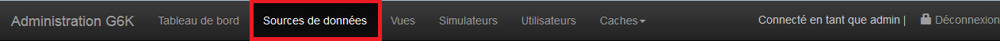

puis sur 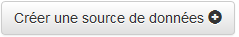 du menu latéral gauche.

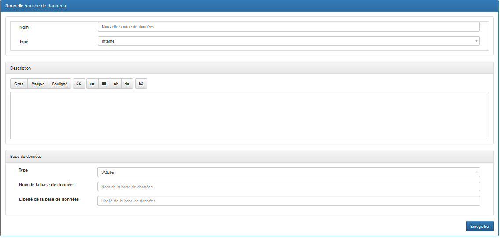

**Attributs :**

1. « Nom » : Nom de la source de données sans espaces ni caractères spéciaux ou accentués. 
2. « Type » : Type de la source de données « Interne », « Base de données externe » ou « Web service externe (API Rest) ». Choisir « Interne ». 
3. « Base de données » / « Type » : Type de la base de données à choisir en fonction des SGBDR à votre disposition. 
4. « Nom de la base de données » : Nom de la base de données sans espaces ni caractères spéciaux ou accentués. 
5. « Libellé de la base de données » : A votre convenance. 

Pour les bases de données de type MySQL ou PostgreSQL, il faut renseigner également : 

* Le « Serveur de base de données », 
* Le « Port de la base de données », 
* L’ « identifiant de connexion à la base de données », 
* Le « Mot de passe de la base de données ». 

L'identifiant de connexion et le mot de passe doivent vous être fournis par votre administrateur de bases de données. 
L'identifiant doit disposer du privilège de création de bases de données.
 
Vous pouvez décrire la source de données dans l’espace « Description » prévu à cet effet. 

Cliquez sur « Enregistrer » pour sauvegarder la source.

A NOTER : Le formulaire ne contient pas de bouton « Annuler ». Si vous souhaitez abandonner vos modifications, il suffit de passer à une autre page. Le cas échéant, le navigateur vous demandera de confirmer la sortie de la page du formulaire. C'est le cas pour tous les formulaires de saisie présentés dans ce document.

### Création des tables

Une fois la source de données enregistrée, la base de données est présente mais ne contient aucune table. Pour en créer une, cliquez sur le bouton 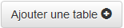 du menu latéral gauche. 

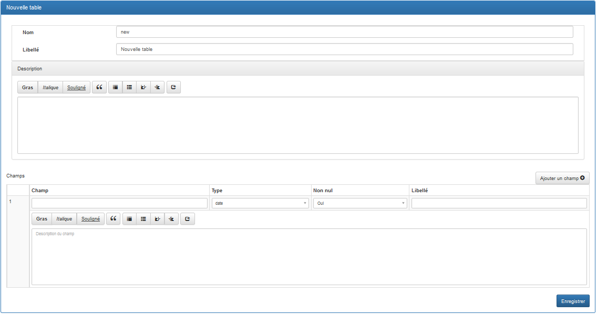

**Attributs :** 

1. « Nom » : Nom de la table sans espaces ni caractères spéciaux ou accentués. 
2. « Libellé » : Titre de la table. 

Vous pouvez décrire la table dans l’espace « Description » prévu à cet effet. 

Le bouton « Ajouter un champ » vous permet d'ajouter des champs (colonnes) dans la base de données :

**Attributs :** 

1. « Champ » : Nom du champ sans espaces ni caractères spéciaux ou accentués. 
2. « Type » : Type du champ. 
3. « Non nul » : Si la donnée contenue dans ce champ est obligatoire, sélectionnez « Oui »  sinon sélectionnez « Non ». 
4. « Libellé » : Titre du champ. 

Assurez-vous d’ajouter tous les champs nécessaires avant d’enregistrer.

Si vous ajoutez un champ après avoir enregistré, vous ne pourrez plus sélectionner « Oui » pour l'attribut « Non nul ». C'est une contrainte liée au SGBDR.
 
La procédure est la même pour créer une autre table. 

### Alimentation des tables

Pour enregistrer des données dans la table, cliquez sur le bouton « Ajouter un enregistrement ».  
Une ligne vierge s'affiche en début de table pour vous permettre de saisir les valeurs de l'enregistrement.

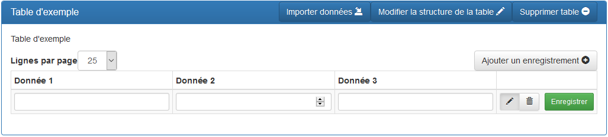

Une fois saisi les valeurs, cliquez sur le bouton « Enregistrer » pour les sauvegarder.  
Si vous voulez modifier les valeurs, cliquez sur l'icône : 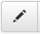, effectuer les modifications puis cliquez sur le bouton « Enregistrer » pour les sauvegarder.  
Enfin, si vous voulez supprimer un enregistrement cliquez sur l'icône : 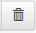, 
un bouton « Confirmer » apparaîtra, cliquez le pour supprimer définitivement l'enregistrement. 

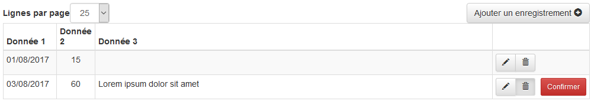

Une fois confirmé, l'enregistrement sera supprimé de la base de données, mais la ligne restera affichée avec un bouton « Restaurer » si toutefois vous vous étiez trompé ou que vous changez d'avis.  

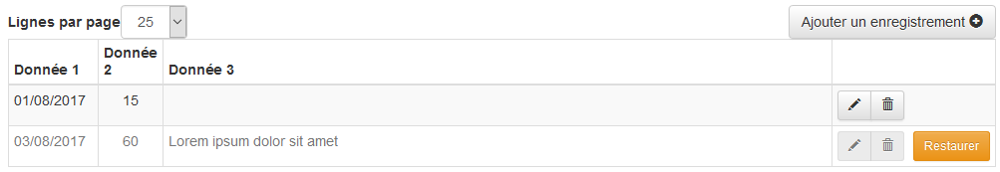

Si vous cliquez sur « Restaurer », la ligne sera réenregistrée dans la base de données. 

Si vous ne cliquez pas sur « Restaurer », au prochain réaffichage de la page l'enregistrement n'apparaîtra plus dans la liste.

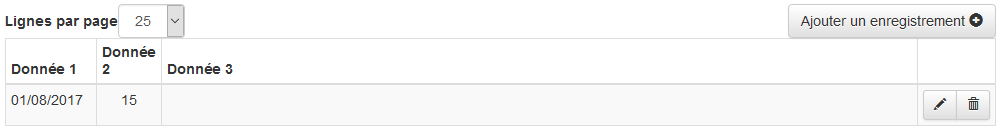

### Import de données dans les tables

Un autre moyen d’alimenter votre table est d'importer des données au format .csv ou .txt provenant d'un fichier Excel. 
Si vous choisissez d'importer des données, cliquez sur le bouton « Importer données » de la barre de titre. 
 

Le message « Êtes-vous sûr de vouloir importer des données dans la table ‘Libellé de la table sélectionnée’ ? » s’affiche, appuyez sur « OK » pour confirmer.  
L'écran suivant s’affiche : 

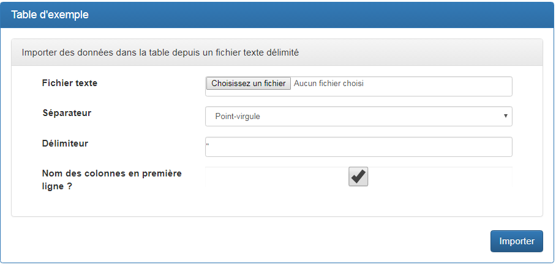

Dans ce formulaire, une fois que vous aurez sélectionné le « Fichier texte » depuis le disque dur de votre ordinateur, il vous sera proposé le « Séparateur » et le « Délimiteur » les plus appropriés au format du fichier (selon son extension : .csv ou .txt).

Si dans votre fichier vous avez une ligne titre avec les noms de colonnes, assurez-vous d'avoir nommé chaque colonne avec le nom du champ correspondant et non le libellé. Vous devez aussi vérifier que les valeurs affectées aux champs sont conformes à leurs types (par exemple que le champ « donnee\_1 » contient une valeur de type date). 

Si vous avez choisi de ne pas mettre de ligne de titre dans votre fichier, décochez la case « Nom des colonnes en première ligne ? ». Dans ce cas, les colonnes doivent être présentées dans l'ordre de déclaration des champs de la table.

Exemple .csv (DOS ou point-virgule lors de l’enregistrement) :

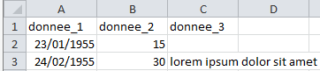

Exemple .txt (Texte séparateur Tabulation lors de l’enregistrement) :

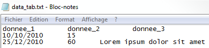

### Modifier la structure d'une table

La structure de la table (son nom, son libellé, les caractéristiques de ses champs) peut être modifiée dans la limite des contraintes imposées par le SGBDR sous-jacent.
Des champs peuvent être rajoutés ou supprimés.

Dans la barre latérale gauche, sélectionnez la source à laquelle appartient la table puis cliquez sur le libellé de la table dans le bloc du haut.

Les informations de la table s'affichent, cliquez sur « Modifier la structure de la table » de la barre de titre :

Confirmez l'action pour afficher le formulaire de modification.

Le formulaire de modification prérempli est le même que celui présenté dans la section « Création des tables » au début de ce document.  
Reportez-vous à cette section pour suivre la procédure.

### Supprimer une table

Dans la barre latérale gauche, sélectionnez la source à laquelle appartient la table puis cliquez sur le libellé de la table dans le bloc du haut.

Les informations de la table s'affichent, cliquez sur « Supprimer » de la barre de titre :

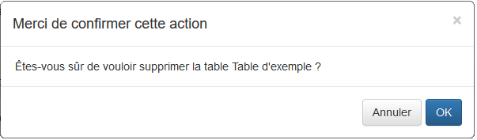

Confirmez l'action pour supprimer définitivement la table. Cette opération est irréversible.

## Exporter une source de données

Vous pouvez exporter une source de données en vue de l'archiver, de la diffuser ou tout simplement l'importer dans une autre instance de G6K (Cf. supra).

Cliquez sur « Sources de données » de la barre de menu. 

Puis cliquez sur la source de données à exporter dans la barre latérale gauche.

Puis cliquez sur le bouton « Exporter » de la barre de titre.

G6K génère deux fichiers au format JSON dont les caractéristiques sont les suivantes :

Le premier fichier, dont le nom est formé avec le nom de la source suivi de l'extension .schema.json, décrit des données contenues dans la source.  
La description des données est conforme à la spécification [JSON schema](http://json-schema.org/) qui est à la fois une norme de description et une norme de validation de données JSON.

Le deuxième fichier, dont le nom est formé avec le nom de la source suivi de l'extension .json., comporte les données contenues dans la source.

Ces deux fichiers sont compressés dans un fichier qui porte également le nom de la source avec l'extension .zip.  
Il vous est proposé en téléchargement pour archivage.

## Modifier une source de données

Cliquez sur « Sources de données » de la barre de menu. 

Puis cliquez sur la source de données à modifier dans la barre latérale gauche.

Puis cliquez sur le bouton « Modifier » de la barre de titre.

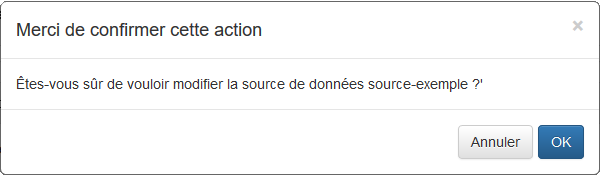

Confirmez l'action pour afficher le formulaire de modification.

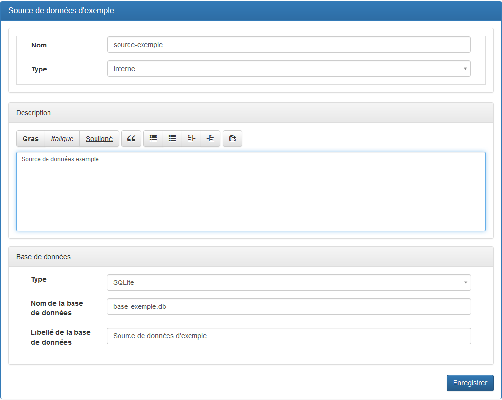

Le formulaire prérempli est le même que celui présenté dans la section « Création de la source de données » au début de ce document.  
Reportez-vous à cette section pour suivre la procédure.

## Supprimer une source de données

Cliquez sur « Sources de données » de la barre de menu 

Puis cliquez sur la source de données à supprimer dans la barre latérale gauche.

Puis cliquez sur le bouton « Supprimer » de la barre de titre.

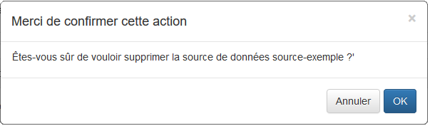

Confirmez l'action pour supprimer définitivement la source.

Cette opération est irréversible. Si toutefois vous avez exporté la source de données (Cf. « Exporter une source de données » plus haut dans ce document), vous pouvez réimporter la source en suivant la procédure ci-dessous.

## Import de la source de données

Vous avez la possibilité d’importer une source de données qui aurait été exportée d'une autre instance de G6K.

Extraire les 2 fichiers de l'archive sur votre ordinateur.

Cliquez sur le bouton « Importer source de données » de la barre latérale gauche.

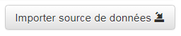

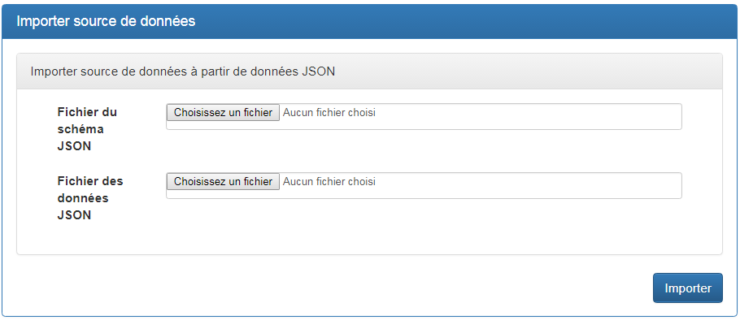

**Attributs :**
 
1. « Fichier du schéma JSON » : Cliquez sur « Choisissez un fichier » et sélectionnez le fichier .schema.json. 
2. « Fichier des données JSON » : Cliquez sur « Choisissez un fichier » et sélectionnez le fichier .json.

# Source de données externe.

## Base de données distante

### Déclaration de la source de données

Cliquez sur « Sources de données » de la barre de menu 

puis sur  du menu latéral gauche.

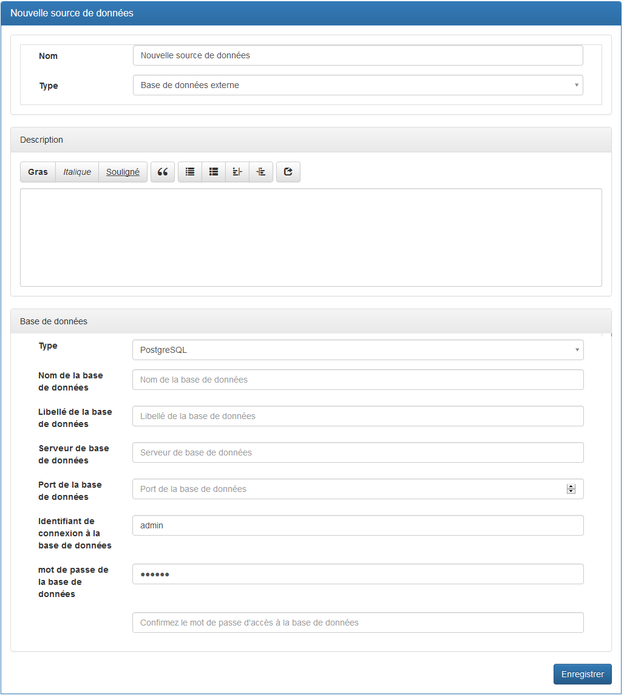

**Attributs :**

1. « Nom » : Nom de la source de données sans espaces ni caractères spéciaux ou accentués. 
2. « Type » : Type de la source de données « Interne », « Base de données externe » ou « Web service externe (API Rest) ». Choisir « Base de données externe ». 
3. « Base de données » / « Type » : Type de la base de données (MySQL ou PostgreSQL). 
4. « Nom de la base de données » : Nom de la base de données sans espaces ni caractères spéciaux ou accentués. 
5. « Libellé de la base de données » : A votre convenance. 
6. « Serveur de base de données » : Nom du serveur ou son adresse IP.
7. « Port de la base de données » : numéro du port, en général sur 4 chiffres. 
8. « Identifiant de connexion à la base de données » : Identifiant d'un utilisateur disposant du privilège SELECT.
9. « Mot de passe de la base de données » : Mot de passe associé à l'identifiant. 

Vous pouvez décrire la source de données dans l’espace « Description » prévu à cet effet. 

#### Déclaration des tables

La déclaration des tables est identique à la création des tables d'une source de données interne.

## Web service

### Déclaration de la source de données

Cliquez sur « Sources de données » de la barre de menu 

puis sur  du menu latéral gauche.

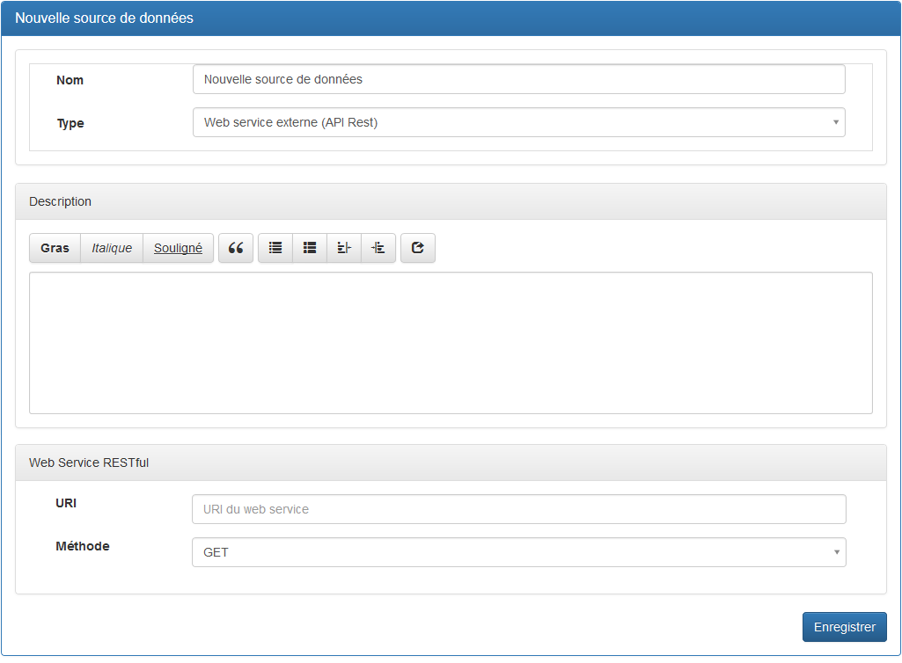

**Attributs :**

1. « Nom » : Nom de la source de données sans espaces ni caractères spéciaux ou accentués. 
2. « Type » : Type de la source de données « Interne », « Base de données externe » ou « Web service externe (API Rest) ». Choisir « Web service externe (API Rest) ». 
3. « URI » : URI du webservice sans paramètres. 
4. « Méthode » : GET (les paramètres sont ajoutés à l'URI) ou POST (les paramètres sont transmis dans le corps du message HTTP). 

Vous pouvez décrire la source de données dans l’espace « Description » prévu à cet effet. 

Les paramètres transmis à l'API sont définis par chacun des simulateurs utilisant l'API.

Si l'URI du webservice comporte un chemin fixe indépendant des requêtes, le faire figurer dans l'URI.

S'il existe un chemin variable en fonction des requêtes soumises au web service, ne pas le mettre dans l'URI, il appartiendra au simulateur de compléter l'URI avec le chemin approprié. 