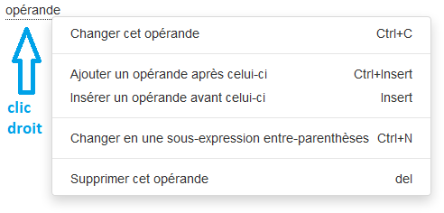

<!-- title: G6K: Guide d'administration  -->
<!-- subtitle: Composition des expressions -->

# Expressions

Les expressions sont des formules mathématiques évaluées par G6K pour réaliser une simulation.

Une expression est une combinaison d'opérandes et d'opérateurs.  
<pre>
&lt;expression&gt; : &lt;opérande&gt;[&lt;opérateur&gt;&lt;opérande&gt;]
&lt;opérande&gt; : &lt;expression&gt;|&lt;opérande&gt;
</pre>

G6K dispose d'un composant permettant de saisir des expressions.

Ce composant est utilisé :

* dans la constitution des filtres des requêtes d'accès aux sources de données de référence
* pour calculer la valeur par défaut, la valeur minimale, la valeur maximale ou le contenu d'une donnée
* dans la constitution des conditions des règles métier

## Composition d'une expression

Pour composer une expression, cliquez sur la boite à liste 

Vous pouvez ainsi sélectionner les éléments constitutifs d'un opérande :

* valeur littérale
* constante
* donnée (champ)
* fonction
* sous-expression
 
 

Ces éléments sont décrits ci-après :

### Opérandes

#### Divers

| Nom             | Description |
|-----------------|-------------|
| Constante       | Permet de saisir une valeur littérale. Après sélection de cet élément, le champ de saisie apparait : . Saisissez la valeur puis appuyez sur la touche « Entrée ». Le mot « Constante » est remplacé par la valeur saisie. |
| Sous-expression | Permet de mettre une partie de l'expression entre parenthèses. Après sélection de cet élément, la boite à liste s'entoure de parenthèses :|

#### Champs

La liste des champs est constituée à partir des libellés des données que vous avez définis (panneau « Données »).

Pour insérer un champ dans l'expression, sélectionnez le dans la liste.

#### Constantes

| Nom   | Description                   |
|-------|-------------------------------|
| pi    | 3,14159                       |
| now   | Date du jour de la simulation |
| today | Alias de now                  |
| true  | Booléen 'vrai'                |
| false | Booléen 'faux'                |

#### Fonctions

| Fonction        | Description | Nombre d'arguments | Type retourné |
|-----------------|-------------|:------------------:|---------------|
| abs             | Renvoie la valeur absolue de l'argument numérique|1|nombre|
| acos            | Renvoie l'arc cosinus de la valeur passée en argument|1|nombre|
| acosh           | Renvoie l'arc cosinus hyperbolique de la valeur passée en argument|1|nombre|
| addMonths       | Ajoute le nombre de mois en argument 1 à la date en argument 2 et retourne la date résultat  | 2 | date |
| asin            | Renvoie l'arc sinus de la valeur passée en argument|1|nombre|
| asinh           | Renvoie l'arc sinus hyperbolique de la valeur passée en argument|1|nombre|
| atan            | Renvoie l'arc tangente de la valeur passée en argument|1|nombre|
| atan2           | Renvoie l'arc tangente 2 de la valeur passée en argument|1|nombre|
| atanh           | Renvoie l'arc tangente hyperbolique de la valeur passée en argument|1|nombre|
| ceil            | Renvoie la plus petite valeur entière supérieure ou égale à la valeur passée en argument|1|nombre|
| cos             | Renvoie le cosinus de la valeur passée en argument|1|nombre|
| cos             | Renvoie le cosinus de la valeur passée en argument|1|nombre|
| count           | Retourne le nombre d'arguments non nul  | illimité |  nombre |
| day             | Retourne le jour (1 à 31) extrait de la date fournie en argument | 1 | nombre |
| exp             | Renvoie l'exponentiel de la valeur passée en argument, c-à-d la valeur de e portée à la puissance de l'argument|1|nombre|
| firstDayOfMonth | Renvoie la date correspondant au premier jour du mois, calculé à partir de la date fournie en argument | 1 | date |
| floor           | Renvoie la plus grande valeur entière inférieure ou égale à la valeur passée en argument|1|nombre|
| fullmonth       | Renvoie le libellé en clair du mois extrait de la date fournie en argument | 1 |   |
| get             | Retourne l'élément de la liste en argument 1 en position fournie en argument 2 | 2 | texte |
| lastday         | Retourne le dernier jour du mois (1 à 31) calculé à partir du mois (1 à 12) en argument 1 et de l'année en argument 2 | 2 | nombre |
| lastDayOfMonth  | Renvoie la date correspondant au dernier jour du mois, calculé à partir de la date fournie en argument | 1 | date |
| length          | Renvoie la longueur de la chaîne passée en argument|1|entier|
| log             | Renvoie le logarithme de la valeur passée en argument|1|nombre|
| log10           | Renvoie le logarithme base 10 de la valeur passée en argument|1|nombre|
| lower           | Convertit la chaîne en lettres minuscules|1|texte|
| match           | Retourne vrai si le texte en argument 2 correspond à l'expression régulière en argument 1, faux sinon | 2 | booléen |
| max             | Renvoie la plus grande des valeurs fournies en arguments|illimité|nombre|
| min             | Renvoie la plus petite des valeurs fournies en arguments|illimité|nombre|
| money           | Convertit le montant fourni en argument en chaîne de caractères | 1 | texte |
| month           | Retourne le mois (1 à 12) extrait de la date fournie en argument | 1 | nombre |
| nextWorkDay     | Retourne le jour ouvrable (tenant compte des jours fériés) suivant la date fournie en argument | 1 | date |
| pow             | Renvoie la valeur de l'argument 1 élevé à la puissance de la valeur de l'argument 2|2|nombre|
| rand            | Retourne une valeur aléatoire comprise entre 0 et 1 inclus avec l'argument comme valeur de départ|1|nombre|
| replace         | Remplace toutes les occurrences de l'argument 1 dans l'argument 3 par la valeur de l'argument 2 | 3 | texte |
| round           | Arrondit la valeur de l'argument 1 à la valeur la plus proche avec le nombre de décimal passé en argument 2|2|nombre|
| sin             | Renvoie le sinus de la valeur passée en argument|1|nombre|
| sinh            | Renvoie le sinus hyperbolique de la valeur passée en argument | 1 | nombre |
| size            | Retourne le nombre d'éléments de la liste fournie e argument | 1 | nombre |
| split           | Transforme la chaine fournie en argument 2 en une liste selon l'expression régulière en argument 1 | 2 | liste |
| sqrt            | Renvoie la racine carrée de la valeur passée en argument|1|nombre|
| sum             | Retourne la somme des arguments | illimité | nombre |
| tan             | Renvoie la tangente de la valeur passée en argument|1|nombre|
| tanh            | Renvoie la tangente hyperbolique de la valeur passée en argument| 1 | nombre |
| upper           | Convertit la chaîne en lettres majuscules|1|texte|
| workdays        | Retourne le nombre de jours ouvrables (tenant compte des jours fériés) entre les deux dates fournies en arguments. | 2  | nombre |
| workdaysofmonth | Retourne le nombre de jours ouvrables (tenant compte des jours fériés) du mois  calculé à partir du mois (1 à 12) en argument 2 et de l'année en argument 1 | 2 | nombre |
| year            | Retourne l'année extraite de la date fournie en argument | 1 | nombre |

Après sélection de la fonction, une boite à liste par argument s'affiche, vous permettant de saisir les arguments de la fonction. Ces arguments sont aussi des expressions.

Une fois terminée la saisie de l'opérande, celui-ci s'affiche souligné.  
Ainsi sont soulignés, les noms d'éléments et les parenthèses ouvrantes.

Cet opérande peut suffire pour constituer une expression mais vous pouvez le combiner avec d'autres opérandes pour composer une expression plus "complexe".  
Pour ce faire, clic-droit sur un élément souligné et le menu suivant s'affiche :



| Elément du menu                                  | Description           |
|--------------------------------------------------|-----------------------|
| Changer cet opérande                             | Remplace l'élément souligné par une boite à liste :  vous permettant de remplacer l'opérande.|
| Ajouter un opérande après celui-ci               | Ajoute une boite à liste d'opérateurs  après l'élément souligné vous permettant de sélectionner l'opérateur qui combinera les deux opérandes.<br>Une fois l'opérateur choisi, une boite à liste s'affiche pour le deuxième opérande. <br>Les opérateurs sont définis dans le paragraphe suivant.|
| Ajouter un opérande avant celui-ci               | Ajoute une boîte à liste d'opérandes pour le deuxième opérande ainsi qu'une boite à liste d'opérateurs pour combiner les deux opérandes  avant l'élément souligné. <br>Les opérateurs sont définis dans le paragraphe suivant.|
| Changer en une sous-expression entre parenthèses | Remplace l'élément souligné par une boite à liste entourée de parenthèse : |
| Supprimer cet opérande                           | Supprime l'opérande souligné.  |

### Opérateurs


| Symbole | Description                  |
|:-------:|------------------------------|
|    +    | Addition                     |
|    -    | Soustraction                 |
|    *    | Multiplication               |
|    /    | Division                     |
|    %    | Reste de la division entière |
|    &    | Opérateur bit à bit 'AND'    |
|    \|   | Opérateur bit à bit 'OR'     |

## Exemple d'expression

Dans le simulateur de démo fourni avec G6K pour le calcul d'une pension alimentaire, la donnée « Montant par enfant » est calculée avec l'expression suivante :

```max(0, round((Revenus du débiteur - Montant forfaitaire du RSA) * Taux pension alimentaire / 100))```

Dans cette expression « Revenus du débiteur », « Montant forfaitaire du RSA » et « Taux pension alimentaire » sont des champs (données), « max » et « round » sont des fonctions, « 0 » et « 100 » sont des constantes, « - », « * » et « / » sont des opérateurs.
