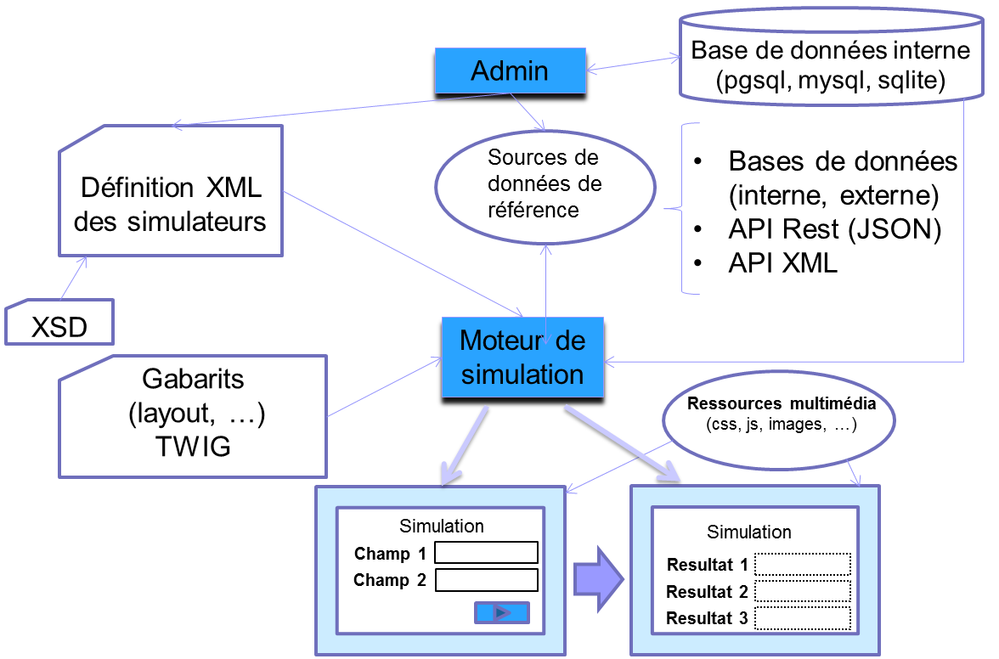

<!-- title: G6K: Moteur de simulation de calcul  -->
<!-- subtitle: En savoir plus ... -->

# C’est quoi ?

G6K est un outil qui permet de créer des simulateurs de calcul sans codage informatique et de les mettre en ligne. Il dispose pour cela d’un moteur de simulation et d’un module d’administration.

Un simulateur de calcul est un service en ligne mis à la disposition d’un utilisateur pour lui permettre de calculer des résultats (taxes, prestations sociales, …) correspondant à sa situation particulière. 
Les résultats sont calculés en fonction des données fournies par l’utilisateur, de données de références (ex : montant d’une taxe) et de règles « métier » qui traduisent la législation en vigueur dans le domaine de la simulation.

# Comment ça marche ?

 

Un administrateur ou un contributeur définit les données à demander à l’utilisateur via des formulaires et les résultats à restituer (éventuellement en passant par des données intermédiaires de calcul).

L’administrateur met en scène la simulation en définissant des étapes de simulation. Chaque étape est composée d’un formulaire permettant la saisie ou la restitution des données préalablement définies.

L’administrateur définit des sources de données de référence qui peuvent être :

- externes et accessibles via des web services ou des requêtes sql;
- ou interne, enregistrés dans une base de données G6K.

L’administrateur ou le contributeur définit des règles (appelées règles « métier » ou business rules – dans G6K) et des calculs à appliquer dans le domaine de la simulation.

Les données, sources de données, étapes et règles de gestion sont enregistrés dans un fichier XML.

G6K possède un moteur de simulation permettant de « jouer » la simulation à l’aide des définitions contenues dans le fichier XML et des sources de données.

# Fonctions du moteur de simulation

* Analyse du fichier XML de définition
* Chargement et alimentation des gabarits (templates)
* Affichage des formulaires de saisie
* Contrôle des données saisies
* Accès aux données de référence
* Évaluation des formules de calcul
* Mise en œuvre des règles « métier »
* Gestion des étapes de simulation (étapes d’acquisition des informations, étape de restitution des résultats)

# Fonctions principales d’administration

* Définition des données:
  - saisies par l’utilisateur
  - intermédiaires
  - dans source de données
  - de résultat
* Définition des calculs
* Définition des règles de gestion (business rules)
* Définition des étapes de calcul
* Définition des textes (champs, aide, notes, …)
* Définition des sources de données internes et externes
* Définition des étapes de simulation
* Mise à jour des « données de référence » internes
