<!-- title: G6K: Guide d'administration  -->
<!-- subtitle: Gestion des simulateurs -->

ATTENTION: Ce document, en cours d'élaboration, est très incomplet.

# Simulateurs

Un simulateur de calcul est un service en ligne mis à la disposition d’un utilisateur pour lui permettre de calculer des résultats (taxes, prestations sociales, …) correspondant à sa situation particulière.

Les résultats sont calculés en fonction des données fournies par l’internaute, de données de références (ex : montant d’une taxe) et de règles qui correspondent à la législation en vigueur dans le domaine de la simulation.

La création des simulateurs est réservée aux utilisateurs disposant du rôle « Manager », « Administrateur » ou « Super administrateur ».

# Avant de commencer

Avant de commencer la saisie du simulateur, bien réfléchir au scénario de simulation, à savoir son découpage en étapes et leurs enchainements. Une étape de simulation correspond à une page et réciproquement. 

Dans chaque page il faut définir les informations qui seront demandées à l’utilisateur (via un formulaire) et celles qu’on lui restitue. Une page peut également contenir des blocs d’information.

Les informations restituées sont soit des données de références, soit des données issues du résultat d’un calcul en fonction de règles de calcul (législation).

Il faut donc au préalable faire l’inventaire de toutes ces données :

* Données saisies par l’utilisateur
* Données de référence (ex : montant du SMIC, RSA, plafond sécu, barèmes divers, …)
* Données issues d’un calcul
* Données résultant d’un calcul intermédiaire.

Pour les données de référence, il faut se poser la question de la source de données. Dispose-t-on d’une API (web service) interne ou externe ou d’une base de données pour retrouver ces données ?

Si oui, il sera possible de paramétrer cette API ou cette base de données dans G6K pour pouvoir y accéder.

Dans le cas contraire il faudra créer une source de données (base de données) interne dans G6K. A noter que les valeurs simples (tel que le montant du RSA) peuvent être définies en constante dans le simulateur, évitant ainsi la création d’une source de données. En revanche, les structures de données complexes (tel qu’un barème) nécessitent la création d’une source de données interne.

Ensuite, il est conseillé d’identifier tous les éléments d’une page, les nommer, les labeliser :

1. Donner un nom au simulateur, celui qui figurera dans l’url
2. Donner un titre au simulateur. Ce titre apparaitra sur chaque page en dessous du fil d’Ariane de navigation sur le site
3. Définir une description chapeau qui apparaitra sur chaque page de la simulation en dessous du titre
4. Pour chaque étape :
  * Donner un nom court à l’étape et un libellé (pas trop long). Le nom court figurera dans le fil d’Ariane de succession des étapes.
  * Définir les informations (champs) qui seront demandées ou restituées à l’utilisateur
  * Pour chaque champ :
    * Lui donner un nom et une étiquette (label)
    * Lui attribuer un type (date, entier, montant, pourcentage, liste de choix, …)
    * Décrire le champ (cette description pourra servir de bulle d’aide)
    * Décrire les conditions^1^ d’affichage du champ
    * Définir son usage (saisie utilisateur ou restitution)
    * S’il s’agit d’un champ de saisie :
      * Définir les contrôles de saisie ainsi que les messages d’erreurs associés.
      * Eventuellement définir une mention qui pourra apparaître au-dessus ou au-dessous du champ de saisie.
    * S’il s’agit d’un champ de restitution :
      * Définir les règles de constitution de la valeur du champ (calcul, source de données, …)
    * Eventuellement définir des notes de bas de page et les conditions^1^ de leur affichage.
    * Définir des boutons de navigation entre les étapes (étape suivante, précédente, nouvelle simulation, saut à l’étape N) et leur condition d’affichage.

# Création d’une source de données

Si vous avez besoin d’une source de données de référence et si celle-ci n'existe pas encore, il faut la créer avant de créer le simulateur. 

Reportez-vous à la section [« Création d'une source de données de référence »](datasources-management.html) de la documentation.

# Création d’un simulateur

Cliquez sur « Simulateurs » de la barre de menu :

puis sur le bouton  du menu latéral gauche. 

Il vous est proposé un formulaire de saisie des paramètres généraux du simulateur :

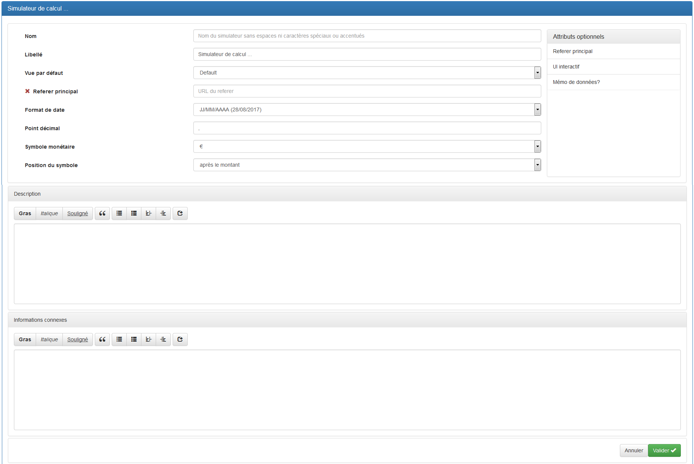

**Attributs :**
 
1. « Nom » : Correspond au nom qui sera affiché dans l’URL (*…/calcul/nom-du-simulateur*) et au fichier .XML créé lors de l’enregistrement du simulateur.
Le simulateur sera enregistré sous le nom &lt;nom-du-simulateur>.xml dans le répertoire des simulateurs de G6K. 
2. « Libellé » : Titre qui sera affiché sur la page de votre simulateur. 
3. « Vue par défaut » : Vue avec laquelle sera affiché votre simulateur.
La vue est un ensemble de gabarits et de styles utilisés pour afficher le simulateur.
Pour plus d'informations sur les vues, consulter la page [« Gestion des vues »](views-management.html) de la documentation.  
4. « Format de date » : A choisir en fonction du format d’affichage et de saisie des dates le plus couramment utilisé dans le pays. 
5. « Point décimal » : A choisir en fonction du format d’affichage des valeurs numériques (montant, pourcentages, ...) souhaité. 
6. « Symbole monétaire » : A choisir en fonction du pays. 
7. « Position du symbole » : A choisir en fonction du pays.

**Attributs optionnels :**

1. « Referer principal » : URL de la page du site qui appelle le simulateur.
G6K constitue un fil d'Ariane de navigation où l'avant dernier élément est construit avec cette URL et le libellé du simulateur. 
2. « UI interactif » : Si cette option est cochée, le moteur de simulation utilisera le Javascript pour donner de l’interactivité à la simulation (recommandé) 
3. « Mémo de données » : Si cette option est cochée le moteur de simulation sera autorisé à enregistrer la valeur de certains champs dans les cookies du navigateur pour une utilisation ultérieure. Utile pour une valeur comme la date de naissance. 

Décrire ce que fait votre simulateur dans le champ « Description ».  
Cette description sera affichée en dessous du libellé/titre du simulateur de toutes les pages/étapes de simulation. 

Optionnellement, vous pouvez saisir des informations complémentaires dans le champ « Informations connexes » que le gabarit de la vue pourra afficher ou pas.

Une fois la saisie des paramètres terminée et que vous avez cliqué sur le bouton , le bouton  apparait en haut à droite de la page.
Ce bouton permet d'envoyer les informations saisies ou modifiées au serveur à tout moment, parceque le bouton « Valider » ne fait que garder les informations dans la mémoire de votre ordinateur.

## Sources de données utilisées
 
Dans le panneau dépliable « Sources de données utilisées » vous allez pouvoir définir les requêtes spécifiques d'accès aux données de référence des sources de données.
Certaines de ces requêtes peuvent nécessiter des paramètres qui doivent être définis, au préalable, dans le panneau « Données ».

Dans la barre de titre du panneau « Sources de données utilisées », cliquez sur le bouton « Ajouter » pour afficher l'écran de sélection de la source et de définition d'une requête :  

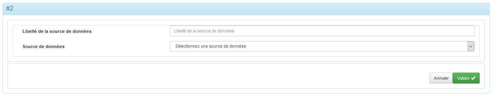

**Attribut :**

1. « Source de données » : Correspond à la source de données sur laquelle porte la requête. 

**Attribut optionnel :**

1. « Libellé de la source de données » : Titre à donner à la source pour cette requête.

Une fois la source sélectionnée, le formulaire se complète des champs de définition de la requête.

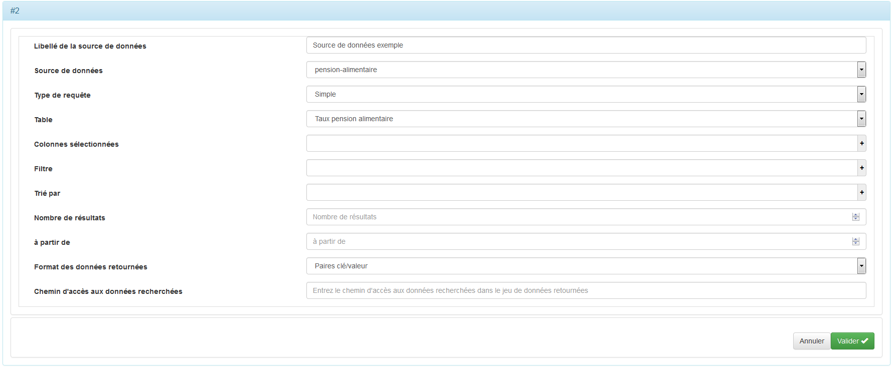

### Requête simple

Une requête est dite simple si elle ne porte que sur une seule table et qu'elle ne comporte pas de sous-requête imbriquée.  
Le formulaire permet de construire les requêtes simples sans que vous ayez à connaitre le langage SQL.

**Attributs :**

1. « Type de requête » : Choisir le type « Simple ».  
2. « Table » : Nom de la table sur laquelle porte la requête. 
3. « Colonnes sélectionnées » : Champs/colonnes de la table qui contiennent les données que vous souhaitez récupérer.
Pour entrer une colonne, cliquez sur le '+' à droite du champ puis sélectionnez la colonne dans la liste déroulante.
Vous pouvez également composer une expression auquel cas vous devrez définir un alias comme nom de colonne.
Pour supprimer une colonne, cliquez sur le 'x' à gauche du nom de la colonne. 
4. « Filtre » : Conditions portant sur les champs/colonnes permettant de ne garder que les lignes du résultat de la requête respectant ces conditions. 
5. « Trié par » : Tri par ordre croissant ou décroissant sur les champs/colonnes sélectionnées. 
Pour entrer une colonne, faire comme en&nbsp;3., puis sélectionnez l'ordre de tri (croissant ou décroissant).
6. « Nombre de résultats » : Parmi toutes les « lignes » de résultats retournées par la requête, indiquer le nombre de lignes qui doit être conservées. Mettre 0 si toutes les lignes doivent être conservées. 
7. « à partir de » : Parmi toutes les « lignes » de résultats retournées par la requête, indiquer le numéro de la première ligne qui doit être prise en considération pour le traitement de la requête. Le numéro de la première ligne est 0, 1 la deuxième et ainsi de suite. 
8. « Format des données retournées » : 
  * « JSON » : format d'échange de données en texte lisible. 
  * « XML » : format de description des données. 
  * « valeur simple » : N/A. 
  * « paires clé/valeur » : Tableau de paires clé/valeur. 
  * « HTML » : format de données conçu pour représenter les pages web. 
  * « CSV » : format informatique ouvert représentant des données tabulaires sous forme de valeurs séparées par des virgules. 
9. « Chemin d’accès aux données recherchées » : Le chemin d’accès dépend du format des données retournées : 
  * « JSON » : Chemin au format [JsonPath](http://goessner.net/articles/JsonPath/) ou [Xpath](http://xmlfr.org/w3c/TR/xpath/) 
  * « XML » : Chemin au format [Xpath](http://xmlfr.org/w3c/TR/xpath/) 
  * « Valeur simple » : N/A 
  * « Paires clé/valeur (tableau) » : chemin sous la forme « N° de ligne / nom de colonnes » (exemple : 0/taxe : colonne taxe de la ligne 1) 

Pour construire la requête, se reporter à la documentation du [Composant visuel de fabrication de requêtes simples](source-query-builder.html)

Si le filtre de la requête contient un paramètre variable, vous devez d'abord déclarer une donnée (Cf. la section « Données » infra) qui contiendra la valeur du paramètre.

Ensuite, validez la saisie sans saisir le filtre dans un premier temps. Cliquez sur le bouton « Modifier », le bouton  apparait en bas à droite du formulaire pour vous permettre de déclarer le paramètre.  
Après avoir déclaré le paramètre, vous pouvez saisir le filtre et sélectionner le paramètre de l'expression.

**Attributs des Paramètres :**

1. « Nom » : Nom du paramètre sans espaces ni caractères spéciaux ou accentués. 
2. « Provenance » : Provenance du paramètre soit « Donnée » soit « Constante ». 
3. « Donnée » : Nom de la donnée avec laquelle vous allez travailler. 

**Attribut optionnel des Paramètres :**

1. « Optionnel » : Paramètre optionnel ou non. Un paramètre ne peut être optionnel que s’il est utilisé par une requête d’une source de données de type « Web service »

Figure 1 : Source de données avec une requête simple et un paramètre

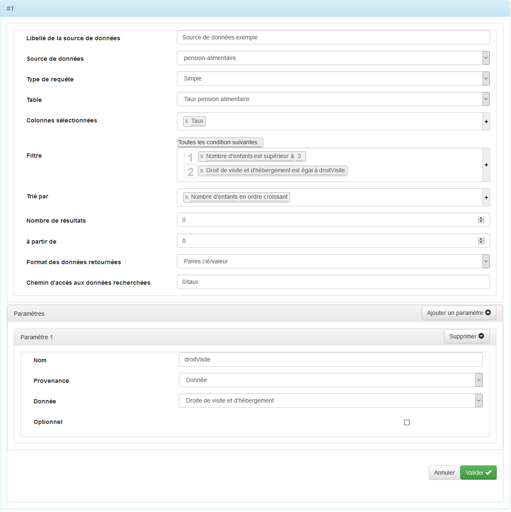

Une fois la saisie validée, l'écran suivant s'affiche :

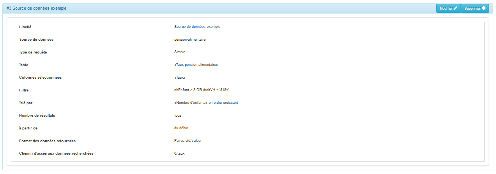

Cette requête retournera un tableau de paires « 'taux'/valeur du taux ». Le chemin d'accés spécifié (0/taux) sélectionnera la première ligne du tableau et la valeur coorespondant à 'taux'. Nous verrons plus loin comment déclarer une donnée pour stocker la valeur du taux.

### Requête complexe

Dans ce cas, les champs « Table », « Colonnes sélectionnées », « Filtre », « Trié par », « Nombre de résultats » et « à partir de » sont remplacés par le champ « Requête SQL » car ces éléments figurent dans la requête.

Comme pour les requêtes simples, des paramètres peuvent être utilisés.  
Les formes $X$d où X est le numéro du paramètre, font référence à des valeurs entières, $X$f à des valeurs décimales et $X$s à des valeurs alphanumériques.
 
**Attributs :**

1. « Type de requête » : Choisir le type « Complexe ».  
2. « Requête SQL » : La requête SQL. 
8. « Format des données retournées » : 
  * « JSON » : format d'échange de données en texte lisible. 
  * « XML » : format de description des données. 
  * « valeur simple » : N/A. 
  * « paires clé/valeur » : Tableau de paires clé/valeur. 
  * « HTML » : format de données conçu pour représenter les pages web. 
  * « CSV » : format informatique ouvert représentant des données tabulaires sous forme de valeurs séparées par des virgules. 
9. « Chemin d’accès aux données recherchées » : Le chemin d’accès dépend du format des données retournées : 
  * « JSON » : Chemin au format [JsonPath](http://goessner.net/articles/JsonPath/) ou [Xpath](http://xmlfr.org/w3c/TR/xpath/) 
  * « XML » : Chemin au format [Xpath](http://xmlfr.org/w3c/TR/xpath/) 
  * « Valeur simple » : N/A 
  * « Paires clé/valeur (tableau) » : chemin sous la forme « N° de ligne / nom de colonnes » (exemple : 0/taxe : colonne taxe de la ligne 1) 

Figure 2 : Source de données avec une requête complexe

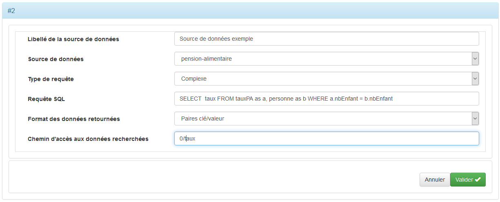

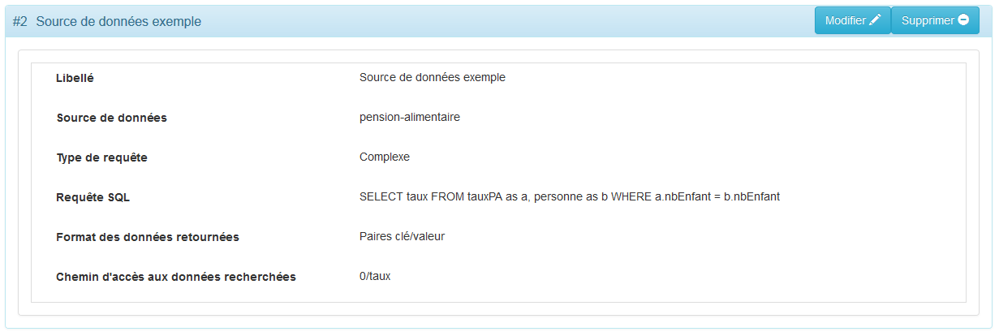

## Données

Les données permettent stocker des valeurs quel que soit leurs provenances (saisies par l'utilisateur, source de données, élément ou résultat de calculs). 
Elles peuvent être regrouper en groupes de données, ce qui permet de les disposer  dans les rangées d’un tableau (Cf. disposition « grille » d’un groupe de champs, plus loin dans ce document).

Pour ajouter une donnée ou un groupe de données, cliquez sur « Ajouter » de la barre de titre « Données » puis sur « Ajouter une donnée » ou « Ajouter un groupe de données » selon le cas.

Figure 3 : Formulaire d'ajout d'un groupe de données

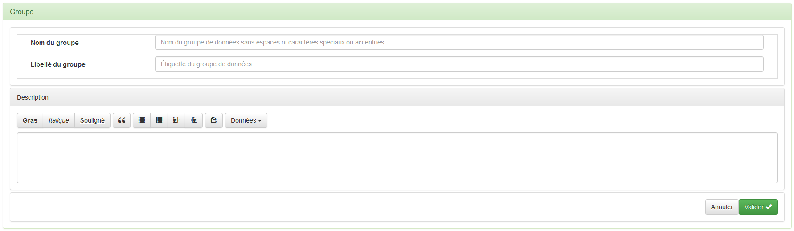

**Attributs :**

1. « Nom du groupe » : Nom du groupe de données sans espaces ni caractères spéciaux ou accentués. 
2. « Libellé du groupe » : Titre du groupe de données que l’on pourra sélectionner lors de la définition des groupes des champs des étapes, des règles métier ou des profils. 

Donnez une description du groupe de données dans le champ « Description »

Figure 4 : Formulaire d'ajout d'une donnée

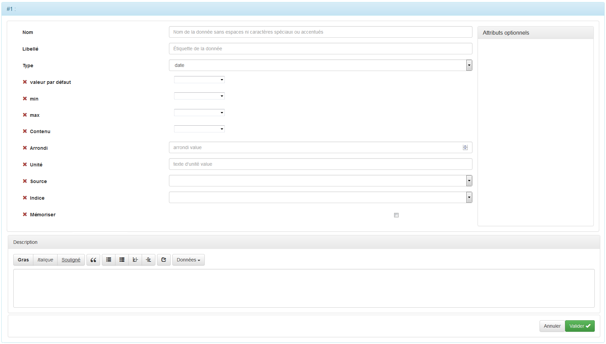

**Attributs :**

1. « Nom » : Nom de la donnée sans espaces ni caractères spéciaux ou accentués. 
2. « Libellé » : Titre de la donnée que l’on pourra sélectionner lors de la définition des champs des étapes, des règles métier ou des profils. 
3. « Type » : A choisir en fonction du format de donnée souhaité. 

**Type de données**

|Type           |Description                             |
|---------------|----------------------------------------|
| date          | date au format défini dans es options du simulateur. Cf. supra. Si la donnée est associée a un champ de saisie, un selecteur de date sera proposé à l'utilisateur.|
| jour          | Numéro de jour de 1 à 31.|
| mois          | Numéro de mois de 1 à 12.|
| année         | Année sur 4 chiffres.|
| booléen       | Valeur boolénne (0/1). Si la donnée est associée a un champ de saisie, une cache à cocher sera proposée à l'utilisateur.|
| entier        | Valeur entière.|
| nombre décimal| Valeur décimale avec virgule.|
| texte         | Valeur alphanumérique.|
| texte enrichi | Valeur alphanumérique avec enrichissement (gras, italique, souligné, ...).|
| montant       | Valeur monétaire à 2 décimales.|
| choix         | Valeur pouvant être choisie dans une liste déroulante ou avec des boutons radios.|
| choix multiple| Valeurs choisies à l'aide de cases à cocher.|
| pourcentage   | Pourcentage de 0 à 100, possiblement avec des valeurs décimales.|
| liste         | Liste de valeurs. Ne peut être utilisé en saisie.|
| table         | Tableau de valeurs. Ne peut être utilisé en saisie.|
| département   | Code de département. Si la donnée est associée a un champ de saisie, l'utilisateur choisit dans une liste déroulante.|
| région        | Code de région. Si la donnée est associée a un champ de saisie, l'utilisateur choisit dans une liste déroulante.|
| pays          | Nom de pays|  

**Attributs optionnels :**

1. « Valeur par défaut » : Valeur par défaut de la donnée. 
2. « Min » : Valeur minimale de la donnée pour les données de type numérique.
3. « Max » : Valeur maximale de la donnée pour les données de type numérique.
4. « Contenu » : Expression inconditionnelle à affecter à la donnée. Pour la composition de l'expression se reporter à [Composition des expressions](expression-builder.html).
5. « Arrondi » : Utilisable avec les données de type « Nombre décimal ». Permet de fixer le nombre de décimales après la virgule. La dernière décimale est arrondie. 
6. « Unité » : Caractérise une valeur numérique comme par exemple "kilomètres", "litres", "ampère", etc ... L'unité est affichée après le champ.
7. « Source » : Si la donnée doit être alimentée par une source de donnée définie dans le panneau « Sources de données utilisées ». 
8. « Indice » : Correspond au champ retourné par la requête destiné à alimenter la donnée. 
9. « Mémoriser » : Garder en mémoire (cookie de l’utilisateur) la valeur afin que l’utilisateur n’ait pas à la ressaisir (Cf. attribut « Mémo » du simulateur)

Donnez une description de la donnée dans le champ « Description ». Cette description pourra être affichée dans une bulle d'aide, à la demande de l'utilisateur.

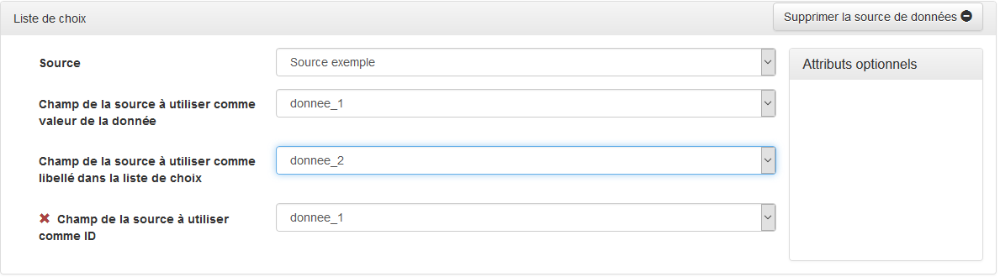

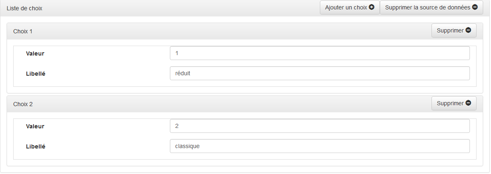

## Étapes

Une fois que vous avez défini vos sources de données et vos données vous allez pouvoir commencer à paramétrer la ou les étapes de votre simulateur. 

Une étape est constituée d’un ou plusieurs panneaux dans lesquels sont disposés des blocs d'infos et des groupes de champs dans l'ordre où ils sont déclarés.

Les blocs d'infos sont composés de chapitres eux-mêmes composés de sections.

Les groupes de champs sont composés de champs qui peuvent être disposés de trois manières différentes :  

* « Classique » : Les champs et leurs étiquettes sont affichés de façon classique, c'est-à-dire les uns en dessous des autres. 
* « Grille » : Les champs sont disposés par rangées sous forme de tableaux. Les données associées au champs d'une rangée doivent être regroupés dans des « groupes de données » (Cf. infra). Les étiquettes de champ sont ignorées.  
* « En ligne » : Les champs et leurs étiquettes sont disposés les uns à la suite des autres de façon à former une phrase. 

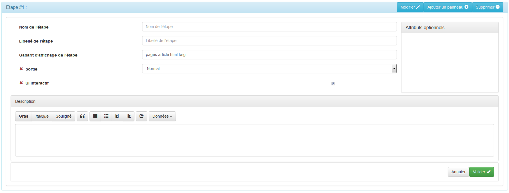

**Attributs :**

1. « Nom » : Nom de l’étape sans espaces ni caractères spéciaux ou accentués. 
2. « Libellé de l’étape » : Titre de l’étape qui sera affiché. 
3. « Gabarit d’affichage de l’étape » : 

**Attributs optionnels :**

1. « Sortie » : 
2. « UI interactif » :

### Panneaux 

Les panneaux composent les étapes et sont eux-mêmes constitués de groupes de champs. 
S'il y plusieurs panneaux, ils seront présentés sous forme d’onglets :

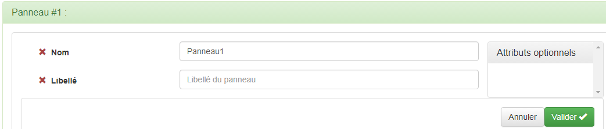

**Attributs :**

1. « Nom » : Nom du panneau sans espaces ni caractères spéciaux ou accentués. 

***Attribut optionnel :***

1. « Libellé » : Titre du panneau

#### Groupe de champs

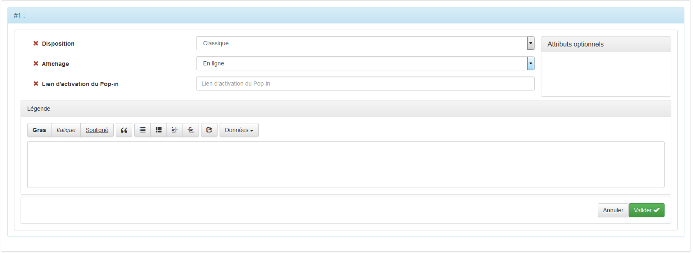

**Attributs :**

1. « Disposition » : Classique, grille ou en ligne. 
2. « Affichage » : En ligne ou pop-in. 

**Attribut optionnel :**

1. « Lien d’activation du Pop-in » :

##### Champs 

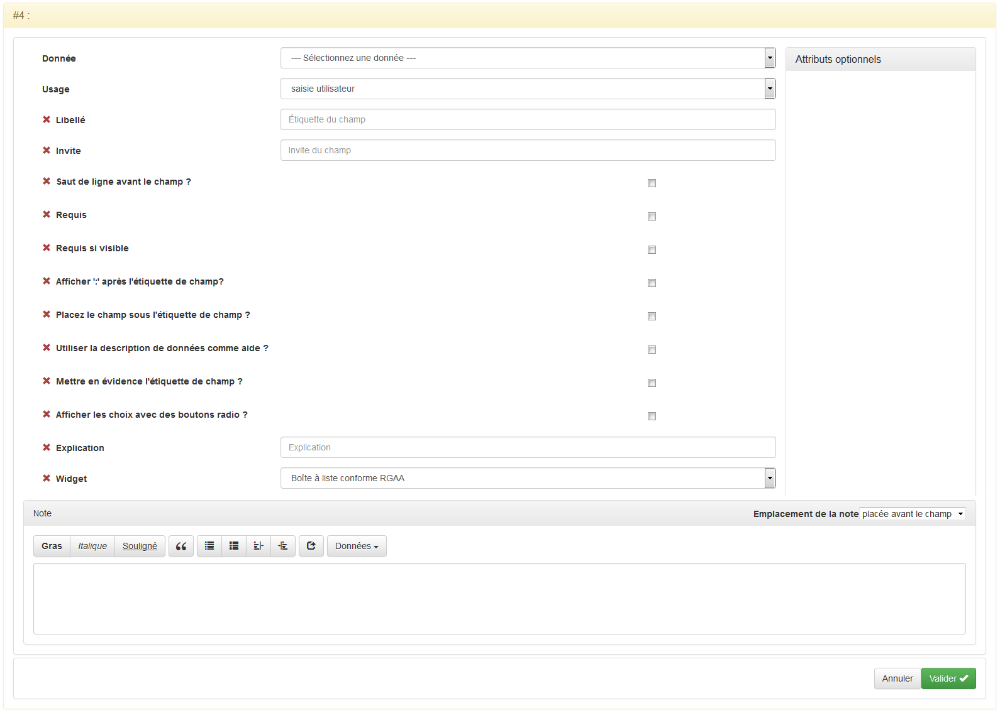

**Attributs :**

1. « Donnée » : Donnée associée au champ. S’il s’agit d’un champ de saisie, c’est dans cette donnée que sera stockée la valeur saisie par l’utilisateur. S’il s’agit d’un champ de restitution, c’est le contenu de cette donnée qui sera affichée dans le champ. 
2. « Usage » : Saisie par l’utilisateur ou restitution à l’utilisateur.

**Attributs optionnels :**

1. « Libellé » : Titre du champ. 
2. « Requis » : Champ requis (Un message d’erreur sera affiché si le champ n’est pas renseigné). 
3. « Afficher ‘ :’ après l’étiquette de champ ? » : A choisir en fonction de vos besoins. 
4. « Utiliser la description de données comme aide ? » : A choisir en fonction de vos besoins. 
5. « Invite » : 
6. « Saut de ligne avant le champ ? » : A choisir en fonction de vos besoins. 
7. « Requis si visible » : Lorsque le champ sera visible on peut décider du fait qu’il soit requis. 
8. « Placez le champ sous l’étiquette de champ ? » : A choisir en fonction de vos besoins. 
9. « Mettre en évidence l’étiquette de champ ? » : A choisir en fonction de vos besoins. 
10. « Afficher les choix avec les boutons radio ? » : Ne pas utiliser pour les longues listes de choix.
11. « Explication » : A choisir en fonction de vos besoins. 
12. « Widget » : A choisir en fonction de vos besoins :
  * « Boite à liste conforme RGAA » : Boîte à liste conforme au Référentiel Général d’Accessibilité pour les Administration. 
  * « Boîte à liste avec auto-complétion » : Lors de la saisie l’auto-complétion se fait automatiquement, cela permet à l’utilisateur de trouver l’élément qu’il recherche.
  * « Code postal obtenu par auto-complétion sur le nom de la commune ou son code postal » : Permet à l’utilisateur de profiter de l’auto-complétion concernant le nom de la commune ou son code postal. 
  * «  Code Insee obtenu par auto-complétion sur le nom de la commune ou son code postal » : Permet à l’utilisateur de profiter de l’auto-complétion concernant le nom de la commune ou son code postal.
  * « Code Insee obtenu à partir d'une carte de France » : Une carte apparaît et laisse le choix à l’utilisateur de se géolocaliser ou non. 
  * « Sélecteur de date conforme RGAA » : Permet à l’utilisateur de sélectionner une date. 
  * « Éditeur en place de champ de formulaire » : 

#### Bloc d'info

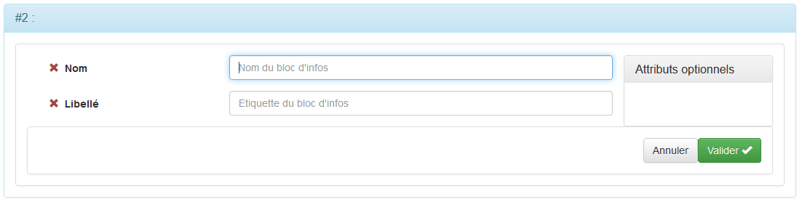

**Attributs optionnels :**

##### Chapitre

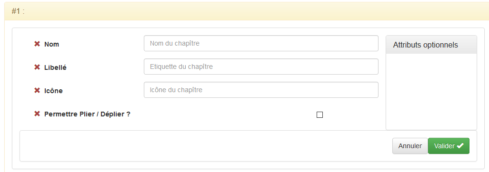

**Attributs optionnels :**

###### Section

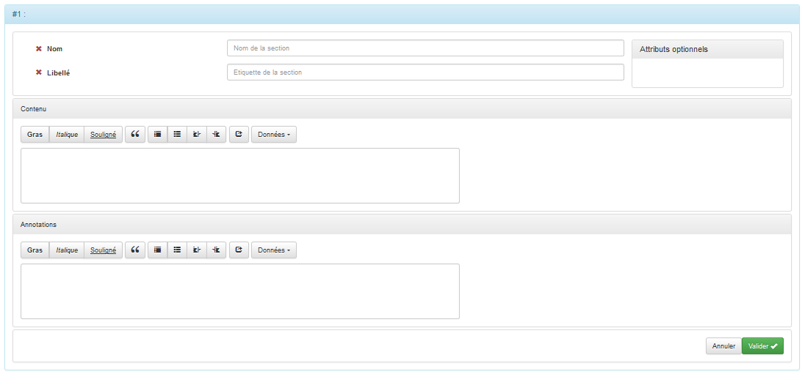

**Attributs optionnels :**

### Notes de bas de page

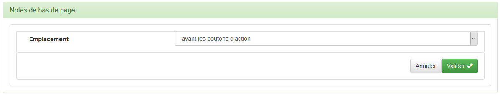

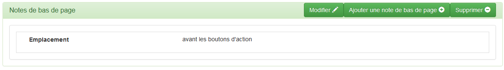

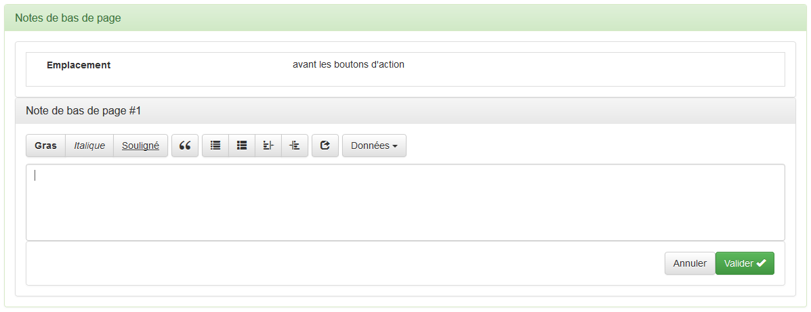
 
### Boutons d’actions
 
Les boutons d’actions permettent par exemple de passer d’une étape à l’autre ou de réinitialiser un formulaire.

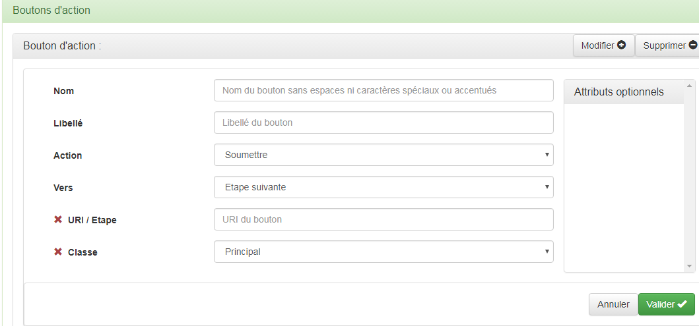

**Attributs :**

1. « Nom » : Donnée qui sera affiché pour les utilisateurs. 
2. « Libellé » : Saisie par l’utilisateur ou restitution à l’utilisateur. 
3. « Action » : Soumettre le formulaire et passage à l’étape définie par l’attribut « Vers » ou réinitialiser. 
4. « Vers » : A choisir en fonction de vos besoins.

**Attributs optionnels :**

1. « URI / étape » : Titre du champ. 
2. « Classe » : Niveau d’importance du bouton « Principale » le bouton sera mis en avant visuellement et « Secondaire » le bouton ne sera pas mis en avant visuellement.

## Règles métier

Les règles métier se définissent de la façon suivante : « Lorsque … » conditions, « Alors … » actions et « sinon … » actions.

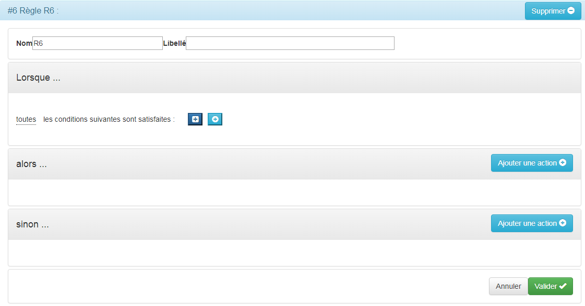

Ce sont les règles « métier » qui déterminent le comportement du simulateur. Elles se déclenchent lorsque le contexte change. 

Un changement de contexte se traduit toujours par l'acquisition ou la modification d'une donnée.

G6k s'informe du changement de contexte en revérifiant les conditions associées aux règles lorsque la valeur d'une donnée change.

Ainsi lorsque l'utilisateur saisit une valeur, que g6K accède à une donnée de référence ou qu'une valeur est calculée, les règles impactées sont déclenchées et les actions associées sont réalisées :

Les actions qui peuvent être réalisées sont :

* Montrer ou cacher une partie de la page (un champ, un groupe de champs, un panneau, un bouton, ...)
* Afficher un message d'erreur ou d'avertissement
* Effectuer un calcul et l'affecter à une donnée

Se reporter à la page [Composition des règles métier](business-rules.html) pour savoir comment on compose une règle.

## Profils

Lorsque vous allez définir des profils vous prédéfinirez des données liées aux différent profils. 

Les profils peuvent correspondre à des types de personnes par exemple les données prédéfinies pour un professionnel diffèrent des données pré remplies d’un particulier.

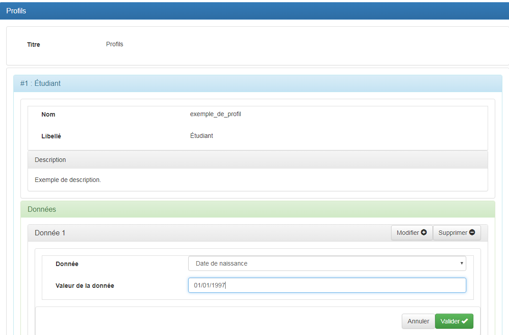

**Attributs :**

1. « Titre » : Titre de vos profils. 
2. « Nom » : Nom du profil. 
3. « Libellé » : Libellé du profil. 
4. « Données » / « Ajouter » : Ajout des données à pré remplir. 
5. « Donnée » : Choix de la donnée que l’on souhaite pré remplir. 
6. « Valeur » : Valeur pré rempli.

## Enregistrement du simulateur

A la fin de votre saisie, cliquer le bouton  en haut à droite de la page pour enregistrer votre travail.

A noter que G6K, enregistre une version de « travail » qu'il sera nécessaire de « Publier » pour la mise en ligne.
