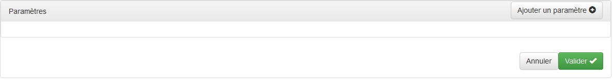

<!-- title: G6K: Guide d'administration  -->
<!-- subtitle: Composant visuel de fabrication de requêtes simples -->

# Vue d'ensemble

Ce composant UI est un assistant visuel permettant de composer des requêtes simples d'accès aux bases de données des sources de données de référence.

Une requête simple est une requête qui ne porte que sur une seule table et qui ne comporte pas de requêtes imbriquées.

Le résultat de l'exécution de la requête est un ensemble de lignes de résultats que l'on peut filtrer de deux manières :

* soit en ne gardant que les lignes qui respecte une certaine condition
* soit en ne gardant que p lignes à partir de la ligne numéro q (les lignes sont numérotés de 0 à n)

Les conditions sont des expressions que l'on compose avec le nom des colonnes 

Les lignes de résultats ne comportent que les colonnes que l'on a sélectionnées et peuvent être triées dans un ordre déterminé.

# Usage

Ce composant est utilisé dans le volet « Simulateurs » du module d'administration. Cf. la section [Sources de données utilisées](simulators-management.html#sources-de-donnees-utilisees) du guide de gestion des simulateurs.

Dans le formulaire de définition de la source de données que vous aurez ouvert, seule la partie concernant les requêtes simples ci-dessous est traitée dans ce document :

## Sélection de la table

Dans la boite à liste du champ « Table », seules les tables de la source de données choisies dans le volet « Simulateurs » vous sont proposées. Sélectionnez la table sur laquelle porte la requête.

## Sélection des colonnes

Les colonnes sont les valeurs des champs de la table que vous souhaitez récupérer après l'exécution de la requête.  

G6K permet de définir des pseudo-colonnes à l'aide d'expressions.  
Ces expressions contiennent le plus souvent des noms réels de colonnes de la table mais ce n'est pas obligatoire.  
Les pseudo-colonnes doivent posséder un nom d'alias permettant de les référencer en tant qu'indice de résultat dans le simulateur.

Pour définir une colonne ou une pseudo-colonne, cliquez dans le champ « Colonnes sélectionnées » ou sur le signe « + » à droite du champ :

Devant la boite à liste qui s'est affichée, le « X » permet de supprimer la colonne.

Cliquez sur la boite à liste :

puis sélectionner le champ de la table ou reportez-vous à la page [Composition des expressions](expression-builder.html) pour composer une pseudo-colonne.

Les fonctions sont spécifiques à la base de données de la source, elles sont définies [ci-après](#fonctions).

Si vous avez simplement sélectionné un champ sans composer d'expression, la saisie de la colonne est terminée sinon vous devez entrer un alias :

Cliquez sur « Cliquez pour entrer l'alias de la colonne », saisissez l'alias (sans espaces ni caractères spéciaux ou accentués) dans la boite de saisie puis appuyez sur la touche « Entrée ».

Pour définir une nouvelle colonne ou une pseudo-colonne, cliquez dans l'espace vide du champ ou sur le signe « + ».

Le nombre de colonnes n'est pas limité.

## Composition du filtre

Sans filtre, la requête retournerait toutes les lignes de la table, ce qui n'est pas souhaitable sauf si on souhaite constituer une liste de choix à partir de l'intégralité de la table.  
Le filtre permet de ne retenir que les lignes qui répondent à une certaine condition. Ce peut être une condition simple ou une condition combinée.

Une condition à la syntaxe suivante :
<pre class="prettyprint">
&lt;condition&gt; : &lt;condition simple&gt; | &lt;condition combinée&gt;
&lt;condition simple&gt; : &lt;expression&gt;&lt;operateur de comparaison&gt;&lt;expression&gt;
&lt;condition combinée&gt; : &lt;conjonction&gt; | &lt;disjonction&gt;
&lt;conjonction&gt; : &lt;condition&gt; et &lt;condition&gt; | ( &lt;condition&gt; et &lt;condition&gt; )
&lt;disjonction&gt; : &lt;condition&gt; ou &lt;condition&gt; | ( &lt;condition&gt; ou &lt;condition&gt; )
&lt;expression&gt; : &lt;opérande&gt;[&lt;opérateur arithmétique&gt;&lt;opérande&gt;]
&lt;opérande&gt; : &lt;expression&gt;|&lt;opérande&gt;
</pre>

Se reporter [ici](business-rules.html#operateurs) pour la liste des opérateurs de comparaison et [ici](expression-builder.html#operateurs) pour la liste des opérateurs numériques.

Pour composer le filtre, cliquez dans le champ « Filtre » ou sur le signe « + » à droite du champ :

Cliquez sur la boite à liste :

Dans cet exemple, il y a deux paramètres : « droitVH » et « nbEnfants ». Les paramètres contiennent des constantes, des valeurs des données saisies par l'utilisateurs, des données calculées ou des données provenant d'autres sources.  
Si vous avez besoin de paramètres pour constituer votre requête, validez le formulaire sans saisir de filtre puis cliquez sur « Modifier ».  
Un panneau « Paramètres » s'affiche en dessous du formulaire pour vous permettre d'en définir. Se reporter à la section [Définition des paramètres](#definition-des-parametres) de cette page.

Pour composer une expression depuis cette liste, reportez-vous à la page [Composition des expressions](expression-builder.html).

Après saisie de l'expression, « Cliquez pour sélectionner l'opérateur » s'affiche :

Cliquez pour choisir l'opérateur de comparaison :

Une fois choisi l'opérateur, vous pouvez composer la deuxième expression :

Vous avez terminé la saisie d'une première condition, vous pouvez en saisir d'autres en cliquant dans l'espace vide du champ ou sur le signe « + »

A partir de la deuxième condition, les conditions sont numérotées et un bouton s'affiche au-dessus du champ pour vous permettre de combiner les conditions :

En cliquant sur ce bouton, vous obtenez 3 possibilités de combinaison :
 

| Combinaison                       | Description  |
|-----------------------------------|--------------|
| Toutes les conditions suivantes : | Combine toutes les conditions avec le connecteur 'et' |
| L'une des conditions suivantes :  | Combine toutes les conditions avec le connecteur 'ou' |
| Avancée                           | Permet de combiner les conditions avec des 'et', des 'ou' et des parenthèses |

Le mode « Avancée » affiche une barre en dessous des conditions permettant de combiner les conditions par leurs numéros :

Cliquer sur un connecteur  le change en , cliquer sur un connecteur  le change en .

Cliquez sur le bouton  pour ajouter une paire de parenthèses ouvrante et fermante.

La parenthèse ouvrante se place en début de condition, la fermante en fin de condition. 

Vous pouvez supprimer une paire de parenthèse en cliquant sur la croix rouge au-dessus d'une des deux parenthèses.

Vous pouvez déplacer chacun des éléments (chiffre, connecteur ou parenthèse) de la condition en les faisant glisser d'une position à l'autre.

## Tri des lignes de résultat

Vous pouvez trier les lignes de résultats selon plusieurs critères (clés de tri), en ordre croissant ou décroissant.

Les critères peuvent être de noms de colonnes ou des expressions.

Pour ajouter un critère, cliquez dans le champ « Trié par » ou sur le signe « + » à droite du champ :

Cliquez sur la boite à liste pour choisir un champ ou composer une expression.

Pour changer l'ordre de tri sur ce critère, cliquez sur « en ordre croissant ».

Vous avez terminé la saisie d'un critère, vous pouvez en saisir d'autres en cliquant dans l'espace vide du champ ou sur le signe « + »

Pour supprimer un critère, cliquez sur le « X » à gauche du critère.

## Limiter le nombre de lignes de résultat

Une autre façon de filtrer les résultats de la requête est de limiter le nombre de lignes retournées de façon inconditionnelle.  
Les champs « Nombre de résultats » et « à partir de » du formulaire permettent de définir une "fenêtre" de lignes sur l'ensemble des lignes de résultats.

« Nombre de résultats » : Nombre lignes de résultats que vous souhaitez récupérer. « 0 » signifie : toutes les lignes.  
« à partir de » : Numéro de la première ligne que vous souhaitez récupérer. Les lignes sont numérotées de 0 à n.

## Définition des paramètres

Les paramètres permettent d'introduire des données variables dans des requêtes. Ces requêtes sont dites "paramétrées".

Les contenus des paramètres sont soit des constantes, soit des données saisies par l'utilisateur, des données calculées ou des données provenant d'autres sources

Pour accéder au panneau des paramètres d'une source, cliquez sur le bouton « Modifier » de la barre de titre du panneau de la source.

Pour ajouter un paramètre, cliquez sur le bouton « Ajouter un paramètre » :

Le champ « Provenance » est positionné par défaut sur « Donnée » et le champ « Donnée » est affiché en dessous pour vous permettre de choisir la donnée.

Si vous sélectionnez « Constante » dans le champ « Provenance », le champ du dessous est remplacé par « Constante » avec un champ de saisie de texte :

**Attributs :**

* « Nom » : Nom du paramètre sans espace ni caractères spéciaux ou accentués
* « Provenance » : Provenance de la donnée : « Constante » ou « Donnée »
* « Donnée » : Donnée variable alimentant le paramètre
* « Constante » : Valeur fixe affectée au paramètre
* « Optionnel » : Si la case est cochée, le paramètre ne sera pas transmis à la requête s'il ne contient aucune valeur.

# Fonctions

## SQLite

| Fonction | Description | Nombre d'arguments | Type retourné |
|----------|-------------|:------------------:|---------------|
|abs|renvoie la valeur absolue de l'argument numérique|1|nombre|
|ifnull|renvoie une copie de son premier argument non-NULL, ou NULL si les deux arguments sont NULL|2|texte|
|instr|	Trouve la sous-chaîne (argument 1) dans la chaîne (argument 2) et renvoie un entier indiquant la position de la première occurrence de la sous-chaîne.|2|nombre|
|length|renvoie la longueur de la chaîne passée en argument|1|entier|
|like|renvoie true si l'argument 2 correspond au motif fournit dans l'argument 1, false sinon|2|booléen|
|lower|convertit la chaîne en lettres minuscules|1|texte|
|ltrim|renvoie une chaîne dont les caractères blancs au début de la chaîne fournie en argument sont supprimés|1|texte|
|max|renvoie la plus grande des valeurs fournies en arguments|-1|nombre|
|min|renvoie la plus petite des valeurs fournies en arguments|-1|nombre|
|nullif|renvoie NULL si le premier argument est égal au second argument.|2|texte|
|quote|renvoie une chaîne qui est la valeur de son argument sous une forme appropriée pour l'inclusion dans une instruction SQL. Les chaînes sont entourées de guillemets simples avec des échappements sur des guillemets intérieurs au besoin.|1|texte|
|random|renvoie un entier pseudo-aléatoire entre -9223372036854775808 et 9223372036854775807|0|nombre|
|replace|renvoie une copie de la chaîne en argument 1 avec chaque instance de la sous-chaîne en argument 2 remplacée par la sous-chaîne en argument 3|3|texte|
|round|arrondi une valeur numérique à la précision spécifiée|2|nombre|
|rtrim|renvoie une chaîne dont les caractères blancs de la fin de la chaîne fournie en argument sont supprimés|1|texte|
|soundex|renvoie une chaîne qui est le codage soundex de la chaîne passée en argument|1|texte|
|trim|renvoie une chaîne dont les caractères blancs au début et à la fin de la chaîne fournie en argument sont supprimés|1|texte|
|upper|convertit la chaîne en lettres majuscules|1|texte|
|strftime|Formate la date en fonction de la chaîne de format spécifiée.|2|texte|

## MySQL

| Fonction | Description | Nombre d'arguments | Type retourné |
|----------|-------------|:------------------:|---------------|
|ascii|retourne le code ASCII du premier caractère de l'argument|1|entier|
|char|retourne le caractère correspondant au code ascii fourni dans l'argument 1|1|texte|
|char_length|renvoie la longueur de la chaîne passée en argument|1|entier|
|character_length|renvoie la longueur de la chaîne passée en argument|1|entier|
|format|formate l'argument 1 avec le format #,###,###.## et l'arrondi avec le nombre de décimales spécifié dans l'argument 2|2|texte|
|insert|retourne une chaîne de caractères, après avoir remplacé la portion de chaîne de l'argument 1, commençant à la position spécifiée par l'argument 2 et de longueur en caractères spécifiée par l'argument 3, par la chaîne de l'argument 4|4|texte|
|instr|retourne la position de la première occurrence de la chaîne de l'argument 2 dans la chaîne de caractères de l'argument 1|2|entier|
|left|retourne les caractères les plus à gauche de la chaîne de caractères de l'argument 1, de la longueur spécifiée par l'argument 2|2|texte|
|length|renvoie la longueur de la chaîne passée en argument|1|entier|
|locate|retourne la position de la première occurrence de la chaîne de l'argument 1 dans la chaîne de caractères de l'argument 2 , à partir de la position spécifiée par l'argument 3|3|entier|
|lower|convertit la chaîne en lettres minuscules|1|texte|
|lpad|complète l'argument 1 à sa gauche avec la chaîne en argument 3 répétée plusieurs fois jusqu'à ce que la chaîne atteigne la longueur spécifiée en argument 2|3|texte|
|ltrim|renvoie une chaîne dont les caractères blancs au début de la chaîne fournie en argument sont supprimés|1|texte|
|mid|renvoie la sous-chaîne extraite de la chaîne passée en argument 1 à partir de la position en argument 2, d'une longueur spécifiée par l'argument 3|3|texte|
|position|retourne la position de la première occurrence de la chaîne de l'argument 1 dans la chaîne de caractères de l'argument 2 , à partir de la position spécifiée par l'argument 3|3|nombre|
|quote|renvoie une chaîne qui est la valeur de son argument sous une forme appropriée pour l'inclusion dans une instruction SQL. Les chaînes sont entourées de guillemets simples avec des échappements sur des guillemets intérieurs au besoin.|1|texte|
|repeat|retourne une chaîne de caractères constituée de la répétition de la chaîne de l'argument 1, d'un nombre de fois spécifié par l'argument 2. Si nombre de fois <= 0, retourne une chaîne vide. Retourne NULL su un des deux arguments est NULL|2|texte|
|replace|renvoie une copie de la chaîne en arguement 1 avec chaque instance de la sous-chaîne en argument 2 remplacée par la sous-chaîne en argument 3|3|texte|
|reverse|retourne une chaîne dont l'ordre des caractères est l'inverse de la chaîne fournie en l'argument|1|texte|
|right|retourne les caractères les plus à droite de la chaîne de caractères de l'argument 1, de la longueur spécifiée par l'argument 2|2|texte|
|rpad|complète l'argument 1 à sa droite avec la chaîne en argument 3 répétée plusieurs fois jusqu'à ce que la chaîne atteigne la longueur spécifiée en argument 2|3|texte|
|rtrim|renvoie une chaîne dont les caractères blancs de la fin de la chaîne fournie en argument sont supprimés|1|texte|
|soundex|renvoie une chaîne qui est le codage soundex de la chaîne passée en argument|1|texte|
|space|retourne une chaîne constituée du nombre d'espaces fourni en argument|1|texte|
|substring|renvoie la sous-chaîne extraite de la chaîne passée en argument 1 à partir de la position en argument 2, d'une longueur spécifiée par l'argument 3|3|texte|
|substring_index|retourne une portion de la chaîne de caractères de l'argument 1, située avant le nombre d'occurences spécifié par l'argument 3, du délimiteur spécifié par l'argument 2. Si l'argument 3 est positif, tout ce qui précède le délimiteur sera retourné. Si l'argument 3 est négatif, tout ce qui suit le délimiteur sera retourné|3|texte|
|trim|renvoie une chaîne dont les caractères blancs au début et à la fin de la chaîne fournie en argument sont supprimés|1|texte|
|upper|convertit la chaîne en lettres majuscules|1|texte|
|abs|renvoie la valeur absolue de l'argument numérique|1|nombre|
|acos|renvoie l'arc cosinus de la valeur passée en argument|1|nombre|
|asin|renvoie l'arc sinus de la valeur passée en argument|1|nombre|
|atan|renvoie l'arc tangente de la valeur passée en argument|1|nombre|
|atan2|renvoie l'arc tangente 2 de la valeur passée en argument|1|nombre|
|ceil|renvoie la plus petite valeur entière supérieure ou égale à la valeur passée en argument|1|nombre|
|ceiling|renvoie la plus petite valeur entière supérieure ou égale à la valeur passée en argument. Alias de la fonction ceil|1|entier|
|cos|renvoie le cosinus de la valeur passée en argument|1|nombre|
|cot|renvoie la cotangente de la valeur passée en argument|1|nombre|
|degrees|convertit en degrés la valeur en radians passée en argument|1|nombre|
|exp|renvoie l'exponentiel de la valeur passée en argument, c-à-d la la valeur de e portée à la puissance de l'argument|1|nombre|
|floor|renvoie la plus grande valeur entière inférieure ou égale à la valeur passée en argument|1|entier|
|ln|renvoie le logarithme naturel (népérien) de la valeur passée en argument|1|nombre|
|log|renvoie le logarithme de la valeur passée en argument|1|nombre|
|log10|renvoie le logarithme base 10 de la valeur passée en argument|1|nombre|
|log2|renvoie le logarithme base 2 de la valeur passée en argument|1|nombre|
|power|renvoie la valeur de l'argument 1 élevé à la puissance de la valeur de l'argument 2|2|nombre|
|radians|convertit en radians la valeur en degrés passée en argument|1|nombre|
|rand|retourne une valeur aléatoire comprise entre 0 et 1 inclus avec l'argument comme valeur de départ|1|nombre|
|round|arrondi la valeur de l'argument 1 à la valeur la plus proche avec le nombre de décimal passé en argument 2|2|nombre|
|sin|renvoie le sinus de la valeur passée en argument|1|nombre|
|sqrt|renvoie la racine carrée de la valeur passée en argument|1|nombre|
|tan|renvoie la tangente de la valeur passée en argument|1|nombre|
|truncate|tronque l'argument 1 du nombre de décimales fournie en argument 2 et retourne le résultat|2|nombre|
|adddate|Ajoute à la date figurant dans l'argument 1, le nombre de jours spécifié dans l'argument 2|2|date|
|date_format|retourne la date fournie en argument 1, formaté avec le format spécifié en argument 2. Cf. la liste des spécificateurs de format supra.|2|texte|
|datediff|retourne le nombre de jours entre les 2 dates fournies en arguments|2|entier|
|dayname|renvoie le nom du jour de semaine de la date fournie en argument|1|texte|
|dayofmonth|retourne le jour du mois (1 à 31) de la date fournie en argument||1|entier|
|dayofweek|retourne l'index du jour de la semaine pour date ( 1 = dimanche, 2 = lundi, ..., 7 = samedi)|1|entier|
|dayofyear|retourne le jour de l'année (1 à 366) de la date fournie en argument|1|entier|
|from_days|retourne la date calculée à partir du nombre de jours écoulé depuis l'année 0 fourni en argument|1|date|
|last_day|retourne la date du dernier jour du mois pour la date fournie en argument|1|date|
|makedate|retourne la date calculée à partir de l'année fournie en argument 1 et du jour dans l'année fournie en argument 2.|3|date|
|month|retourne le mois de la date fournie en argument, dans la fourchette de 1 à 12|1|entier|
|monthname|retourne le nom complet du mois de la date fournie en argument|1|texte|
|now|retourne la date courante|0|date|
|quarter|retourne le trimestre de la date fournie en argument, dans la fourchette de 1 à 4|1|entier|
|str_to_date|retourne la date correspondant à la chaîne fournie en argument1, dont le format est spécifié en argument 2. Cf. la liste des spécificateurs de format supra.|1|nombre|
|subdate|soustrait le nombre de jours fourni en argument 2 à la date fournie en argument 1.|2|date|
|to_days|retourne le nombre de jours écoulé depuis l'année 0 jusqu'à la date fournie en argument|1|entier|
|week|retourne le numéro de la semaine de la date fournie en argument 1 selon le premier jour de la semaine fourni en argument 2 (nombre pair de 0 à 6 = dimanche, numéro impair de 1 à 7 = lundi)|2|entier|
|weekday|retourne l'index du jour de semaine de la date fournie en argument ( 0 = lundi, 1 = mardi, ..., 6 = dimanche).|1|entier|
|weekofyear|retourne le numéro de la semaine dans l'année de la date fournie en argument |1|entier|
|year|retourne l'année de la date fournie en argument|1|entier|
|yearweek|retourne l'année suivie du numéro de la semaine de la date fournie en argument 1 selon le premier jour de la semaine fourni en argument 2 (nombre pair de 0 à 6 = dimanche, numéro impair de 1 à 7 = lundi)|2|entier|

**Spécificateurs de format de date MySQL**

| Spécificateur | Description |
|---------------|-------------|
|%a|Nom abrégé du jour de la semaine ( Lun...Dim )|
|%b|Nom abrégé du mois ( Jan...Déc )|
|%c|Mois, numérique ( 0... 12 )|
|%D|Jour du mois avec le suffixe anglais ( 0th, 1st, 2nd, 3rd, ... )|
|%d|Jour du mois, numérique ( 00...31 )|
|%e|Jour du mois, numérique ( 0...31 )|
|%f|Microsecondes ( 000000...999999 )|
|%H|Heure ( 00...23 )|
|%h|Heure ( 01...12 )|
|%I|Heure ( 01...12 )|
|%i|Minutes, numérique ( 00...59 )|
|%j|Jour de l'année ( 001...366 )|
|%k|Heure ( 0...23 )|
|%l|Heure ( 1...12 )|
|%M|Nom du mois ( Janvier...Décembre )|
|%m|Mois, numérique ( 00...12 )|
|%p|AM ou PM|
|%r|Temps, 12 heures ( hh:mm:ss suivi de AM ou PM)|
|%S|Secondes ( 00...59 )|
|%s|Secondes ( 00...59 )|
|%T|Temps, 24 heures ( hh:mm:ss )|
|%U|Semaine ( 00... 53), où le dimanche est le premier jour de la semaine; WEEK() Mode 0|
|%u|Semaine ( 00... 53), où lundi est le premier jour de la semaine; WEEK() Mode 1|
|%V|Semaine ( 01... 53), où le dimanche est le premier jour de la semaine; WEEK() Mode 2; utilisé avec %X|
|%v|Semaine ( 01... 53), où lundi est le premier jour de la semaine; WEEK() Mode 3; utilisé avec %x|
|%W|Nom du jour de la semaine ( Lundi... Dimanche)|
|%w|Jour de la semaine ( 0 = dimanche .. 6 = samedi)|
|%X|Année de la semaine où le dimanche est le premier jour de la semaine, numérique, quatre chiffres; utilisé avec %V|
|%x|Année de la semaine, où le lundi est le premier jour de la semaine, numérique, quatre chiffres; utilisé avec %v|
|%Y|Année, numérique, quatre chiffres|
|%y|Année, numérique (deux chiffres)|
|%%|Un caractère % littéral|
|%x|x, Pour tout " x" non mentionné ci-dessus|

## PostgreSQL

| Fonction | Description | Nombre d'arguments | Type retourné |
|----------|-------------|:------------------:|---------------|
|ascii|retourne le code ASCII du premier caractère de l'argument|1|entier|
|char|retourne le caractère correspondant au code ascii fourni dans l'argument 1|1|texte|
|char_length|renvoie la longueur de la chaîne passée en argument|1|entier|
|character_length|renvoie la longueur de la chaîne passée en argument|1|entier|
|initcap|convertit la première lettre de chaque mot de la chaîne en majuscule et toutes les autres lettres sont converties en minuscules|1|texte|
|length|renvoie la longueur de la chaîne passée en argument|1|entier|
|lower|convertit la chaîne en lettres minuscules|1|texte|
|lpad|complète l'argument 1 à sa gauche avec la chaîne en argument 3 répétée plusieurs fois jusqu'à ce que la chaîne atteigne la longueur spécifiée en argument 2|3|texte|
|ltrim|supprime tous les caractères spécifiés (argument 2) du côté gauche de la chaîne passée en argument 1|2|texte|
|repeat|répète la chaîne en argument 1, le nombre de fois spécifié en argument  2|2|texte|
|replace|renvoie une copie de la chaîne en argument 1 avec chaque instance de la sous-chaîne en argument 2 remplacée par la sous-chaîne en argument 3|3|texte|
|rpad|complète l'argument 1 à sa droite avec la chaîne en argument 3 répétée plusieurs fois jusqu'à ce que la chaîne atteigne la longueur spécifiée en argument 2|3|texte|
|rtrim|supprime tous les caractères spécifiés (argument 2) du côté droit de la chaîne passée en argument 1|2|texte|
|split_part|découpe la chaine passée en argument 1 avec le délimiteur passé en argument2 et retourne la partie dont la position est spécifiée en argument 3|3|texte|
|strpos|renvoie la position de la sous-chaîne en argument 2 dans la chaîne en argument 1|2|entier|
|substr|renvoie la sous-chaîne extraite de la chaîne passée en argument 1 à partir de la position en argument 2, d'une longueur spécifiée par l'argument 3|3|texte|
|translate|remplace dans la chaîne en argument 1, chacun des caractères de la séquence en argument 2 par le caractère de même position de la séquence en argument 3|3|texte|
|upper|convertit la chaîne en lettres majuscules|1|texte|
|abs|renvoie la valeur absolue de l'argument numérique|1|nombre|
|acos|renvoie l'arc cosinus de la valeur passée en argument|1|nombre|
|asin|renvoie l'arc sinus de la valeur passée en argument|1|nombre|
|atan|renvoie l'arc tangente de la valeur passée en argument|1|nombre|
|atan2|renvoie l'arc tangente 2 de la valeur passée en argument|1|nombre|
|cbrt|renvoie la racine cubique de la valeur passée en argument|1|nombre|
|ceil|renvoie la plus petite valeur entière supérieure ou égale à la valeur passée en argument|1|entier|
|ceiling|renvoie la plus petite valeur entière supérieure ou égale à la valeur passée en argument. Alias de la fonction ceil|1|entier|
|cos|renvoie le cosinus de la valeur passée en argument|1|nombre|
|cot|renvoie la cotangente de la valeur passée en argument|1|nombre|
|degrees|convertit en degrés la valeur en radians passée en argument|1|nombre|
|exp|renvoie l'exponentiel de la valeur passée en argument, c-à-d la valeur de e portée à la puissance de l'argument|1|nombre|
|floor|renvoie la plus grande valeur entière inférieure ou égale à la valeur passée en argument|1|nombre|
|ln|renvoie le logarithme naturel (népérien) de la valeur passée en argument|1|nombre|
|log|renvoie le logarithme de la valeur passée en argument|1|nombre|
|mod|renvoie le reste de la division de l'argument 1 par l'argument 2|2|entier|
|power|renvoie la valeur de l'argument 1 élevé à la puissance de la valeur de l'argument 2|2|nombre|
|radians|convertit en radians la valeur en degrés passée en argument|1|nombre|
|random|retourne une valeur aléatoire comprise entre 0 et 1 inclus|0|nombre|
|round|arrondi la valeur de l'argument 1 à la valeur la plus proche avec le nombre de décimal passé en argument 2|2|nombre|
|sin|renvoie le sinus de la valeur passée en argument|1|nombre|
|sqrt|renvoie la racine carrée de la valeur passée en argument|1|nombre|
|tan|renvoie la tangente de la valeur passée en argument|1|nombre|
|trunc|Tronque la valeur de l'argument 1 au nombre de décimales spécifié par l'argument 2|2|nombre|
|date_part|extrait une partie de la date passée en argument 2 selon le mot-clé passée en argument 1. ex: date_part('day', '207-08-25') retourne 25. Les mots-clés sont: microseconds, milliseconds, second, minute, hour, day, week, month, quarter, year, decade, century, millennium|2|nombre|
|date_trunc|Tronque la date en argument 2 à partir de sa partie spécifiée par le mot-clé figurant en argument 1: Les mot-clés sont :microseconds, milliseconds, second, minute, hour, day, week, month, quarter, year, decade, century, millennium|2|date|
|now|retourne la date courante|0|date|

