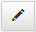

<!-- title: G6K: Guide d'administration -->
<!-- subtitle: Gestion des utilisateurs -->

# Comptes utilisateurs

Cette interface vous permet des gérer les comptes utilisateurs qui sont autorisés à accéder soit au module d'administration de G6K, soit aux simulateurs à accès protégés.

**A noter que le module d'administration ne permet pas de protéger l'accès à un simulateur, il faut en faire la demande à l'administrateur système qui modifiera la configuration de G6K en conséquence.**

Tous les comptes utilisateurs n'ont pas accès aux mêmes fonctions d'administration.

L'accès aux fonctions se fait selon des « rôles » qui respectent la hiérarchie suivante :

* « Utilisateur » : accès aux simulateurs protégès nécessitant une authentification.
* « Contributeur » : fonction du rôle « utilisateur » + accès aux tutoriels, mis à jour des données et donc accès au menu « Sources de données ».
* « Manager » : fonctions du rôle « contributeur » + gestion (création/modification) des simulateurs.
* « Admin » : fonctions du rôle « manager » + gestion des vues et du cache.
* « Super admin » : fonctions du rôle « admin » + gestion des utilisateurs.

Ainsi tout manager est contributeur, tout admin est manager et ainsi de suite ...

# Interface de gestion des utilisateurs

Si vous avez accès à cette interface, c'est donc que vous êtes un des « Super admins »

Cliquez sur « Utilisateurs » de la barre de menu pour y accèdez.

La liste des comptes utilisateurs s'affiche sous forme de tableau:  

Plusieurs attributs sont liés aux utilisateurs, ils sont définis ci-dessous :

**Attributs :**

* « Identifiant » : identifiant de l’utilisateur. *Spécification :* **Minimum 3 caractères.**
* « Email » : email de l’utilisateur. *Spécification :* **Différent des autres emails déjà enregistrés.**
* « Mot de passe » : mot de passe de l’utilisateur qui sera crypté. *Spécification **:*** **Minimum 6 caractères.**
* « Activé » : détermine si le compte est activé ou non.
* « Rôles » : Utilisateur, Contributeur, Manager, Admin et Super admin.
* « Dernière connexion » : date à laquelle l’utilisateur s’est connecté pour la dernière fois.

Vous pouvez ajuster la taille de la liste avec , trier la liste en cliquant sur le nom de colonne qui vous interesse afin de faciliter la lecture et la recherche dans les listes longues.
Ainsi si vous cliquez sur « Identifiant », la liste sera triée par identifiants en ordre croissant. Si vous cliquez une deuxième fois, elle sera triée en ordre décroissanr. Il en est de même pour les autres colonnes du tableau.

Mais surtout, vous pouvez ajouter, modifier ou supprimer un compte utilisateur.

## Ajout d’un utilisateur

Pour créer un compte utilisateur, cliquez sur le bouton  en haut à droite de la liste.

Une ligne vierge apparaîtra en tête de liste, vous pouvez alors saisir les attributs du compte en respectant leurs spécifications.

Pour sauvegarder le compte, cliquez sur le bouton , il sera immédiatement enregistré dans la base de données.

*Si l’utilisateur entre un mauvais identifiant lors de sa connexion, le message suivant sera affiché ‘’Identifiants invalides.’’.*

*Lorsqu’un compte est désactivé, il ne peut plus se connecter pour accèder aux fonctions de son rôle.  
Par exemple, si le compte de « Guest » est désactivé, il en sera notifié par le message ‘’Le compte est désactivé.’’. lorsqu'il essaiera de se connecter*

## Modification d’un utilisateur

Pour modifier un compte utilisateur, cliquez sur le bouton :   
La ligne du compte devient éditable, vous pouvez ainsi effectuer vos modifications :

* activer/désactiver le compte;
* modifier l’identifiant, l’email, le mot de passe;
* ajouter ou supprimer des rôles.

Pour supprimer un rôle, cliquez sur la croix à gauche du nom du rôle.

Lorsque vous cliquez dans le champ « Rôles », une liste déroulante s'ouvre pour sélectionner un rôle.

Pour sauvegarder vos changements, cliquez sur le bouton : 

## Suppression d’un utilisateur

Pour supprimer un utilisateur cliquez sur le bouton : 

Un bouton de confirmation apparaîtra, cliquez sur ce dernier (  ) pour supprimer le compte.

Une fois confirmé, le compte de l'utilisateur sera supprimé de la base de données des utilisateurs, mais la ligne du compte restera affichée avec un bouton « Restaurer » si toutefois vous vous étiez trompé ou que vous changez d'avis.  
A noter que si vous restaurer le compte, l'utilisateur ne pourra pas se connecter avec son ancien mot de passe. En effet, pour des raisons de sécurité, l'ancien mot de passe n'a pu être enregistré car celui-ci a été codé en fonction du jour de sa création.  
Vous devez donc saisir un nouveau mot de passe et le communiquer à l'utilisateur.

Au prochain ré-affichage de la page le compte n'apparaîtra plus dans la liste.

