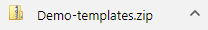
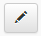
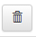

<!-- title: G6K: Guide d'administration  -->
<!-- subtitle: Gestion des vues -->

# Qu'est-ce qu'une vue ?

Les vues sont les modèles de pages et de styles dans lesquelles s'intégrent les simulateurs. Elles sont composées de « Gabarits » et de « Ressources multimédia ».  
Les « Gabarits » sont des fichiers (.twig) qui structurent la page qui est affichée.  
Les « Ressources multimédia » contiennent tous les éléments de style (fichiers CSS, JavaScript, images, polices...).

La gestion (création, modification, suppression) des vues est réservée aux utilisateurs disposant du rôle « Manager », « Administrateur » ou « Super administrateur ».

# Création d’une vue

Cliquez sur le bouton « Vues » de la barre de menu 


puis sur le bouton « Créer une vue » du menu latéral gauche


Un formulaire sera alors affiché. Donnez un nom à la vue (sans espace ni caractères spéciaux ou accentués) et éventuellement importez deux fichiers sous format .zip correspondant aux « Gabarits » et aux « Ressources multimédia ». 


Si vous ne disposez pas de fichier « Gabarits » et de fichier « Ressources multimédia », la vue que vous allez créer récuperera les éléments de la vue par défaut fournie avec G6K.

Cliquez sur « Créer » pour enregistrer la vue. Les fichiers .zip, s'ils sont fournis, seront décompréssés puis la vue sera affichée sous la forme de répertoires, avec deux onglets :

* les « Gabarits » où sont stockés les fichiers .twig structurant la page
* et « Ressources multimédia » où sont situés les fichiers de style et les images.


<p class="figure-legend">Figure 1 – Affichage des « Gabarits » de la vue « Demo»</p>


<p class="figure-legend">Figure 2 – Affichage des « Ressources multimédia » de la vue « Demo»</p>


# Exporter une vue

Si vous voulez exporter les « Gabarits » ou les « Ressources multimédia », sélectionnez l'onglet correspondant puis cliquez sur le bouton .
G6K compose alors un fichier compressé qu'il vous propose en téléchargement.

 

Le suffixe « -templates » pour les gabarits twig et « -assets » pour les ressources multimédia.

L'export (recommandé) vous permet d'archiver vos vues et éventuellement de les ré-importer dans un nouveau système si vous en changez.

# Gestion d’une vue

Il y a plusieurs boutons qui permettent de gérer les « Gabarits » et les « Ressources multimédia », leurs fonctions sont définies ci-dessous.

## Ajout d’un sous-dossier ou d’un fichier à un dossier existant

Si vous voulez ajouter un sous-dossier ou un fichier à un dossier, cliquez sur le bouton  « Ajouter un sous-dossier ou un fichier dans ‘*nom du dossier*’ » : 

Un formulaire sera alors affichée où vous pouvez choisir entre :

* ajouter un « sous-dossier », il faudra donner un nom (qui ne doit contenir ni espaces, ni caractères spéciaux ou accentués) à ce sous-dossier,
* ajouter un « fichier », il faudra alors lui donner un nom et l’importer depuis votre ordinateur.

Dans l'onglet « Gabarits », on ne peut ajouter que des fichiers avec l'extension .twig, sinon une erreur sera affichée.  
Pour les « Ressources multimédia » il n’y a pas d’extension ou de type particulier.

Puis appuyez sur le bouton « Soumettre ».

<p class="figure-legend">Figure 3 – Formulaire d’ajout d’un sous-dossier et affichage du sous-dossier ajouté</p>


<p class="figure-legend">Figure 4 - Formulaire d’ajout d'un fichier et affichage du fichier ajouté</p>


## Renommer un élément

Pour renommer un élément, cliquez sur le bouton « Renommer ‘*élément’* » :   
Un formulaire vous invitera à indiquer le nouveau nom de l’élément, cliquez sur le bouton « Soumettre » pour appliquer le renommage.

<p class="figure-legend">Figure 5 - Formulaire pour renommer l'élément et affichage de l'élément renommé</p>


<div class="alert alert-warning" role="alert">
ATTENTION: Certains gabarits sont cités dans la définition des étapes (Cf. attribut « Gabarit d'affichage de l'étape ») dans la documentation [Création d’un simulateur](simulators-management.html), si vous le renommez, pensez à modifier l'étape du simulateur concerné.
</div>

## Mettre à jour un fichier

Pour mettre à jour un fichier, cliquez sur le bouton « Mettre à jour ce fichier » : 


Une zone de saisie où vous pouvez modifier le fichier s'affichera.

<p class="figure-legend">Figure 6 - Interface de modification/édition(fond blanc)</p>


Une fois vos modifications effectuées, cliquez sur le bouton « Enregistrer » pour sauvegarder le fichier.  
Une fois l’enregistrement effectué le bouton « Enregistrer » se transformera en bouton « Modifier » et vous ne pourrez pas éditer le fichier tant que vous n’appuierez pas sur le bouton « Modifier ».

<p class="figure-legend">Figure 7 - Interface non éditable, modifications enregistrées (fond grisâtre)</p>


## Supprimer un élément

Pour supprimer un dossier, un sous-dossier ou un fichier, cliquez sur le bouton "Supprimer cet élément » :   
Un message de confirmation apparaîtra, si vous êtes certain de supprimer l’élément, appuyez sur « OK ».


La page va alors être rechargée et l’élément que vous avez supprimé ne sera plus affiché. 
Si vous supprimez un dossier qui contient d’autres éléments tout le contenu sera effacé.

<div class="alert alert-warning" role="alert">
ATTENTION: Certains gabarits sont cités dans la définition des étapes (Cf. attribut « Gabarit d'affichage de l'étape ») dans la documentation [Création d’un simulateur](simulators-management.html), si vous le supprimez, pensez à modifier l'étape du simulateur concerné.
</div>

## Supprimer une vue

Si vous souhaitez supprimer une vue, cliquez sur le bouton « Supprimer vue ».  


Un message de confirmation apparaîtra, si vous êtes certain de supprimer la vue, cliquez sur « OK ».  


La vue sera supprimée et ne sera plus affichée dans le menu de « Gestion des vues » :  


<div class="alert alert-warning" role="alert">
ATTENTION: Il faudra modifier tous les simulateurs qui utilisaient cette vue en tant que « Vue par défaut ».
</div>

# Composition des gabarits

Cette section décrit la façon dont vous devez composer les gabarits d'une vue ainsi que les règles et contraintes qu'ils doivent respecter.

Tous les gabarits que vous composez doivent hériter du layout de base « EUREKAG6KBundle:base/layout:pagelayout.html.twig » fourni avec G6K.  
Vous devez donc placer la ligne suivante en tête de gabarit :

```  

```

Le layout de base remplit les fonctions suivantes :

* Appels des scripts et styles nécessaires au fonctionnement du moteur de simulation;
* Définition des blocs que vous pourrez remplir ou compléter dans vos gabarits.

Ces blocs sont :

* « doctype » : Document type de la page : contient &lt;!DOCTYPE html&gt; pour HTML5
* « title » : Titre de la page web : vide
* « metas » : Métadonnées de la page web
* « styles » : Liaisons des feuilles de styles CSS
* « hscripts » : Appels de scripts dans la balise &lt;head&gt;
* « body » : Corps de la page HTML
* « bodyclass » : Permet d'ajouter des classes CSS à la balise &lt;body&gt; : vide
* « bodyattr » : Permet d'ajouter des attributs à la balise &lt;body&gt; : vide
* « content » : Contenu visible de la page web. Inclus dans le bloc body : vide;
* « scripts » : Scripts et appels de scripts en fin de page. Inclus dans le bloc body. 
* « jquery » : Appel de la bonne version de jquery en fonction du navigateur.

<div class="alert alert-warning" role="alert">
ATTENTION: Si vous ajoutez du contenu à ces blocs, mettre {{ parent() }} en début de bloc pour ne pas écraser le contenu mis par le layout de base. Ceci n'est pas utile pour les blocs « title », « bodyclass », « bodyattr » et « content » qui sont vides.
</div>

A noter que le layout de base n'ajoute aucun contenu visible à la page web. C'est dans le bloc « content » que vous devez mettre vos éléménts tels que en-tête de page, pied de page, menus, barre(s) latérale(s) et autres contenus.  
Vous devez y ajouter aussi le formulaire de simulation, ce que vous ferez à l'aide d'une macro twig et de variables fournis par G6K.

A l'instar de la vue « Demo », il est conseillé de définir une layout propre à votre vue qui sera chargée d'afficher les différents éléments de la page hormis le formulaire de simulation et les éléments propres à un simulateur.
Vous définirez ensuite un gabarit qui héritera de la la layout propre à la vue et qui contiendra le formulaire de simulation et les éléments propre à un simulateur.  
C'est ce dernier gabarit qui devra être référencé dans la définition des étapes de simulation dans les simulateurs. Cf. [Création d’un simulateur](simulators-management.html)

Concrètement, supposons que votre page à l'architecture suivante :


C'est le layout qui affiche les parties à fond gris et positionne le bloc « content » (partie à fond blanc) dans la page.

C'est le gabarit enfant qui alimente le bloc « content » où :

 Libellé/Titre du simulateur  
 Description du simulateur  
 Fil d'Ariane d'enchainement des étapes  
 Description de l'étape courante  
 Emplacement du formulaire de simulation à l'étape courante
 
 Les variables et les macros qui permettent d'alimenter ces éléments sont :
 
 ``{{ step.simulator.label }}``  
 ``{{ form.paragraphs(step.simulator.description|jscode) }}``  
 ``{{ form.breadcrumb(_context) }}``  
 ``{{ step.description }}``  
 ``{{ form.draw(_context, 'form-horizontal', 'form-group', 'control-label', 'input-group', 'form-control', 'panel panel-default', 'panel-heading', 'panel-body') }}``
 
Pour utiliser ces macros, il faut les importer dans le gabarit :  
```  

```


Les macros disponibles et utiles sont :

* « form.breadcrumb » : Dessine le fil d'Ariane d'enchaînement des étapes.  
  Paramère : _context  
* « form.draw » : Affiche le formulaire de simulation pour l'étape courante.  
  Paramètres :  
  1. _context
  2. classe CSS du conteneur de groupe de champs
  3. classe CSS du conteneur de champs
  4. classe CSS de l'étiquettes de champ
  5. classe CSS du conteneur englobant un champ et son unité ou le symbole monétaire
  6. classe CSS du champ
  7. classe CSS du conteneur de chapître
  8. classe CSS de l'êntête de chapître
  9. classe CSS du conteneur de section
* « form.heading » : Affiche un texte avec un niveau de titre (balises h1, h2, ...) après avoir supprimé les sauts de ligne.  
  Paramètres :  
  1. texte à afficher
  2. niveau de titre (1 à 6)
  3. classe CSS de la balise générée
* « form.paragraphs » : Affiche un texte comportant des sauts de ligne en englobant chaque ligne du texte dans des paragraphes HTML (&lt;p&gt;).  
  Paramètre : le texte à afficher  
* « form.profiles » : Affiche les profils.  
  Paramètre : _context

  
Les variables disponibles et utiles sont :

* « step.simulator.name » : Nom du simulateur
* « step.simulator.label » : Libellé/Titre du simulateur
* « step.simulator.description » : Description du simulateur
* « step.simulator.referer » : URL de la page du site où est référencé le simulateur
* « step.simulator.memo : Vrai si le simulateur autorise l'utilisation d'un memo (enregistrement de valeurs de champs dans les cookies), faux sinon
* « step.name » : Nom de l'étape courante
* « step.label » : Libellé/Titre de l'étape courante
* « step.description » : Description de l'étape courante
* « step.dynamic » : Vrai si Javascript est utilisé pour "animer" la simulation, faux sinon
* « script » : Vrai si Javascript est activé dans le navigateur, faux sinon

<p class="figure-legend">Figure 8 - Gabarit « Demo » illustant l'utilisation des macros et des variables</p>


